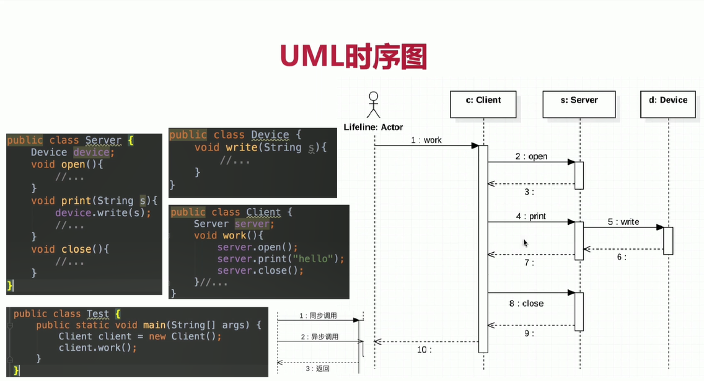
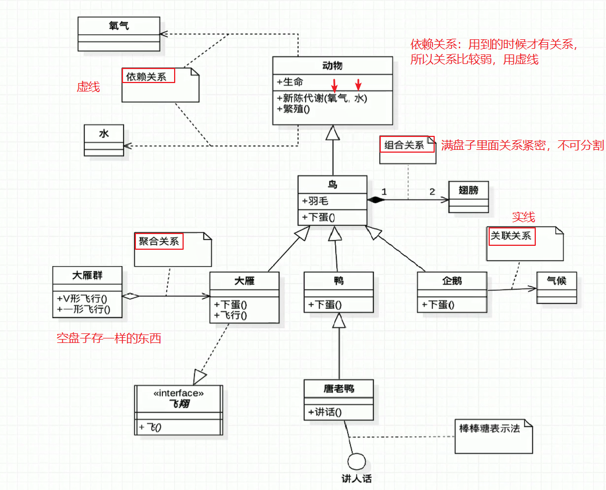

# 01-UML(统一建模语言)

* UML类图：用于表示类、接口、实例等之间相互的静态关系
* **UML箭头方向**：从子类指向父类（extends）
* **空心三角箭头**：继承或实现；实现：继承；虚线：实现
* 实线：关联；虚线：依赖
* **空心菱形**：聚合；实心菱形：组合
    * 菱形就是乘东西的器皿
    * 聚合：空器皿中可以放很多东西，聚在一起（大雁聚合成大雁群）
    * 组合：代表器皿里面已经有实体结构的存在，生死与共（鸟与翅膀）
* 关于组合关系中常见的数字表达含义，假设有A类和B类，数字标记在A类侧,表明系统在某一时刻，B的实例可以与A的xx个实例相关：
    * `0..1`    0或1个实例
    * `0..*`    0或多个实例
    * `1..1`    1个实例
    * `1`       只能由一个实例
    * `1..*`    至少有一个实例
* UML时序图举例

    

* 一个类如何表示？

    

* UML中类的关系

    

