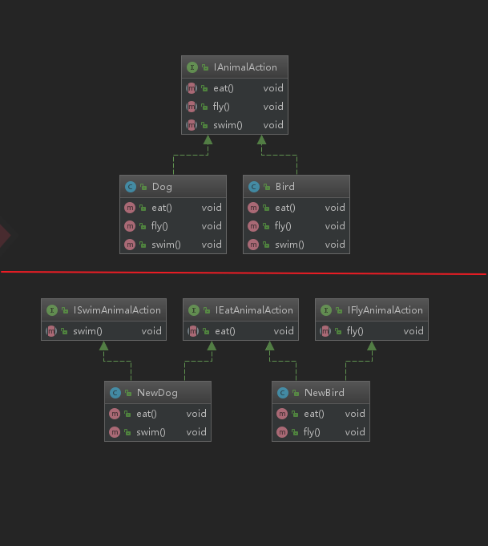

# 05-软件设计七大原则-接口隔离原则

## 定义

* 用多个专门的接口，而不适用单一的总接口，客户端不应该依赖它不需要的接口
* 一个类对一个类的依赖应该建立在最小的接口上
* 建立单一接口，不要建立庞大臃肿的接口
* 尽量细化接口，接口中的方法尽量少

也就是说，我们提供接口的时候，只暴露需要的方法，而将不需要的方法隐藏起来。

## 例子

定义一个接口叫做动物行为接口，但是呢，由于没有细化，比如狗子，一旦实现这个接口，那就要实现所有的方法，包括它不会的飞翔。

    

将接口进行细化（这里要注意是要适当）。哪个要实现什么，就去实现，不需要的方法就可以不用去实现。

注意，接口隔离原则好像与上一章的单一职责原则有点像，这里说明一下区别：单一职责原则强调职责，一个class或者接口只负责一个职责，可以有很多的方法。但是接口隔离原则强调的是适当地设计接口，尽量地给不同的调用者适当的接口，不要设计的太臃肿，主动的是接口依赖的隔离。

这里强调适当，接口也不能太多，效果反而会适得其反。