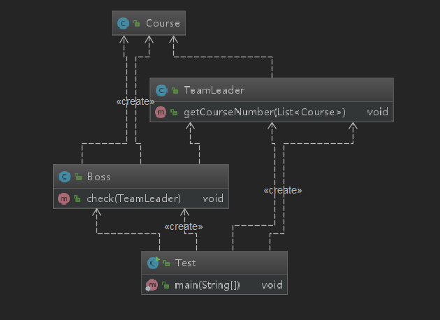
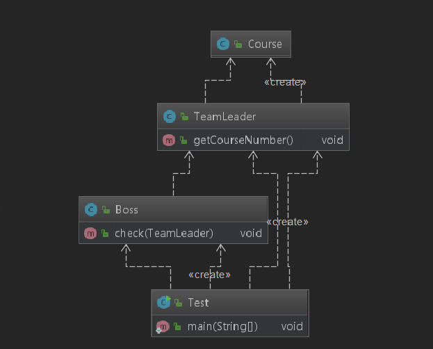

# 06-软件设计七大原则-迪米特原则

## 定义

- 一个对象应该对其他对象保持最少的了解，又叫最少知道原则。
- 尽量降低类与类之间的耦合
- 优点：降低类之间的耦合
- 强调：只和朋友交流，不和陌生人交流（朋友类：出现在这个类的成员变量上，方法输入，方法的返回类型；而出现在方法体内部的类不属于朋友类）

可能对于最后的强调有点疑惑，下面举例说明。

## 例子

假设一个场景，是一个boss要技术主管查询一下线上上线的课程有哪些。

定义一个课程类，里面啥都不写：

```java
public class Course {}
```

定义一个boss类，让技术主管告诉他上线的课程的数量：

```java
public class Boss {
    public void check(TeamLeader teamLeader){
        List<Course> courses = new ArrayList<>();
        for(int i=0;i<20;i++){
            courses.add(new Course());
        }
        teamLeader.getCourseNumber(courses);
    }
}
```

定义一个TeamLeader类，用于查询数量:
```java
public class TeamLeader {
    public void getCourseNumber(List<Course> courses) {
        System.out.println(courses.size());
    }
}
```
测试类里面打印即可。乍看没什么问题，但是我们分析一下：boss其实根本不需要管course类，我只要问技术主管即可，而技术主管通过一些手段去查询。但是我们现在的这个程序的问题是：boss类里面的方法体里面有了他根本就不需要关心的course类。关系是：

<div align="center">
    
</div>

我们再来分析一下boss的朋友，根据上面强调的规则，teamleader为方法的入参，是boss的朋友，返回值为void的，不谈。没有成员变量。方法体里面的是course，不是boss的朋友，所以这个course我们是不是可以放在teamleader这个类里面呢？

将boss类改为：


```java
public class Boss {
    public void check(TeamLeader teamLeader){
        teamLeader.getCourseNumber();
    }
}
```

将统计的具体细节移动到teamleader里面：


```java
public class TeamLeader {
    public void getCourseNumber() {
        List<Course> courses = new ArrayList<>();
        for(int i=0;i<20;i++){
            courses.add(new Course());
        }
        System.out.println(courses.size());
    }
}
```

关系变为：


<div align="center">
    
</div>