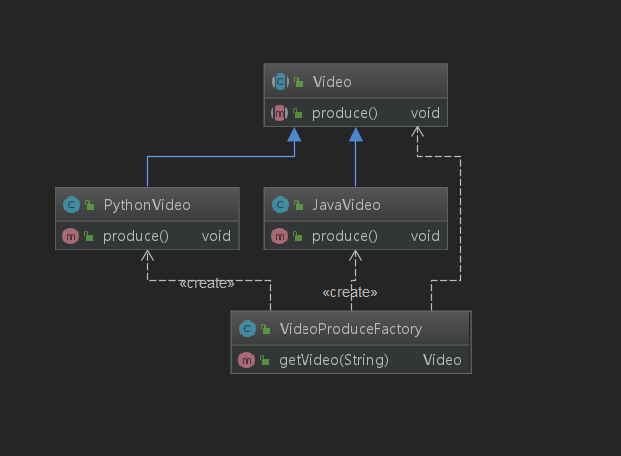
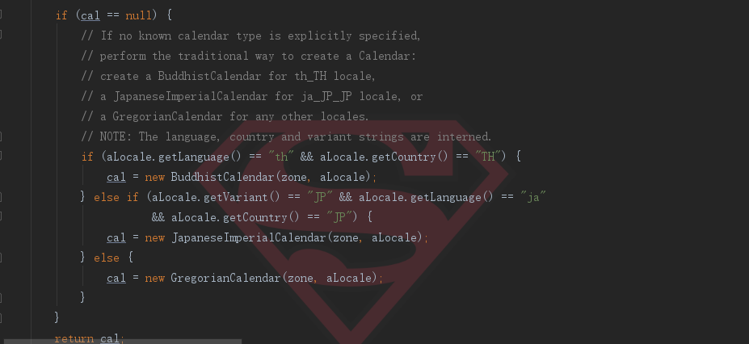

# 09-简单工厂模式

## 定义

* 由一个工厂对象决定创建出哪一种产品类的实例
* 创建型，单不属于23种设计模式

## 适用场景

* 工厂类负责创建的对象比较少
* 客户端只知道传入工厂的参数，对于如何创建对象不关心
* 只需要传入一个正确的参数，就可以获取你所需要的对象而无须知道其创建细节
* 缺点：工厂类的职责相对过重，增加新的产品需要修改工厂类的判断鲁逻辑，违背了开闭原则

## 例子

<div align="center">
    
</div>
场景：由很多的课程，比如有java和python的课程。具体的生产过程可以放在这个工厂里面：

```java
public abstract class Video {
    public abstract void produce();
}
```


```java
public class JavaVideo extends Video{
    @Override
    public void produce() {
        System.out.println("创建java课程...");
    }
}
```

```java
public class PythonVideo extends Video{
    @Override
    public void produce() {
        System.out.println("创建python课程...");
    }
}
```

```java
public class VideoProduceFactory {
    public Video getVideo(String type){
        if("java".equalsIgnoreCase(type)){
            return new JavaVideo();
        }else if("python".equalsIgnoreCase(type)){
            return new PythonVideo();
        }
        return null;
    }
}
```
我的测试类直接通过这个工厂来生产即可，不需要依赖具体的课程类了。

## 改进

上面的工厂方法是根据传入的名字来获取对应的实例的，一旦出现新增，是必然要修改这个工厂类的，并且传入的字符串还要做异常处理。这里用反射进行优化。


```java
public Video getVideoByClass(Class c){
    Video video = null;
    try {
        video = (Video) Class.forName(c.getName()).newInstance();
    } catch (InstantiationException e) {
        e.printStackTrace();
    } catch (IllegalAccessException e) {
        e.printStackTrace();
    } catch (ClassNotFoundException e) {
        e.printStackTrace();
    }
    return video;
}
```

调用类:

```java
public class Test {
    public static void main(String[] args) {
        VideoProduceFactory factory = new VideoProduceFactory();
        Video video = factory.getVideoByClass(PythonVideo.class);
        video.produce();
    }
}
```

## 应用

比如JDK中的`Calendar`这个类：


```java
public static Calendar getInstance()
{
    return createCalendar(TimeZone.getDefault(), Locale.getDefault(Locale.Category.FORMAT));
}
```

这是根据地区获取实例。

<div align="center">
    
</div>

还有比较典型的是获取mysql驱动：Class.forName("com.mysql.jdbc.driver");


## 总结

简单工厂非常简单，但是缺点也显而易见，比如我这里新增一个算法课，那么就需要修改这个工厂类。不符合开闭原则。

