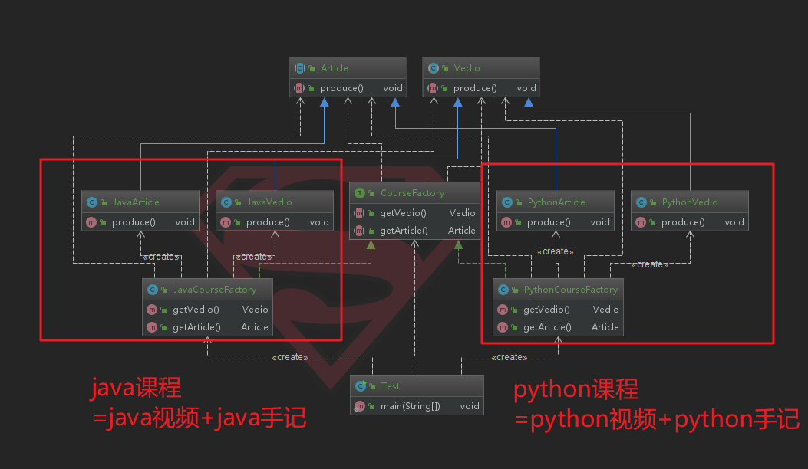

# 11-抽象工厂模式

## 定义

- 抽象工厂模式提供一个创建一系列相关或相互依赖对象的接口
- 无须指定他们具体的类
- 创建型
- 优点：无须关心创建细节、**将一个系列的产品族统一到一起创建**
- 缺点：增加了系统的抽象性和理解难度；规定了所有可能被创建的产品集合，产品族中扩展新的产品困难，需要修改抽象工厂的接口
- 美的冰箱和海尔冰箱是同一个产品等级，但是美的冰箱和美的空调是同一个产品族

<div align="center">
    
</div>

那么，工厂方法针对的是产品等级结构，就是竖着的。抽象工厂针对的是产品族，是横着的。

记法：**不同工厂同一个产品是统一产品等级；同一个工厂不同产品集合是产品族**。

产品族是针对某个工厂而言，这个工厂里面会有很多产品；

## 例子


场景：java教程包含两个东西：java视频+java手记；python教程包含两个东西：python视频+python手记

那么，java视频和java手记是一个产品族；

python视频和python手记是一个产品族；

java视频和python视频是同一个产品等级；

java手记和python手记是同一个产品等级；

OK，分别创建一个视频的抽象类`Vedio`和手记的抽象类`Article`（定义生产产品族的抽象类）：


```java
public abstract class Vedio {
    public abstract void produce();
}

public abstract class Article {
    public abstract void produce();
}
```

分别创建java视频类、java手记类、python视频类、python手记类：


```java
public class JavaVedio extends Vedio{
    @Override
    public void produce() {
        System.out.println("生产java视频");
    }
}

public class JavaArticle extends Article{
    @Override
    public void produce() {
        System.out.println("生产java手记");
    }
}

public class PythonVedio extends Vedio{
    @Override
    public void produce() {
        System.out.println("生产python视频");
    }
}

public class PythonArticle extends Article{
    @Override
    public void produce() {
        System.out.println("生产python手记");
    }
}
```

有了具体的产品之后，先创建一个总工厂确定生产的产品族，然后分别创建java工厂和python工厂去实现它（每个工厂都生产这个产品族）：


```java
public interface CourseFactory {
    Vedio getVedio();
    Article getArticle();
}

public class JavaCourseFactory implements CourseFactory{
    @Override
    public Vedio getVedio() {
        return new JavaVedio();
    }

    @Override
    public Article getArticle() {
        return new JavaArticle();
    }
}

public class PythonCourseFactory implements CourseFactory{
    @Override
    public Vedio getVedio() {
        return new PythonVedio();
    }

    @Override
    public Article getArticle() {
        return new PythonArticle();
    }
}
```
测试：


```java
public class Test {
    public static void main(String[] args) {
        CourseFactory javaCourseFactory = new JavaCourseFactory();
        CourseFactory pythonCourseFactory = new PythonCourseFactory();
        javaCourseFactory.getArticle().produce();
        javaCourseFactory.getVedio().produce();

        pythonCourseFactory.getArticle().produce();
        pythonCourseFactory.getVedio().produce();
    }
}


//运行结果
生产java手记
生产java视频
生产python手记
生产python视频
```

我们可以分析一下，如果此时要增加前端的课程，那么就会非常方便，无非是增加一个前端视频类和前端手记类：`FEVedio`和`FEArticle`，然后创建一个`FECourseFactory`这个类来生产这两个产品即可。其实，就是说，抽象工厂模式对于产品族的扩展是非常友好的。结合具体实例，比如我这里有了海尔工厂和美的工厂，他们都生产冰箱和空调。此时我要新添加一个品牌，比如是松下工厂，那么就可以很方便地扩展松下的产品族。符合开闭原则。不需要动其他工厂以及这个工厂对应的产品族。

每个工厂只生产产品族，就是说美的的工厂只生产美的的空调和冰箱；海尔的工厂只生产海尔的空调和冰箱。那么，我要获取海尔冰箱，我不需要关心如何创建这个冰箱，我只需要知道海尔这个工厂即可。

但是，显然，这里我们需要固定住`CourseFactory`，这个相当于是抽象工厂，确定了一个工厂能生产的东西，比如美的工厂，现在`CourseFactory`只能规定去生产空调和冰箱，但是如果美的要扩张业务，要去生产洗衣机，那么就需要修改`CourseFactory`这个类，继而其他的工厂也都要去改变。

对应到这里的场景，我的产品等级情况是：java视频和python视频是同一个产品等级；java手记和python手记是同一个产品等级；如果要规定，课程不仅需要有视频和手记，还需要有解答区，那么此时，就是需要修改`CourseFactory`，将会要修改很多地方。

所以，抽象工厂适合于产品等级基本不变的场景（即每个工厂要生产什么基本先确定下来），对于增加产品族（多一家工厂加盟）是完全支持扩展的。

<div align="center">
    
</div>

