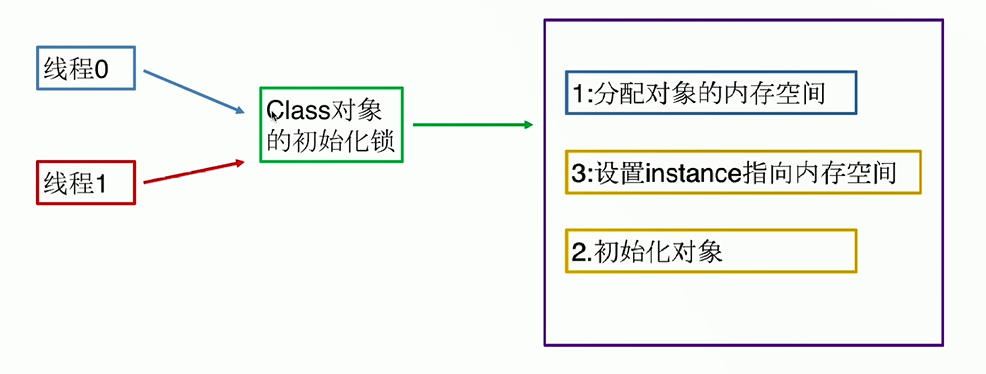
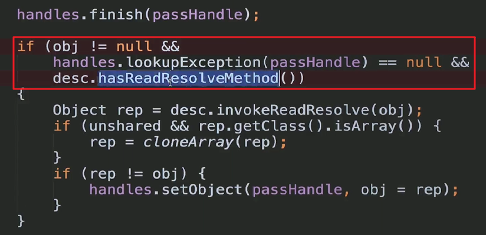
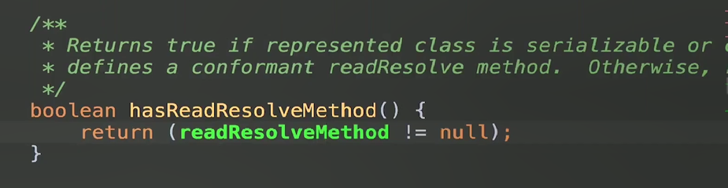

# 13-单例模式(上)

## 一、定义

- 保证一个类只有一个实例，并提供一个全局访问点
- 创建型
- 对于单例的适用场景是不必多说了
- 单例模式的优点也是很明显的了：只有一个实例，减少内存开销
- 缺点也很明显：不易扩展
- 单例的关键词：私有构造器、线程安全、延迟加载、序列化和反序列化安全、防止反射攻击


## 二、懒汉式

```java
public class LazySingleton {
    private static LazySingleton instance = null;
    private LazySingleton(){}
    public static LazySingleton getInstance(){
        if(instance == null){
            instance = new LazySingleton();
        }
        return instance;
    }
}
```

存在线程安全的问题，解决方法是：`synchronized`，但是这种排队执行，是比较慢的。下面进行优化。

## 三、双重锁检查--禁止指令重排序


```java
public class LazyDoubleCheckSingleton {
    private static volatile LazyDoubleCheckSingleton instance = null;
    private LazyDoubleCheckSingleton(){}
    public static LazyDoubleCheckSingleton getInstance(){
        if(instance == null){//1
            synchronized (LazyDoubleCheckSingleton.class){
                if(instance == null){
                    instance = new LazyDoubleCheckSingleton();//2
                }
            }
        }
        return instance;
    }
}
```
注意要用`volatile`关键字，来防止指令重排序。因为`instance = new LazyDoubleCheckSingleton();`这一步可以分为三个步骤：

- 第一步：分配内存给对象
- 第二步：初始化对象
- 第三步：设置instance指向刚刚分配的内存地址

这个时候，第二步和第三步执行顺序可能会被颠倒。

比如第一个线程t1，进来了，执行new，即先指向内存，但是对象还没有初始化完成，这个时候instance已经不为null，但是还没有初始化成功。

此时假设恰好t1时间片执行结束，t2进来了，首先判断是否为Null，因为不为null，所以直接返回这个还没有初始化好的instance，这个时候，针对这个线程t2系统就要报异常了。

此时，t2线程不影响t1线程继续执行，再去初始化一下对象，返回初始化好的instance.

加上`volatile`关键字之后，每个线程就都可以看到这个共享内存中的最新状态了，保证了内存可见性。

用`volatile`关键字修饰的共享变量，在进行写操作的时候，将当前缓存行的数据写回到系统内存（共享内存）中，这个写回系统内存的操作会使其他线程缓存的这个变量值失效，所以他们需要去系统内存去同步数据。

这样，既兼顾了性能，又兼顾了线程安全。

## 四、允许重排序--禁止其他线程看到重排序

采用静态内部类的方式。原理如下。

假设有一个类叫A：

- A类实例被创建
- A类中声明的静态方法被调用
- A类中声明的一个静态成员被赋值
- A类中声明的一个静态成员被使用，并且这个成员不是常量成员
- 如果A类为顶级类，并且A类中有嵌套的断言语句（不常用）

根据java语言规范，其中任何一种情况首次发生，这个类就会立即被初始化。

那么，我们执行`InnerClass.instance`这句话的时候，就是调用了这个内部类的静态成员，所以此时这个静态内部类立即被初始化。

<div align="center">
    
</div>

JVM在类的初始化阶段（class加载后，线程使用前），这个阶段会执行类的初始化，**JVM会先获取一个锁**，这个锁可以同步多个线程对一个类的初始化，基于这个特性，可以实现基于静态内部类的延迟加载、线程安全的方案。

那么，由于存在一把初始化锁，只能有一个线程执行初始化，即使静态内部类中存在重排序，也不会有任何问题，因为其他线程压根看不到，进不来。


```java
public class StaticInnerClassLazySingleton {

    private StaticInnerClassLazySingleton(){}
    
    private static class InnerClass {
        private static StaticInnerClassLazySingleton instance = new StaticInnerClassLazySingleton();
    }

    public static StaticInnerClassLazySingleton getInstance(){
        return InnerClass.instance;
    }

}
```

## 五、饿汉式

类加载的时候就完成了初始化，没有延迟加载(final static)。


```java
public class HungrySingleton {
    private final static HungrySingleton instance = new HungrySingleton();
    private HungrySingleton(){}
    public HungrySingleton getGetInstance(){
        return instance;
    }
}
```

也可以将初始化对象放到静态块中，达到一样的效果。


## 六、序列化和反序列化破坏单例模式及解决


```java
public static void main(String[] args) throws IOException, ClassNotFoundException {
    //获取单例对象
    HungrySingleton instance = HungrySingleton.getGetInstance();
    //序列化
    ObjectOutputStream oos = new ObjectOutputStream(new FileOutputStream("singletonFile"));
    oos.writeObject(instance);
    //反序列化
    File file = new File("singletonFile");
    ObjectInputStream ois = new ObjectInputStream(new FileInputStream(file));
    //获取反序列化后的对象
    HungrySingleton newInstance = (HungrySingleton) ois.readObject();
    //测试
    System.out.println(instance);
    System.out.println(newInstance);
    System.out.println(instance == newInstance);
}
```
测试结果：

```
com.swg.creational.singleton.HungrySingleton@135fbaa4
com.swg.creational.singleton.HungrySingleton@568db2f2
false
```

反序列化后就破坏了单例。原因是在`ObjectInputStream`中，有段逻辑判断这个类是不是`implements Serializable`，是的化就用反射构建的对象，是新的实例。


此时如果将`HungrySingleton`改为：

```java
public class HungrySingleton implements Serializable {
    private final static HungrySingleton instance = new HungrySingleton();
    private HungrySingleton(){}
    public static HungrySingleton getGetInstance(){
        return instance;
    }

    private Object readResolve(){
        return instance;
    }
}
```
执行结果：

```
com.swg.creational.singleton.HungrySingleton@135fbaa4
com.swg.creational.singleton.HungrySingleton@135fbaa4
true
```
为什么呢？在上面发射生成了一个新的对象obj之后，下面还有一个判断：


<div align="center">
    
</div>


这里`hasReadResolveMethod`这个方法，具体如下：

<div align="center">
    
</div>


就是说，加入这个类实现了序列化接口，并且有`readResolve()`这个方法，就返回true.

就会执行下面的`desc.invokeReadResolve(obj)`这句，这句其实就是利用反射去调用`HungrySingleton`类中的`readResolve()`方法，拿到了原来里面的对象实例。所以就解决了这个问题。

未完待续...