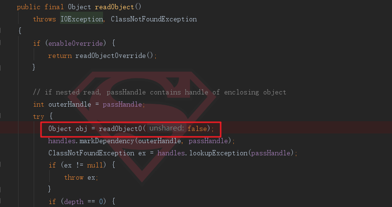
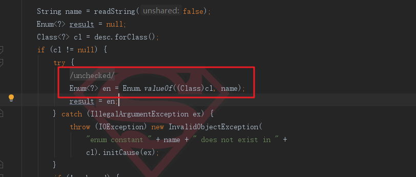
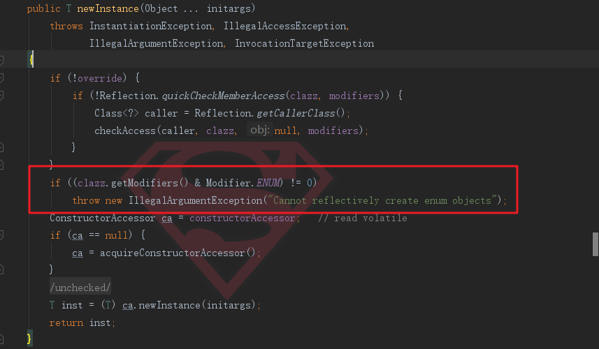
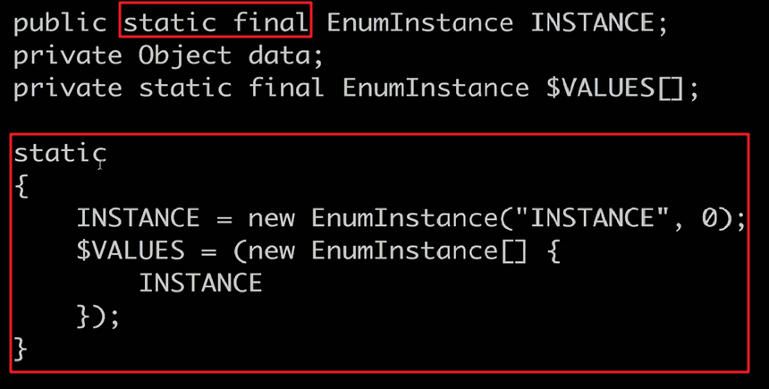

# 14-单例模式(下)

## 一、反射攻击

还是以饿汉模式实现的单例模式类来实验：


```java
public class HungrySingleton implements Serializable {
    private final static HungrySingleton instance = new HungrySingleton();
    private HungrySingleton(){}
    public static HungrySingleton getGetInstance(){
        return instance;
    }

    //此方法忽略，跟本章无关
    private Object readResolve(){
        return instance;
    }
}
```


```java
public class Test2 {
    public static void main(String[] args) throws NoSuchMethodException, IllegalAccessException, InvocationTargetException, InstantiationException {
        Class objectClass = HungrySingleton.class;
        Constructor constructor = objectClass.getDeclaredConstructor();
        constructor.setAccessible(true);
        HungrySingleton instance = HungrySingleton.getGetInstance();
        HungrySingleton newInstance = (HungrySingleton) constructor.newInstance();

        System.out.println(instance);
        System.out.println(newInstance);
        System.out.println(instance == newInstance);
    }
}
```
比较简单，就是通过反射拿到这个类的私有构造器，然后利用这个构造器去创建这个类的对象。运行结果如下：


```
com.swg.creational.singleton.HungrySingleton@1540e19d
com.swg.creational.singleton.HungrySingleton@677327b6
false
```


那么可以进行反射的一些防御，因为是饿汉，在类加载之后就已经创建好实例对象了，所以我们可以在构造器种进行判断：


```java
public class HungrySingleton implements Serializable {
    private final static HungrySingleton instance = new HungrySingleton();
    private HungrySingleton(){}
    public static HungrySingleton getGetInstance(){
        if(instance != null){
            throw new RuntimeException("单例构造器禁止反射调用");
        }
        return instance;
    }

    private Object readResolve(){
        return instance;
    }
}
```

测试结果：

```
Exception in thread "main" java.lang.RuntimeException: 单例构造器禁止反射调用
```

对于声明静态属性或者用静态内部类的这两种方式，因为类加载的时候，实例就会生成好，所以可以用这种方式进行防御。但是对于不是在类加载时期就加载类对象的模式，就不一定行了，跟具体的时序有关（主要看在反射创建对象的时候是不是已经存在了实例对象）。

即使添加复杂逻辑，比如用标记位来判断等手段都是不行的，因为反射的威力不仅可以修改构造器，还可以修改一个类的属性，所以是没有意义的。

## 二、Enum枚举单例

为了解决反射攻击以及序列化反序列化问题，推荐适用枚举单例。


```java
public enum EnumInstance {
    INSTANCE;
    private Object data;

    public Object getData() {
        return data;
    }
    public void setData(Object data) {
        this.data = data;
    }

    public static EnumInstance getInstance(){
        return INSTANCE;
    }
}
```
对其进行序列化和反序列化测试：

```java
public class Test3 {
    public static void main(String[] args) throws IOException, ClassNotFoundException {
        EnumInstance instance = EnumInstance.getInstance();
        instance.setData(new Object());
        //序列化
        ObjectOutputStream oos = new ObjectOutputStream(new FileOutputStream("singletonFile"));
        oos.writeObject(instance);
        //反序列化
        File file = new File("singletonFile");
        ObjectInputStream ois = new ObjectInputStream(new FileInputStream(file));
        //获取反序列化后的对象
        EnumInstance newInstance = (EnumInstance) ois.readObject();
        //测试
        System.out.println(instance.getData());
        System.out.println(newInstance.getData());
        System.out.println(instance.getData() == newInstance.getData());
    }
}
```
运行结果：

```
java.lang.Object@378bf509
java.lang.Object@378bf509
true
```
原理是：还是要看`ObjectInputStream`对枚举是如何处理的，我们循着这个路径：

点开`(EnumInstance) ois.readObject();`中的`readObject()`方法，显示：

<div align="center">
    
</div>

点进去，找到枚举这一个类型：

<div align="center">
    
</div>

点进`readEnum`这个方法：

<div align="center">
    
</div>

我们看到是根据枚举的名字来生成枚举对象的，枚举的名字是唯一的，所以反序列化后还是原来的那个对象实例。解决了序列化和反序列化的问题。下面来看看是如何防止反射攻击的：

我们还是跟以前一样去获取枚举的构造器试试：


```java
Class objectClass = EnumInstance.class;
Constructor constructor = objectClass.getDeclaredConstructor();
constructor.setAccessible(true);
```

获取构造器的时候直接抛出异常了。


```java
Constructor constructor = objectClass.getDeclaredConstructor();
```

为什么获取不到枚举的无参构造器呢？

我们进入Enum源码，发现里面只有一个构造器：


```java
protected Enum(String name, int ordinal) {
    this.name = name;
    this.ordinal = ordinal;
}
```
那么我们就拿这个有参构造器去尝试一下：


```java
Class objectClass = EnumInstance.class;
Constructor constructor = objectClass.getDeclaredConstructor(String.class,int.class);
constructor.setAccessible(true);
EnumInstance instance = (EnumInstance) constructor.newInstance("swg",666);
```
但是我们会发现，根据构造器去创建实例对象的时候报错了：

```
Exception in thread "main" java.lang.IllegalArgumentException: Cannot reflectively create enum objects
```
报错信息说，不能反射创建枚举对象。原因是：


<div align="center">
    
</div>


ok，解决了反射攻击。

经过jad反编译之后，我们可以看到这个枚举类是一个final类型，表明不能被继承；构造器私有，不能被new，最重要的是，针对我们创建的实例：


<div align="center">
    
</div>

说明是在类加载的时候就去创建了，类似于饿汉模式。

## 三、容器单例

容器启动的时候，可以将一些单例实例放进map中来。
```java
public class ContainerSingleton {
    private static Map<String,Object> map = new HashMap<String,Object>();

    private ContainerSingleton(){

    }

    public static void putInstance(String key,Object instance){
        //判断key不为空，instance也不为空
        if(!map.containsKey(key)){
            map.put(key,instance);
        }
    }

    public static Object getInstance(String key){
        return map.get(key);
    }
}
```
这种方式存在问题，多线程情况下，两个线程t1和t2，t1线程先塞入一个<"key",1>，此时t2进来，立即塞入同样的<"key",2>，那么此时t2返回2,t1也会返回1，造成了数据的混乱。

## 四、ThreadLocal

本地线程，是线程隔离的，保证一个线程的实例唯一。

这属于带引号的单例模式，不赘述。