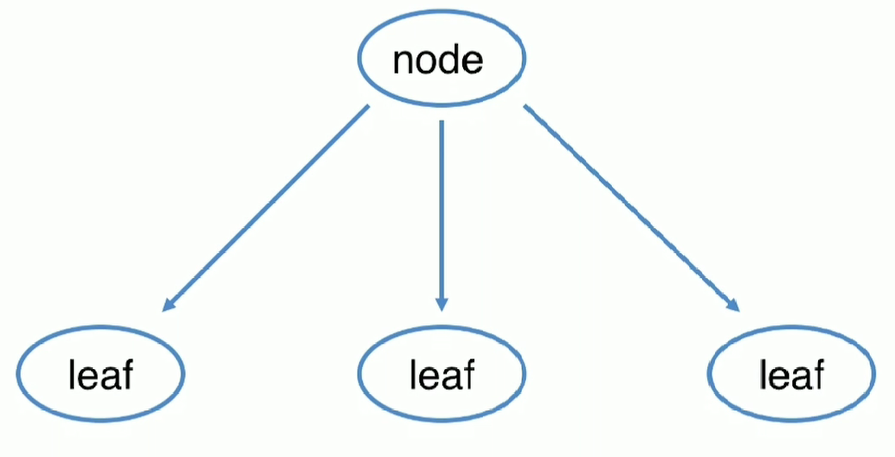

# 20-组合模式

## 定义

- 将对象组合成树形结构以表示“部分-整体”的层次结构
- 组合模式使客户端对单个对象和组合对象保持一致的方式处理
- 结构型
- 适用场景
    - 希望客户端可以忽略组合对象与单个对象的差异时
    - 处理一个树形结构时
- 优点
    - 可以清楚地定义分层次的复杂对象，表示对象的全部或部分层次
    - 让客户端忽略了层次的差异，方便对整个层次结构进行控制
- 缺点
    - 某些节点需要个性化，就会变复杂
    - 使设计更加抽象

<div align="center">
    
</div>

## 例子

考虑一个场景，比如慕课网，有目录和课程。对于目录来说，一般有名称、添加课程、删除课程以及打印所有目录和下面的课程。对于课程来说，有名称、价格以及打印课程名称。

那么，首先定义一个抽象类，作为节点默认行为的统一抽象：


```java
public abstract class CatlogComponent {
    public void add(CatlogComponent catlogComponent){
        throw new UnsupportedOperationException("不支持添加操作");
    }

    public void remove(CatlogComponent catlogComponent){
        throw new UnsupportedOperationException("不支持删除操作");
    }

    public String getName(CatlogComponent catlogComponent){
        throw new UnsupportedOperationException("不支持获取名称操作");
    }

    public double getPrice(CatlogComponent catlogComponent){
        throw new UnsupportedOperationException("不支持获取价格操作");
    }

    public void print(){
        throw new UnsupportedOperationException("不支持打印操作");
    }
}
```
下面定义目录类：

```java
public class CourseCatlog extends CatlogComponent{
    //这里就应用到组合模式，即目录和课程都是一个类型，添加的时候一概而论
    private List<CatlogComponent> items = new ArrayList<>();
    //目录名称
    private String name;
    //目录层级
    private Integer level;

    public CourseCatlog(String name,Integer level){
        this.name = name;
        this.level = level;
    }

    //添加目录
    @Override
    public void add(CatlogComponent catlogComponent) {
        items.add(catlogComponent);
    }

    //删除目录
    @Override
    public void remove(CatlogComponent catlogComponent) {
        items.remove(catlogComponent);
    }

    //获取目录名称
    @Override
    public String getName(CatlogComponent catlogComponent) {
        return this.name;
    }

    //打印所有层级目录以及目录下的课程
    @Override
    public void print() {
        System.out.println(this.name);
        for(CatlogComponent item:items){
            if(this.level != null){
                for (int i=0;i<this.level;i++){
                    System.out.print("--");
                }
            }
            item.print();
        }
    }
}
```

定义一个课程类:

```java
public class Course extends CatlogComponent{
    //课程名称
    private String name;
    //课程价格
    private double price;

    public Course(String name, double price) {
        this.name = name;
        this.price = price;
    }

    //获取课程名称
    @Override
    public String getName(CatlogComponent catlogComponent) {
        return this.name;
    }
    
    //获取课程价格
    @Override
    public double getPrice(CatlogComponent catlogComponent) {
        return this.price;
    }

    //打印课程信息
    @Override
    public void print() {
        System.out.println("课程名称："+this.name+",价格为:"+this.price);
    }
}
```

测试类:


```java
public class Test {
    public static void main(String[] args) {
        CatlogComponent linuxCourse = new Course("linux课程",11);
        CatlogComponent windowsCourse = new Course("windows课程",12);

        CatlogComponent javaCatlog = new CourseCatlog("java课程",2);

        CatlogComponent snailmall1 = new Course("电商一期",55);
        CatlogComponent snailmall2 = new Course("电商二期",66);
        CatlogComponent snailmall3 = new Course("电商三期",77);

        javaCatlog.add(snailmall1);
        javaCatlog.add(snailmall2);
        javaCatlog.add(snailmall3);


        //慕课网为最大的根目录，这里将linux课程、windows课程以及java课程放在一个层级上
        CatlogComponent immoc = new CourseCatlog("慕课网",1);
        immoc.add(linuxCourse);
        immoc.add(windowsCourse);
        immoc.add(javaCatlog);

        immoc.print();

    }
}
```
打印结果：

```
慕课网
--课程名称：linux课程,价格为:11.0
--课程名称：windows课程,价格为:12.0
--java课程
----课程名称：电商一期,价格为:55.0
----课程名称：电商二期,价格为:66.0
----课程名称：电商三期,价格为:77.0
```
