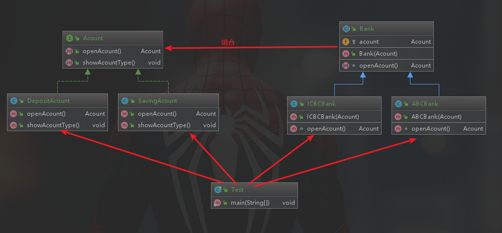

# 21-桥接模式

## 定义

- 将抽象部分与他的具体实现部分分离，使他们都可以独立地变化
- 通过组合的方式建立两个类之间联系，而不是继承
- 结构型
- 适用场景
    - 抽象与具体实现之间增加更多的灵活性
    - 一个类存在两个或多个独立变化的维度，且这两个或多个维度都需要独立进行扩展
    - 不希望适用继承，或因为多层继承导致类的个数剧增
- 优点
    - 分离抽象部分及其具体实现部分
    - 提高了系统的可扩展性
    - 符合开闭原则
    - 符合合成复用原则
- 桥接模式&组合模式
    - 组合模式更强调整体与部分之间的组合
    - 桥接模式更强调平行维度之间的组合
- 桥接模式&适配器模式
    - 都是为了让两个类配合工作
    - 适配器模式目的是让功能相似但是接口不同的类适配起来
    - 桥接模式分离抽象与具体实现，主要是要分离


## 例子

有很多银行，比如中国农业银行，中国工商银行，银行也分很多账户，比如活期账户和定期账户。

那么，银行有很多扩展，账户也可能会扩展，用桥接模式将他们分离最好不过了。

银行与账户的关系是组合关系：银行组合账户

账户接口:


```java
public interface Acount {
    Acount openAcount();
    void showAcountType();
}
```

定期账户：

```java
public class DepositAcount implements Acount{
    @Override
    public Acount openAcount() {
        System.out.println("打开定期账号");
        return new DepositAcount();
    }

    @Override
    public void showAcountType() {
        System.out.println("这是一个定期账号");
    }
}
```
活期账户：

```java
public class SavingAcount implements Acount{
    @Override
    public Acount openAcount() {
        System.out.println("打开活期账号");
        return new SavingAcount();
    }

    @Override
    public void showAcountType() {
        System.out.println("这是一个活期账号");
    }
}
```

写一个银行抽象类，银行有一个操作是开账户，把账户类组合进来：

```java
public abstract class Bank {
    protected Acount acount;
    public Bank(Acount acount){
        this.acount = acount;
    }

    abstract Acount openAcount();
}
```

中国农业银行：

```java
public class ABCBank extends Bank{
    public ABCBank(Acount acount) {
        super(acount);
    }

    @Override
    Acount openAcount() {
        System.out.println("打开中国农业银行账号");
        //委托给具体账户去打开账户
        acount.openAcount();
        return acount;
    }
}
```


中国工商银行：

```java
public class ICBCBank extends Bank{
    public ICBCBank(Acount acount) {
        super(acount);
    }

    @Override
    Acount openAcount() {
        System.out.println("打开中国工商银行账号");
        acount.openAcount();
        return acount;
    }
}
```

<div align="center">
    
</div>