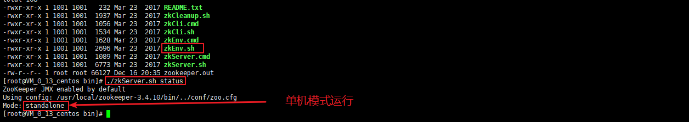
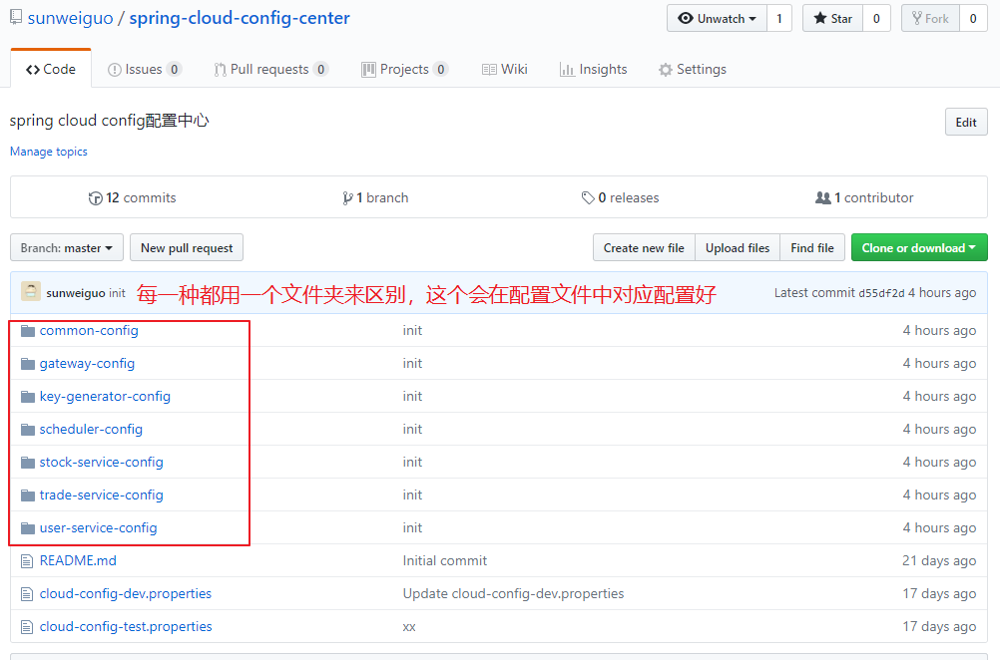
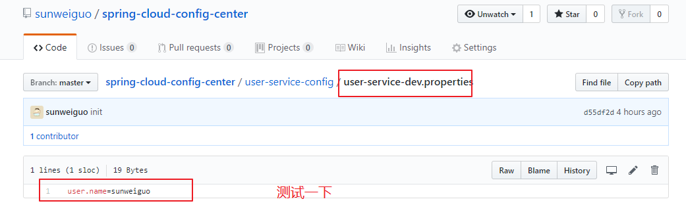
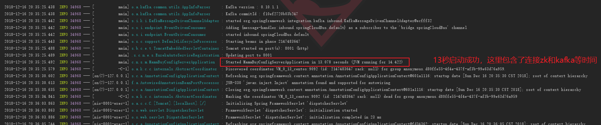
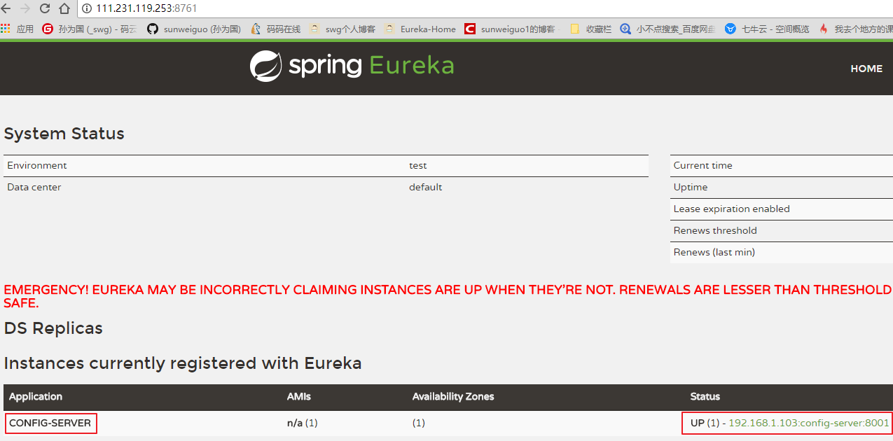
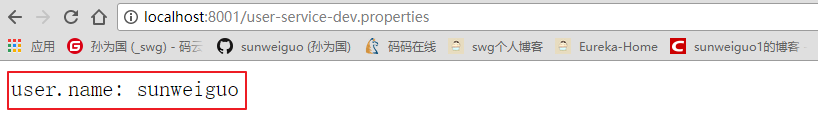
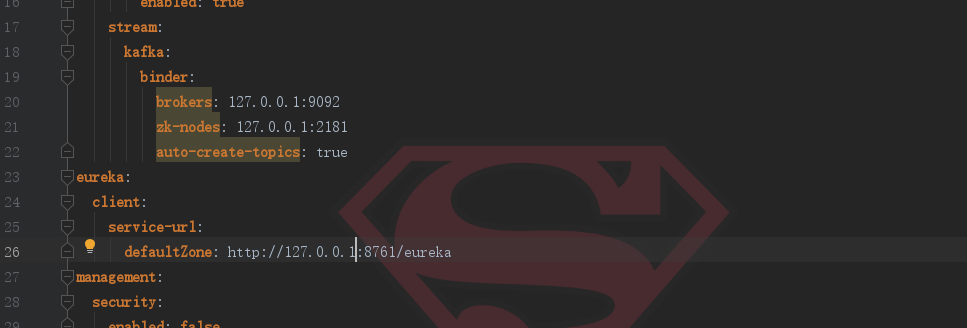
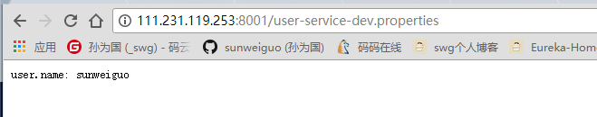

# 02-配置中心

由我们之前学习的消息总线，我们知道实现配置的自动刷新，需要用到`spring-cloud-config-server`，还需要一个消息中间件来实现发布订阅的功能从而实现自动的刷新，这里是用了`kafka`和`zookeeper`这两样。

所以，首先要准备好这两者的环境。

首先是安装jdk，然后安装zookeeper(我这里就建一个，不做集群)，最后安装kafka，依次启动。

在zookeeper的学习和spring cloud组件的学习后安装这些不是问题。对于 kafka的后台启动：

默认端口为9092：
```
nohup ./kafka-server-start.sh ../config/server.properties 1>/dev/null  2>&1  &
```

对于zookeeper的启动：


```
./zkServer.sh start//启动，默认端口为2181

./zkServer.sh status//查看状态
```

zookeeper简单地修改一下配置文件中data文件夹即可。

<div align="center">
    
</div>


ok，现在的环境已经准备好了，我全部部署在了腾讯云服务器上。下面我创建一个config server的工程，用来获取git的信息。所以先准备git文件：


<div align="center">
    
</div>


至于里面的内容，比如我的用户服务，就是一个`user-service-dev.properties`文件（后面创建用户服务的时候，注册到eureka的名字就必须是user-service了，就是spring.application.name这个属性），里面我搞一个测试内容为:`user.name=sunweiguo`:

<div align="center">
    
</div>


ok,下面新建一个`module`叫做`mama-buy-server-config`:


```xml
<parent>
    <groupId>com.njupt.swg</groupId>
    <artifactId>mama-buy</artifactId>
    <version>0.0.1-SNAPSHOT</version>
</parent>

<artifactId>mama-buy-config-server</artifactId>
<version>0.0.1-SNAPSHOT</version>
<name>mama-buy-config-server</name>
<packaging>jar</packaging>
<description>配置中心</description>

<dependencies>
    <dependency>
        <groupId>org.springframework.boot</groupId>
        <artifactId>spring-boot-starter</artifactId>
    </dependency>
    <!--config 读取配置-->
    <dependency>
        <groupId>org.springframework.cloud</groupId>
        <artifactId>spring-cloud-config-server</artifactId>
    </dependency>
    <!--消息总线  发布订阅-->
    <dependency>
        <groupId>org.springframework.cloud</groupId>
        <artifactId>spring-cloud-starter-bus-kafka</artifactId>
    </dependency>
    <!--触发更新-->
    <dependency>
        <groupId>org.springframework.boot</groupId>
        <artifactId>spring-boot-starter-actuator</artifactId>
    </dependency>
    <!--注册-->
    <dependency>
        <groupId>org.springframework.cloud</groupId>
        <artifactId>spring-cloud-starter-eureka</artifactId>
    </dependency>
</dependencies>
```
增加注解，表示是`eureka`客户端和`server config`服务端：


```java
@SpringBootApplication
@EnableConfigServer
@EnableDiscoveryClient
public class MamaBuyConfigServerApplication {
    public static void main(String[] args) {
        SpringApplication.run(MamaBuyConfigServerApplication.class, args);
    }
}
```
最最重要的是配置文件：


```properties
server:
  port: 8001
spring:
  application:
    name: config-server
  cloud:
    config:
      server:
        git:
          uri: https://github.com/sunweiguo/spring-cloud-config-center.git
          username: sunweiguo
          password: *********
          # 对应的文件夹
          search-paths: gateway-config,user-service-config,trade-service-config,stock-service-config,common-config,key-generator-config,scheduler-config
    bus:
      trace:
        enabled: true
    stream:
      kafka:
        binder:
          brokers: 111.231.119.253:9092 #这里是测试，所以连到了腾讯云服务器上，注意要开放端口才行
          zk-nodes: 111.231.119.253:2181
          auto-create-topics: true
eureka:
  client:
    service-url:
      defaultZone: http://111.231.119.253:8761/eureka #eureka已经被我以jar包形式部署上去了
management:
  security:
    enabled: false
  instance:
    ip-address: 111.231.119.253 # 告诉注册中心这个服务的公网ip，github可以真正访问到
    prefer-ip-address: true
```
ok，启动程序，如果没有报错的话：


<div align="center">
    
</div>


看看注册到eureka上成功没有：

<div align="center">
    
</div>


那么，我可以访问到位于git上面的内容吗？


<div align="center">
    
</div>


看到这个就大功告成啦！下面我将这个服务放到服务器上去：


首先是更改ip地址，改为本地访问即可，安全组就可以把暴露出来的端口删除了：

<div align="center">
    
</div>


将其打包部署到服务器:

<div align="center">
    
</div>


