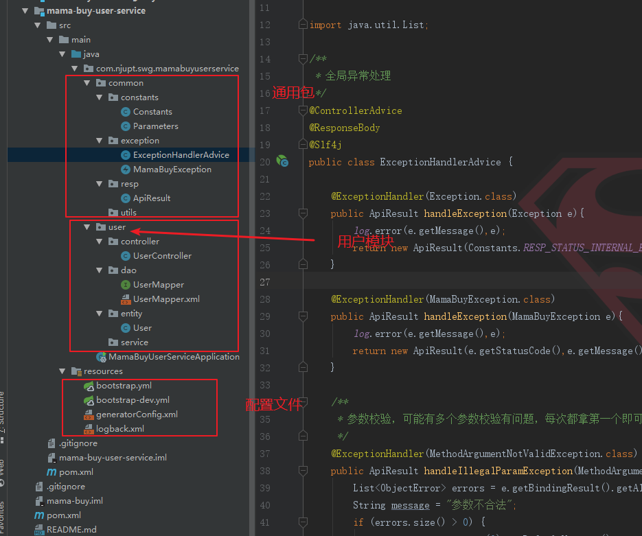

# 03-用户中心(上)

## 用户表


```sql
DROP TABLE IF EXISTS `t_user_0`;
CREATE TABLE `t_user_0` (
  `id` bigint(20) NOT NULL,
  `uuid` bigint(20) NOT NULL,
  `email` varchar(50) NOT NULL,
  `password` varchar(100) NOT NULL,
  `nickname` varchar(100) NOT NULL,
  `mobile` varchar(20) DEFAULT NULL,
  `create_time` timestamp NOT NULL DEFAULT CURRENT_TIMESTAMP ON UPDATE CURRENT_TIMESTAMP,
  `update_time` timestamp NOT NULL DEFAULT CURRENT_TIMESTAMP ON UPDATE CURRENT_TIMESTAMP
) ENGINE=InnoDB DEFAULT CHARSET=utf8mb4;
```
uuid是用于分表的依据，不能重复，至于如何生成以后再说。t_user_0建表成功之后，复制两份，做成三份的分表演示。放在一个单独的数据库`mama-buy-user`里.


## 新建项目mama-buy-user-service

新建boostrap.yml文件，这个文件的启动优先级比application.yml要高，主要是要去配置读取config的服务；然后注册到eureka上；下面弄一个`shardingJDBC`来做分库分表，最后是logback日志。


```properties
# 高优先级启动
server:
  port: 8002
spring:
  application:
    name: user-service # 与git仓库中的配置文件要一致
  profiles:
    active: dev
  cloud:
    config:
      profile: dev # 这个结合name找到配置文件
      discovery:
        enabled: true
        service-id: config-server #config服务名字
eureka:
  client:
    service-url:
      defaultZone: http://111.231.119.253:8761/eureka
sharding:
  jdbc:
    datasource:
      names: ds
      ds:
        name: user
        type: com.alibaba.druid.pool.DruidDataSource
        driver-class-name: com.mysql.jdbc.Driver
        filters: stat
        maxActive: 20
        initialSize: 1
        maxWait: 60000
        minIdle: 1
        timeBetweenEvictionRunsMillis: 60000
        minEvictableIdleTimeMillis: 300000
        validationQuery: select 'x'
        testWhileIdle: true
        testOnBorrow: false
        testOnReturn: false
        poolPreparedStatements: true
        maxOpenPreparedStatements: 20
    config:
      sharding:
        tables:
          t_user:
            actual-data-nodes: ds.t_user_${0..2} # 分的表名
            key-generator-column-name: uuid #用雪花算法自动生成保证不重复
            table-strategy:
              inline:
                sharding-column: uuid # 按照uuid进行分表
                algorithm-expression: t_user_${uuid % 3} # 分表的算法，取模
#    instance:
#      ip-address:
#      prefer-ip-address: true
logging:
  config: classpath:logback.xml
```
还有关于数据库账号密码等配置，可以单独放在`bootstrap-dev.yml`：


```properties
spring:
  cloud:
    stream:
      kafka:
        binder:
          brokers: ${kafka.brokers.host}
          zk-nodes: ${zookeeper.host}
          auto-create-topics: true
      bindings:
        input:
          destination: dis-transation
          group: point-group
sharding:
  jdbc:
    datasource:
      names: ds
      ds:
        url: jdbc:mysql://127.0.0.1:3306/mama-buy-user
        username: root
        password: root
redis:
  node: ${redis.host}
zk:
  host: ${zookeeper.host}
```

一开始启动报错，可以将`session`相关的依赖先注释掉。

ok，根据逆向工程生成用户相关的文件。

上面在工程可以正常启动的情况下，增加一些类，比如全局异常处理类：


```java
/**
 * 全局异常处理
 */
@ControllerAdvice
@ResponseBody
@Slf4j
public class ExceptionHandlerAdvice {

    @ExceptionHandler(Exception.class)
    public ApiResult handleException(Exception e){
        log.error(e.getMessage(),e);
        return new ApiResult(Constants.RESP_STATUS_INTERNAL_ERROR,"系统异常，请稍后再试");
    }

    @ExceptionHandler(MamaBuyException.class)
    public ApiResult handleException(MamaBuyException e){
        log.error(e.getMessage(),e);
        return new ApiResult(e.getStatusCode(),e.getMessage());
    }

    /**
     * 参数校验，可能有多个参数校验有问题，每次都拿第一个即可
     */
    @ExceptionHandler(MethodArgumentNotValidException.class)
    public ApiResult handleIllegalParamException(MethodArgumentNotValidException e) {
        List<ObjectError> errors = e.getBindingResult().getAllErrors();
        String message = "参数不合法";
        if (errors.size() > 0) {
            message = errors.get(0).getDefaultMessage();
        }
        ApiResult result = new ApiResult(Constants.RESP_STATUS_BADREQUEST,message);
        return result;
    }

}
```
还有就是统一返回封装类，常量类等。都不再赘述，比较简单。后面要完成用户的注册等操作。

<div align="center">
    
</div>