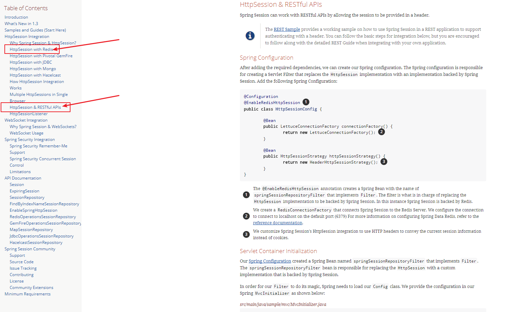
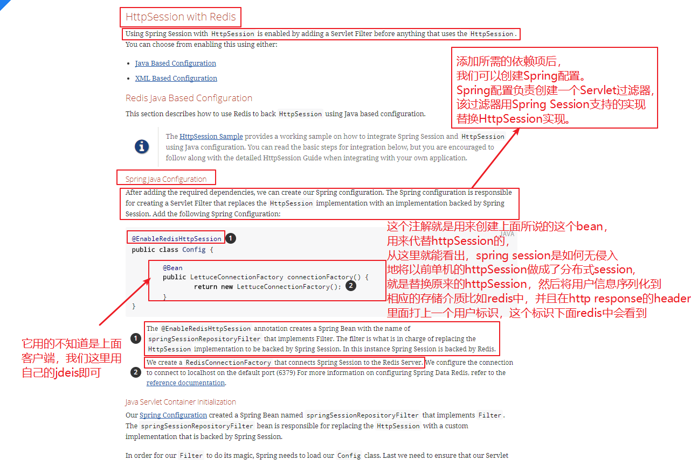
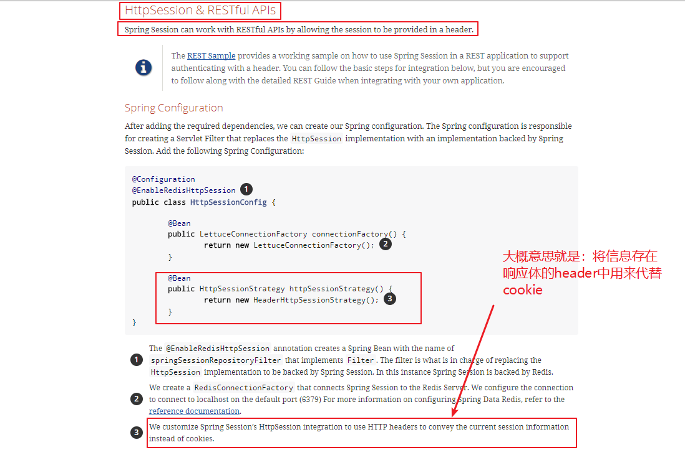
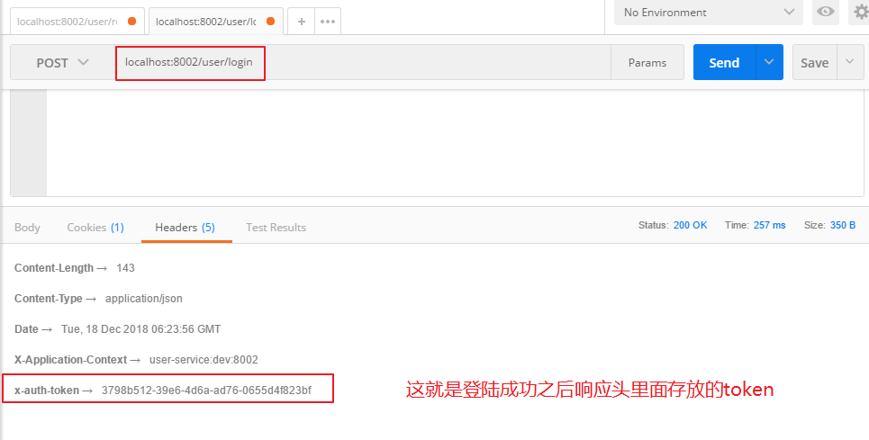
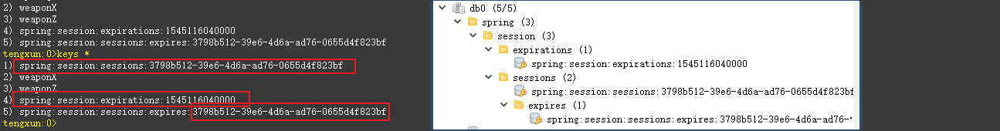

# 04-用户中心(下)

用户的注册和登陆是一个系统最基本的功能，在单系统中，用户的session管理是非常简单的，但是延申到分布式系统中的时候，就不一样了，需要做一个分布式session的管理。在注册这一块，用了Curator封装的分布式锁来控制用户登陆可能出现的用户名重复等问题。

## 用户登陆问题

分库分表如果按照业务字段（手机号码或者邮箱或者其他），耦合性太强，不好扩展。

**这里是直接按照全局唯一的UUID**【++基于twitter开源的snowflake算法，但是snowflake算法的缺陷（强依赖时间，如果时钟回拨，就会生成重复的ID++）】**来进行划分的**，有利于系统的扩展。但是，我这里比如按照邮箱登陆，如何确定去哪一张表中去查询呢？

解决方案：++需要建立一个映射表（关系），可以再系统启动时预先加载到redis中去，首先根据email找到对应的UUID，然后再根据这个UUID来查询。++

登陆因为要记录用户session，这里直接用spring session+redis来管理:

第一步：


```java
@Configuration
@EnableRedisHttpSession //(maxInactiveIntervalInSeconds = 604800)//session超时
public class HttpSessionConfig {

    @Autowired
    private Parameters parameters;

    @Bean
    public HttpSessionStrategy httpSessionStrategy(){
        return  new HeaderHttpSessionStrategy();
    }

    @Bean
    public JedisConnectionFactory connectionFactory(){

        JedisConnectionFactory connectionFactory = new JedisConnectionFactory();

        String redisHost = parameters.getRedisNode().split(":")[0];
        int redisPort = Integer.valueOf(parameters.getRedisNode().split(":")[1]);

        connectionFactory.setTimeout(2000);
        connectionFactory.setHostName(redisHost);
        connectionFactory.setPort(redisPort);
//        connectionFactory.setPassword(parameters.getRedisAuth());

        return connectionFactory;
    }
}
```
ok，这样子其实就配置好了，一开始我也云里雾里的，这是啥玩意？

ok，来spring session的官网(https://spring.io/projects/spring-session)来看看把，我们来看看1.3.4GA版本的文档(https://docs.spring.io/spring-session/docs/1.3.4.RELEASE/reference/html5/#httpsession-rest).


spring session可以存在很多介质中，比如我们的数据源，比如redis，甚至是mongodb等。但是我们常用的是存在redis中，结合redis的过期机制来做。

所以其实我们只要关心如何跟redis整合，以及restful接口。

<div align="center">
    
</div>

那么我们就来看看文档吧！

<div align="center">
    
</div>

好了，我们知道了它的基本原理，下面来看看是如何在restful接口中实现用户session的管理的：

<div align="center">
    
</div>

也就是说要想在restful接口应用中用这种方式，直接告诉spring session:`return  new HeaderHttpSessionStrategy();`即可。进入源码我们就会知道，它默认给这个header里面放置的一条类似于token的名字是`private String headerName = "x-auth-token";`。

那么在用户登陆成功之后，到底存到是什么呢，先来看看响应数据的header里面是什么：

<div align="center">
    
</div>

这一串数字正好可以跟redis中对应上，我们可以先来redis中看看到底在里面存储了啥玩意：

<div align="center">
    
</div>


我们已经看到了想要看到的一串字符串，这里解释一下redis中存储的东西：

* spring:session是默认的Redis HttpSession前缀（redis中，我们常用’:’作为分割符）
* 每一个session都会有三个相关的key，第一个key(spring:session:sessions:37...)最为重要，它是一个HASH数据结构，将内存中的session信息序列化到了redis中。如本项目中用户信息,还有一些meta信息，如创建时间，最后访问时间等。
* 另外两个key，一个是`spring:session:expiration`，还有一个是`spring:session:sessions:expires`，前者是一个SET类型，后者是一个STRING类型，可能会有读者发出这样的疑问，redis自身就有过期时间的设置方式TTL，为什么要额外添加两个key来维持session过期的特性呢？redis清除过期key的行为是一个异步行为且是一个低优先级的行为，用文档中的原话来说便是，可能会导致session不被清除。于是引入了专门的expiresKey，来专门负责session的清除，包括我们自己在使用redis时也需要关注这一点。

这样子，就可以用独立的redis来存储用户的信息，通过前端传来的header里面的token，就可以到redis拿出当前登陆用户的信息了。

OK，在解决了spring session的问题之后，下面就可以来实现登陆啦：

controller:

```java
@RequestMapping("login")
public ApiResult login(@RequestBody @Valid User user, HttpSession session){
    ApiResult<UserElement> result = new ApiResult<>(Constants.RESP_STATUS_OK,"登录成功");

    UserElement ue= userService.login(user);
    if(ue != null){
        if(session.getAttribute(Constants.REQUEST_USER_SESSION) == null){
            session.setAttribute(Constants.REQUEST_USER_SESSION,ue);
        }
        result.setData(ue);
    }

    return result;
}
```

就跟以前一样，将session直接存进去就可以了。


```java
@Override
public UserElement login(User user) {
    UserElement ue = null;
    User userExist = userMapper.selectByEmail(user.getEmail());
    if(userExist != null){
        //对密码与数据库密码进行校验
        boolean result = passwordEncoder.matches(user.getPassword(),userExist.getPassword());
        if(!result){
            throw new MamaBuyException("密码错误");
        }else{
            //校验全部通过，登陆通过
            ue = new UserElement();
            ue.setUserId(userExist.getId());
            ue.setEmail(userExist.getEmail());
            ue.setNickname(userExist.getNickname());
            ue.setUuid(userExist.getUuid());
        }
    }else {
        throw new MamaBuyException("用户不存在");
    }
    return ue;
}
```


## 用户注册问题

从技术角度出发，注册一个网站，再高并发的时候，有可能出现用户名重复这样的问题（虽然一般情况下不会出现这种问题），如何解决呢？

从数据库角度，对于单表，我可以用`select .. for update`悲观锁实现，或者用version这种乐观锁的思想。

更好的方法是将这个字段添加唯一索引，用数据库来保证不会重复。一旦插入重复，那么就会抛出异常，程序就可以捕获到。

但是，我们这里分表了，以上都是针对单表，第一种方案是锁表，不行，设置唯一索引是没有用。怎么办呢？

解决方案：用ZK做一个分布式锁。

首先准备一个ZK客户端，用的是Curator来连接我们的ZK：

具体啥意思，再ZK专题学习中已经详细描述过了。

```java
@Component
public class ZkClient {

    @Autowired
    private Parameters parameters;

    @Bean
    public CuratorFramework getZkClient(){

        CuratorFrameworkFactory.Builder builder= CuratorFrameworkFactory.builder()
                .connectString(parameters.getZkHost())
                .connectionTimeoutMs(3000)
                .retryPolicy(new RetryNTimes(5, 10));
        CuratorFramework framework = builder.build();
        framework.start();
        return framework;

    }

}
```

注册用一个分布式锁来控制：

```java
@Override
public void registerUser(User user) throws Exception {
    InterProcessLock lock = null;
    try{
        lock = new InterProcessMutex(zkClient, Constants.USER_REGISTER_DISTRIBUTE_LOCK_PATH);
        boolean retry = true;
        do{
            if (lock.acquire(3000, TimeUnit.MILLISECONDS)){
                //查询重复用户
                User repeatedUser = userMapper.selectByEmail(user.getEmail());
                if(repeatedUser!=null){
                    throw  new MamaBuyException("用户邮箱重复");
                }
                user.setPassword(passwordEncoder.encode(user.getPassword()));
                user.setNickname("码码购用户"+user.getEmail());
                userMapper.insertSelective(user);
                //跳出循环
                retry = false;
            }
            //可以适当休息一会...也可以设置重复次数，不要无限循环
        }while (retry);
    }catch (Exception e){
        log.error("用户注册异常",e);
        throw  e;
    }finally {
        if(lock != null){
            try {
                lock.release();
                log.info(user.getEmail()+Thread.currentThread().getName()+"释放锁");
            } catch (Exception e) {
                e.printStackTrace();
            }
        }
    }
}
```

思路非常简单，就是先尝试上锁，即`acquire`，但是有可能失败，所以这里用一个超时时间，即`3000ms`之内上不了锁就失败，进入下一次循环。最后释放锁即可。

ok，这里要来说说ZK实现分布式锁了。这里用了开源客户端`Curator`，他对于实现分布式锁进行了封装，但是，我还是想了解一下它的实现原理：

每个客户端对某个方法加锁时，在zookeeper上的与该方法对应的指定节点的目录下，生成一个唯一的瞬时有序节点。 判断是否获取锁的方式很简单，只需要判断有序节点中序号最小的一个。 当释放锁的时候，只需将这个瞬时节点删除即可。同时，其可以避免服务宕机导致的锁无法释放，而产生的死锁问题。

也就是说，最小的那个节点就是Leader，进来判断是不是为那个节点，是的话就可以获取到锁，反之不行。

> 为什么不能通过大家一起创建节点，如果谁成功了就算获取到了锁。 多个client创建一个同名的节点，如果节点谁创建成功那么表示获取到了锁，创建失败表示没有获取到锁。

答：使用临时顺序节点可以保证获得锁的公平性，及谁先来谁就先得到锁，这种方式是随机获取锁，会造成无序和饥饿。


controller层：


```java
@RequestMapping("/register")
public ApiResult register (@RequestBody @Valid User user) throws Exception {

    userService.registerUser(user);

    return new ApiResult(Constants.RESP_STATUS_OK,"注册成功");

}
```
