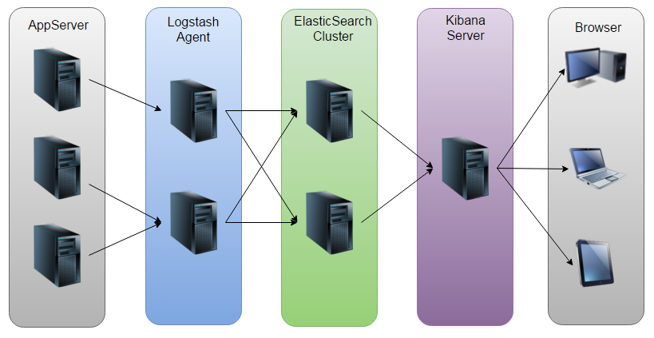
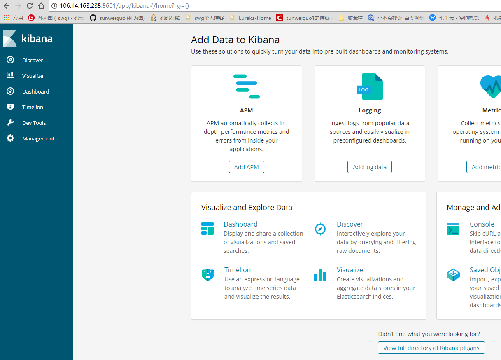
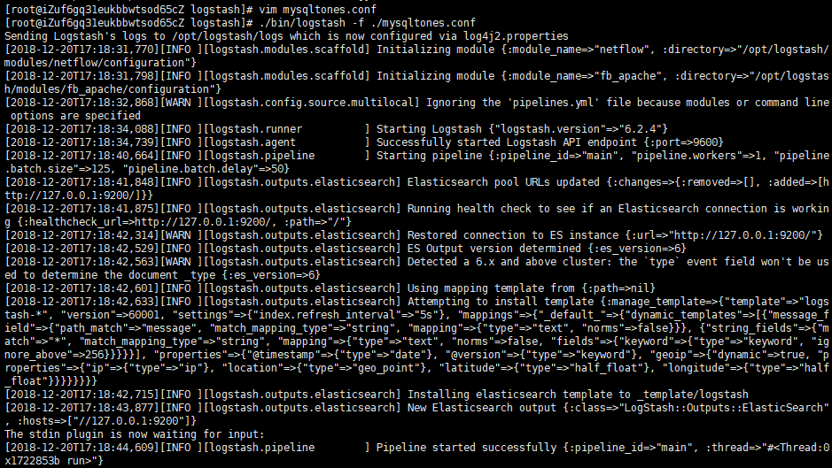
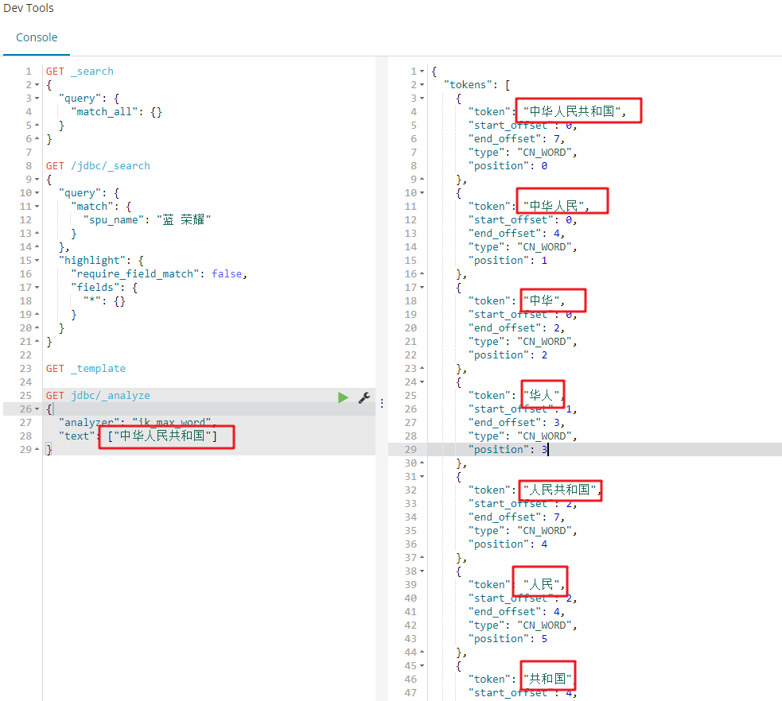
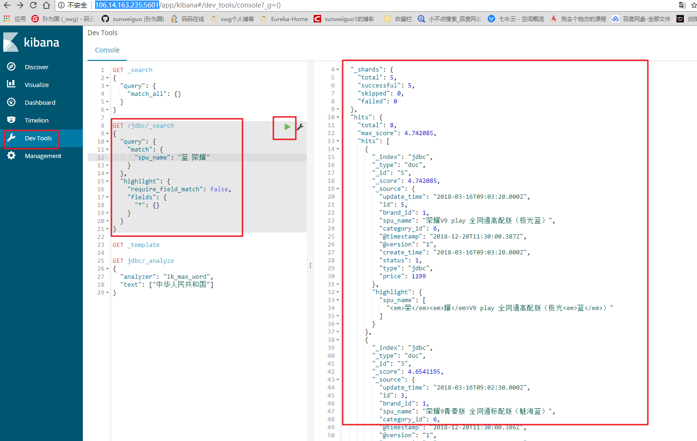

# 06-交易工程(中)## 前言

因为要完成产品的全文搜索这个功能，所以需要准备一下ES的环境。本节安装ELK平台，结合数据库实现全文搜索的功能。

ELK由Elasticsearch、Logstash和Kibana三部分组件组成。 

<div align="center">
    
</div>

Elasticsearch是个开源分布式搜索引擎，它的特点有：分布式，零配置，自动发现，索引自动分片，索引副本机制，restful风格接口，多数据源，自动搜索负载等。 
简单来说，他是个全文搜索引擎，可以快速地储存、搜索和分析海量数据。 

Logstash是一个完全开源的工具，它可以把分散的、多样化的日志日志，或者是其他数据源的数据信息进行收集、分析、处理，并将其存储供以后使用。 

Kibana是一个开源的分析和可视化平台，设计用于和Elasticsearch一起工作。

你用Kibana来搜索，查看，并和存储在Elasticsearch索引中的数据进行交互。

你可以轻松地执行高级数据分析，并且以各种图标、表格和地图的形式可视化数据。

Kibana使得理解大量数据变得很容易。它简单的、基于浏览器的界面使你能够快速创建和共享动态仪表板，实时显示Elasticsearch查询的变化。

## 一、安装ES

### 1.1 首先是安装JDK：


```
cd /opt/

wget --no-cookies --no-check-certificate --header "Cookie: gpw_e24=http%3A%2F%2Fwww.oracle.com%2F; oraclelicense=accept-securebackup-cookie" "http://download.oracle.com/otn-pub/java/jdk/8u141-b15/336fa29ff2bb4ef291e347e091f7f4a7/jdk-8u141-linux-x64.tar.gz"

tar xzf jdk-8u141-linux-x64.tar.gz
```

### 1.2 添加环境变量：


```
vim /etc/profile

JAVA_HOME=/opt/jdk1.8.0_141
JAVA_JRE=$JAVA_HOME/jre
CLASS_PATH=.:$JAVA_HOME/lib/dt.jar:$JAVA_HOME/lib/tools.jar:$JRE_HOME/lib
PATH=$PATH:$JAVA_HOME/bin:$JRE_HOME/bin
export JAVA_HOME JRE_HOME CLASS_PATH PATH


source /etc/profile

java -version
```


### 1.3 下载6.2.4版本：


```
wget https://artifacts.elastic.co/downloads/elasticsearch/elasticsearch-6.2.4.tar.gz
tar -xzvf elasticsearch-6.2.4.tar.gz

tar -zxvf elasticsearch-6.2.4.tar.gz

mv elasticsearch-6.2.4 elasticsearch
```


### 1.4 配置sysctl.conf

```
#修改sysctl配置
vim /etc/sysctl.conf
 
#添加如下配置
vm.max_map_count=262144
 
#让配置生效
sysctl -p
 
#查看配置的数目
sysctl -a|grep vm.max_map_count
```


### 1.5 elasticsearch从5.0版本之后不允许root账户启动


```
#添加用户
adduser dev
 
#设定密码
passwd dev
 
#添加权限
chown -R dev /opt/elasticsearch
 
#切换用户
su dev
 
#查看当前用户
who am i
 
#启动
./elasticsearch/bin/elasticsearch
 
#后台启动
./elasticsearch/bin/elasticsearch -d
```
### 1.6 配置limits.conf

```
vim /etc/security/limits.conf
 
把
* soft nofile 65535
* hard nofile 65535
 
改为
* soft nofile 65536
* hard nofile 65536
 
#切换用户
su dev
 
#查看配置是否生效
ulimit -Hn
```

### 1.7 配置所有用户访问


```
vim /opt/elasticsearch/config/elasticsearch.yml
```


### 1.8 添加一下内容


```
network.host: 0.0.0.0
```
### 1.9 重启

```
ps -ef | grep elastic
kill -9 xxxx
```


### 1.10 测试：


```
curl http://localhost:9200/
```

显示：

```
{
  "name" : "MmiaBfA",
  "cluster_name" : "elasticsearch",
  "cluster_uuid" : "zjX-q5PDRLyrWMy5TiBDkw",
  "version" : {
    "number" : "6.2.4",
    "build_hash" : "ccec39f",
    "build_date" : "2018-04-12T20:37:28.497551Z",
    "build_snapshot" : false,
    "lucene_version" : "7.2.1",
    "minimum_wire_compatibility_version" : "5.6.0",
    "minimum_index_compatibility_version" : "5.0.0"
  },
  "tagline" : "You Know, for Search"
}
```

就说明成功了。


## 二、安装Kibana 6.2.4


```
wget https://artifacts.elastic.co/downloads/kibana/kibana-6.2.4-linux-x86_64.tar.gz

tar -zxvf kibana-6.2.4-linux-x86_64.tar.gz

mv kibana-6.2.4-linux-x86_64 kibana

vim /opt/kibana/config/kibana.yml
```

### 2.1 添加以下内容：


```
server.port: 5601
server.host: "0.0.0.0"
elasticsearch.url: "http://127.0.0.1:9200"
```

### 2.2 切换到bin目录下，启动即可。


```
#不能关闭终端
./kibana  

#可关闭终端
nohup ./kibana &
```
### 2.3 开放防火墙和安全组对应的这个端口

浏览器访问：http://106.14.163.235:5601 看到一个控制台页面就成功啦。


<div align="center">
    
</div>

### 2.4 关闭这个进程


```

ps -ef|grep kibana
 
ps -ef|grep 5601
 
都找不到 
 
尝试 使用 fuser -n tcp 5601
 
kill -9  端口
 
启动即可 ./kibana

或者去这个目录下的.out日志中可以看到看到它占用的pid
```


## 三、logstash


```
# 下载
wget https://artifacts.elastic.co/downloads/logstash/logstash-6.2.4.tar.gz

# 解压
tar -zxvf logstash-6.2.4.tar.gz

# 重命名
mv logstash-6.2.4.tar.gz logstash

# 进入
cd logstash

```


```
# 新建一个配置文件 我这里是mysqltones.conf
input {
    stdin {
    }
    jdbc {
      jdbc_connection_string => "jdbc:mysql://127.0.0.1:3306/mama-buy-trade"
      jdbc_user => "root"
      jdbc_password => "22Daguozi@"

      jdbc_driver_library => "/opt/logstash/mysql-connector-java-5.1.46-bin.jar"
      # the name of the driver class for mysql
      jdbc_driver_class => "com.mysql.jdbc.Driver"
      jdbc_paging_enabled => "true"
      jdbc_page_size => "50000"

      # mysql文件, 也可以直接写SQL语句在此处，如下：
      statement => "SELECT * from t_product"
      # statement_filepath => "/opt/logstash/conf/jdbc.sql"

      # 这里类似crontab,可以定制定时操作，比如每10分钟执行一次同步(分 时 天 月 年)
      schedule => "*/10 * * * *"
      type => "jdbc"

      # 是否记录上次执行结果, 如果为真,将会把上次执行到的 tracking_column 字段的值记录下来,保存到 last_run_metadata_path 指定的文件中
      record_last_run => "true"

      # 是否需要记录某个column 的值,如果record_last_run为真,可以自定义我们需要 track 的 column 名称，此时该参数就要为 true. 否则默认 track 的是 timestamp 的值.
      use_column_value => "true"

      # 如果 use_column_value 为真,需配置此参数. track 的数据库 column 名,该 column 必须是递增的. 一般是mysql主键
      tracking_column => "id"

      last_run_metadata_path => "/opt/logstash/conf/last_id"

      # 是否清除 last_run_metadata_path 的记录,如果为真那么每次都相当于从头开始查询所有的数据库记录
      clean_run => "false"

      # 是否将 字段(column) 名称转小写
      lowercase_column_names => "false"
    }
}

# 此处我不做过滤处理,如果需要，也可参考elk安装那篇
filter {}

output {
    # 输出到elasticsearch的配置
    elasticsearch {
        hosts => ["127.0.0.1:9200"]
        index => "jdbc"

        # 将"_id"的值设为mysql的autoid字段
        document_id => "%{id}"
        template_overwrite => true
    }

    # 这里输出调试，正式运行时可以注释掉
    stdout {
        codec => json_lines
    }
}
```


```
# 启动
./bin/logstash -f ./mysqltones.conf 
```

看到这个就说明成功了：

<div align="center">
    
</div>

## 安装mysql数据库

这一步要在执行logstash之前搞定，我的是阿里云centos7.3版本，mysql版本是5.7，安装过程如下：

```
# 下载MySQL源安装包: 
wget http://dev.mysql.com/get/mysql57-community-release-el7-8.noarch.rpm

# 安装MySQL源：
yum localinstall mysql57-community-release-el7-8.noarch.rpm 

# 检查MySQL源安装情况： 
yum repolist enabled | grep "mysql.*-community.*"

# 安装MySQL: 
yum install mysql-community-server

# 启动MySQL: 
systemctl start mysqld

# 查看MySQL状态: 
systemctl status mysqld

# 设置开机启动MySQL：
systemctl enable mysqld 
systemctl daemon-reload

# 查找并修改MySQL默认密码（注意密码要符合规范，否则会失败）：
grep 'temporary password' /var/log/mysqld.log 

mysql -uroot -p 

alter user root@localhost identified by '你的新密码';

# 远程连接测试添加远程账户：
GRANT ALL PRIVILEGES ON *.* TO '用户'@'%' IDENTIFIED BY '密码' WITH GRANT OPTION;

# 立即生效：
flush privileges;

# 退出MySQL：
exit

# 最后远程将数据给导入数据库
```

## 安装分词器

`ik_max_word`是分词比较细腻的一款，我们就用它来做分词，首先需要安装一下：


```
# 直接安装
./bin/elasticsearch-plugin install https://github.com/medcl/elasticsearch-analysis-ik/releases/download/v6.2.4/elasticsearch-analysis-ik-6.2.4.zip
 
# 重新启动ES
ps -ef | grep elastic
kill -9 xxxx
su dev
./bin/elasticsearch -d
```

对这个分词器在`kibana`中进行测试：


<div align="center">
    
</div>


下面结合数据库模拟一下：

<div align="center">
    
</div>