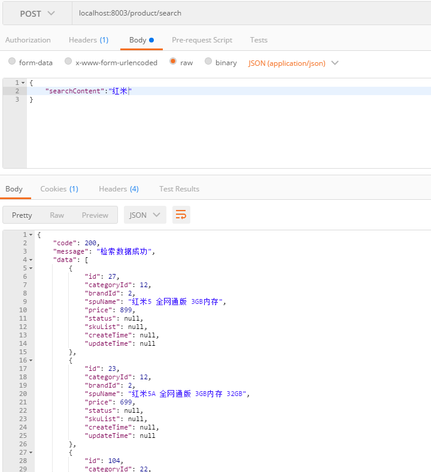
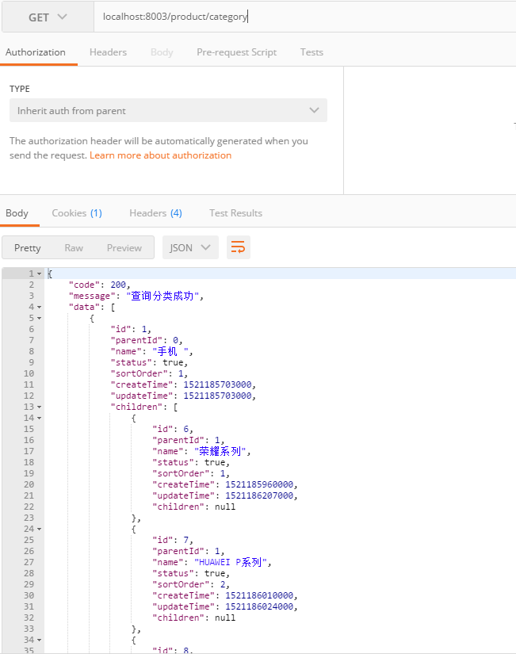
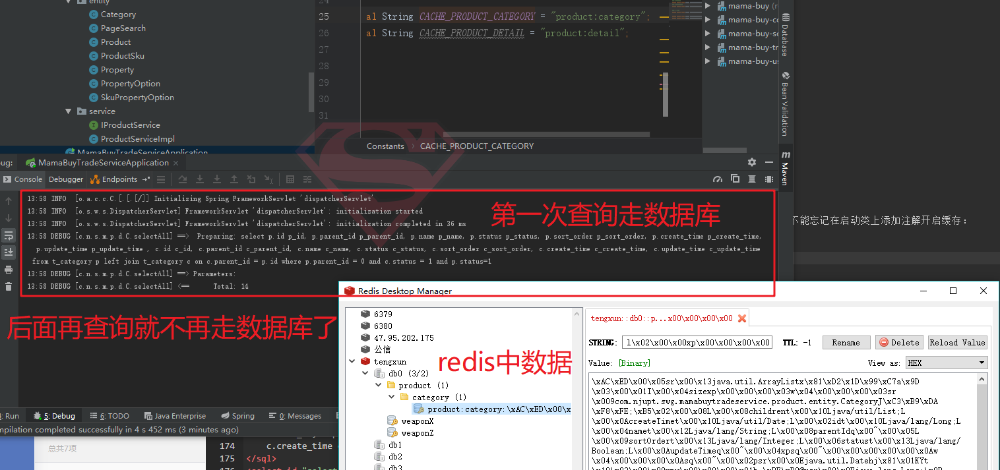

# 07-交易工程(下)

## 一、JEST客户端实现产品搜索接口

上节完成了ELK平台的搭建，经过检验，确实可以实现全文检索的功能，这里在代码层面真正完成产品搜索等服务。

### controller层非常简单：


```java
@RequestMapping("/search")
public ApiResult<List<Product>> searchProduct(@RequestBody PageSearch pageSearch) throws IOException {
    ApiResult<List<Product>> result = new ApiResult<>(200,"检索数据成功");
    List<Product> data = productService.search(pageSearch.getPageNumber(),pageSearch.getPageSize(),pageSearch.getSearchContent());
    result.setData(data);

    return result;
}
```

### 首先引入相关的依赖：

```xml
<!--全文搜索 这里用于商品搜索-->
<dependency>
    <groupId>org.elasticsearch</groupId>
    <artifactId>elasticsearch</artifactId>
</dependency>
<!--全文检索 工具类-->
<dependency>
    <groupId>io.searchbox</groupId>
    <artifactId>jest</artifactId>
</dependency>
```

这里说一说jest。

Jest 是一个Java 版的ElasticSearch Http Rest 客户端，基于HttpClient 封装实现。

因为我们在上一节中用kibana可视化平台发送类似于这样的命令：


```
GET /jdbc/_search
{
  "query": {
    "match": {
      "spu_name": "蓝"
    }
  },
  "highlight": {
    "require_field_match": false,
    "fields": {
      "*": {}
    }
  }
}
```

其实就是说，我们通过kibana给elasticsearch发送了一个restful的一个http get请求，那么现在的问题就是：如何用java代码来封装成这样一个请求。最先想到的肯定是用HttpClient，但是不够方便，正好jest这个工具类帮助我们实现了这个功能。

它就是在httpclient的基础上进行封装，将请求包装成上面那种形式发送给ES，ES给相应信息，它可以接收到，然后我们再解析即可。

要将这个客户端注册到spring中，service层中才能注入使用。


```java
/**
 * ES客户端
 */
@Bean
public JestHttpClient getESClient() throws UnknownHostException {
    JestClientFactory factory = new JestClientFactory();
    factory.setHttpClientConfig(new HttpClientConfig
            .Builder("http://"+parameters.getEsHost())
            .multiThreaded(true)
            .readTimeout(10000)
            .build());
    JestHttpClient client = (JestHttpClient)factory.getObject();
    return client;
}
```


### 具体来看看service层：


```java
/**
 * ES全文检索
 */
@Override
public List<Product> search(int pageNumber, int pageSize, String searchContent) throws IOException {
    if(pageSize==0) {
        pageSize = PAGE_SIZE;
    }
    if(pageNumber<=0) {
        pageNumber = PAGE_NUMBER;
    }

    SearchSourceBuilder searchSourceBuilder = new SearchSourceBuilder();
    //查询，是一种链式的风格，很容易拼接，就是拼接根据上面字段进行匹配，并且支持分页
    searchSourceBuilder.query(QueryBuilders//组合查询
            .boolQuery()
            .must(QueryBuilders.matchQuery("spu_name",searchContent))//must：必须匹配，相当于and；should：相当于or；must not：不匹配
            .must(QueryBuilders.matchQuery("status",1)))//第二个条件是必须是在架的商品
            .from(pageNumber*pageSize)//分页展示的起始位置
            .size(pageSize);//每页展示多少
    //这里就是高亮显示的设置
    searchSourceBuilder.highlight()
            .field("spu_name")
            .preTags("<em>").postTags("</em>")
            .fragmentSize(200);
    //索引，根据索引来查的，我们在logstash中已经设置了这个索引名称
    Search search = new Search.Builder(searchSourceBuilder.toString())
            .addIndex("jdbc")
            .build();
    //响应结果
    SearchResult response = esClient.execute(search);
    String jsonString = response.getJsonString();
    //json字符串的解析
    List<Product> productList = parseResult(jsonString);

    return productList;
}
```

### 下面进行测试：

<div align="center">
    
</div>

## 二、spring cache来实现分类的查询和缓存

### controller接口：

```java
@RequestMapping("/category")
public ApiResult<List<Category>> listCategory(){

    ApiResult<List<Category>> result = new ApiResult<>(200,"查询分类成功");

    List<Category> list =  productService.listCategory();

    result.setData(list);
    return result;
}
```
### 其中service层：

```java
@Override
@Cacheable(cacheNames = Constants.CACHE_PRODUCT_CATEGORY)
public List<Category> listCategory() {
    return categoryMapper.selectAll();
}
```
我们注意到，这里添加了注解`@Cacheable`，这一行注解就可以将其查询出来的结果缓存到redis中，是不是特别地方便。不能忘记在启动类上添加注解开启缓存：


```java
@EnableCaching
```


这里要注意，分类是有层级的，那么展示所有层级的分类有两种方式，一种是直接在sql中实现：


```xml
<sql id="Category_Column_List" >
    p.id p_id, p.parent_id p_parent_id, p.name p_name, p.status p_status, p.sort_order p_sort_order,
    p.create_time p_create_time, p.update_time p_update_time
</sql>
<sql id="Children_Column_List" >
    c.id c_id, c.parent_id c_parent_id, c.name c_name, c.status c_status, c.sort_order c_sort_order,
    c.create_time c_create_time, c.update_time c_update_time
</sql>
<select id="selectAll" resultMap="CategoryResultMap" >
    select 
    <include refid="Category_Column_List" />,
    <include refid="Children_Column_List" />
    from t_category p
    left join t_category c on c.parent_id = p.id
    where p.parent_id = 0 and c.status = 1 and p.status=1
</select>
```

还有一种就是在代码层面实现，思路很简单，就是用一个Set集合，先存放所有的一级分类，然后递归查询它下面的所有子分类。这个方式在电商项目中用到的。本节用的是sql方式直接去查询。

<div align="center">
    
</div>


测试缓存是否生效：

<div align="center">
    
</div>

## 三、商品详情展示


```java
/**
 * 显示商品详情，就是sku
*/
@RequestMapping("/detail/{id}")
public ApiResult<Product> productDetail(@PathVariable Long id){

    ApiResult<Product> result = new ApiResult<>(200,"获取商品详情成功");

    Product product =  productService.productDetail(id);

    result.setData(product);

    return result;

}
```
我们在《交易工程上》中分析了一下，这一块是比较复杂的，因为涉及的东西比较多。这个产品下面有很多的sku，再将那张图拿过来：

<div align="center">
    
</div>

对应着实际页面是：

<div align="center">
    
</div>

那么，从表中我们可以看出，要完成这个详情页面，借助于三张表，那么就对应着三个bean。就是`product`里面包含着`ProductSku`，而`ProductSku`里面包含着`SkuPropertyOption`。


```sql
  <select id="selectByPrimaryKeyWithSku" resultMap="ProductResultMapWithSku" parameterType="java.lang.Long" >
    select
    <include refid="Product_Column_List" />,
    <include refid="Sku_Column_List" />,
    <include refid="Sku_Option_Column_List" />
    from t_product p
    left join t_sku s on s.spu_id = p.id
    left join t_sku_property_option o on  o.sku_id = s.id
    where p.id = #{id,jdbcType=BIGINT} and s.enable_flag = 1 and o.enable_flag = 1
  </select>
```

