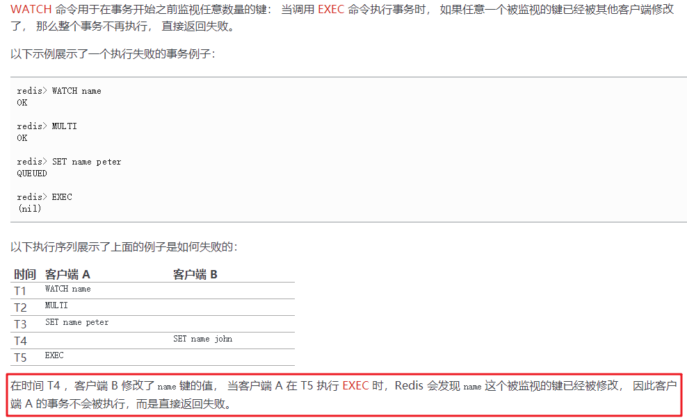
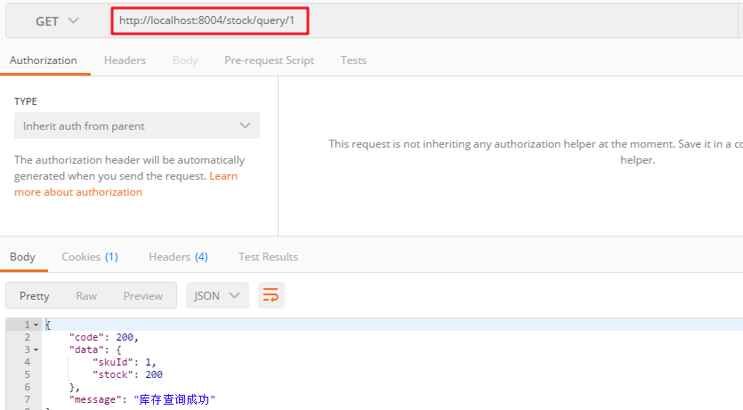
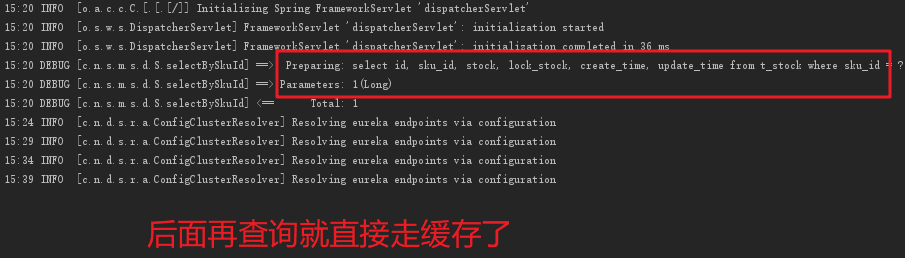
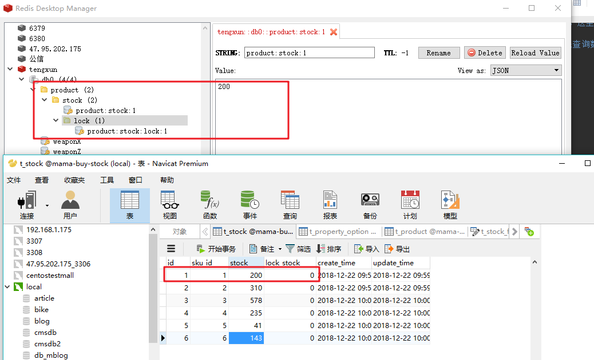

# 08-库存扣减问题

## 一、扣减库存问题分析

在提交订单的时候，要扣减库存，对于sql，是这么写的：

```sql
update t_stcok set stock = stock-2 where sku_id = 1
```

首先这条sql存在超卖问题，很有可能会减成负数。可能会改成如下：

```sql
update t_stcok set stock = stock-2 where sku_id = 1 and stock > 2
```

这样好像解决了超卖问题。但是引入了新的问题。由于库存牵涉进货、补货等系统，所以是个独立的服务。

并且，比如我是通过MQ去通知库存进行扣减库存，但是由于网络抖动，请求扣减库存没有结果，这个时候可能需要进行重试。重试之后，可能成功了，这个时候，有可能这两次都成功了。那么，一个用户买一样东西，但是库存扣了两遍。这就是幂等。如果不做幂等处理，重试会出现上述这种致命问题。

那么如何做到幂等呢？

实际上就是追求数据一致性。那么就可以考虑锁来保证，比如我这里用乐观锁来实现：

```sql
select stock,version from t_stock;
if(stock > 用户购买数量)
    update t_stcok set stock = stock-2 where sku_id = 1 and version = last_version
```

但是，一旦出现并发，那么可能这个用户是执行update失败的，所以还需要去重试(guava retry或者spring retry都可以优雅地实现重试)，直到成功或者库存已经不足。

那么，在少量并发的情况下，可以考虑乐观锁，要不然会大量失败，此时需要用悲观锁：

```sql
select * from t_stock for update;
下面执行update操作。。。
```

在一个事务内，第一句为`select for update`，那么这一行数据就会被本线程锁住，整个事务执行完才能允许其他线程进来。

存在的问题：一个线程锁住这行数据，那么其他线程都要等待，效率很低。

那么，如何保证数据一致性，还可以提高效率呢？

对于扣减库存，往往是先在redis中进行扣减库存。redis是单线程，是高速串行执行，不存在并发问题。

如果是单机redis，可以在同一个事务中保证一次性执行:

```
watch stock
multi
if stock > count
    stock = stock - count;
exec
```

<div align="center">
    
</div>

但是不能在集群中用（分布在不同节点上时），所以用watch不通用。

redis都是原子操作，比如自增:incrby，用这个就可以判断库存是否够。就是所谓的redis预减库存。

但是在实际中，库存表里有两个字段：库存和锁定库存。

锁定库存是表示多少用户真正下单了，但是还没有支付。锁定库存+库存=总库存，等用户真正支付之后，就可以将锁定库存减掉。那么，此时，redis中需要存库存和锁定库存这两个值，上面单一的原子操作就不行了。


解决方案：redis+lua

为什么要用lua呢？可以用lua将一系列操作封装起来执行，输入自己的参数即可。lua脚本在redis中执行是串行的、原子性的。


OK，下面就实战一波：根据skuId查询缓存中的库存值。

## 二、查询库存（设置库存）

首先，我们要明确一点，redis中的库存初始值是由后台的系统人工提前配置好的，在进行商品销售时（用户下单时），直接从redis中先进行库存的扣减。

这里呢，我们没有进行初始化，而是在程序中进行判断：如果redis已经有了这个库存值，就将他查询出来返回；否则，就去数据库查询，然后对redis进行初始化。

这里的一个问题是：如果存在并发问题，但是我们初始化两个值（库存值和库存锁定值），这里采用lua脚本，在lua脚本中完成初始化，并且对于两个用户同时进行初始化库存的问题，可以在lua中进行判断,因为redis是单线程，lua也是单线程，不用担心会同时初始化两次。

下面首先写一个接口，根据skuid查询库存(库存和锁定库存)：


```java
@RequestMapping("/query/{skuId}")
public ApiResult<Stock> queryStock(@PathVariable long skuId){
    ApiResult<Stock>  result = new ApiResult(Constants.RESP_STATUS_OK,"库存查询成功");
    Stock stock = new Stock();
    stock.setSkuId(skuId);

    int stockCount = stockService.queryStock(skuId);

    stock.setStock(stockCount);
    result.setData(stock);
    return  result;
}
```
service层：

```java
@Override
public int queryStock(long skuId) {
    //先查redis
    Stock stock ;
    String stockKey = Constants.CACHE_PRODUCT_STOCK+":"+skuId;
    String stockLockKey = Constants.CACHE_PRODUCT_STOCK_LOCK+":"+skuId;
    
    //只需要查询一个即可，比如我这里只查询库存就行
    Object stockObj = redisTemplate.opsForValue().get(stockKey);
    Integer stockInRedis = null ;
    if(stockObj!=null){
        stockInRedis = Integer.valueOf(stockObj.toString());
    }
    
    //没有，那么我就需要将数据库中的数据初始化到redis中
    if(stockInRedis==null){
        //去数据库查询 然后对redis进行初始化
        stock = stockMapper.selectBySkuId(skuId);
        //两个key和两个库存值通过lua脚本塞到redis中
        //这里如果发生两个用户并发初始化redis，脚本中会进行判断，如果已经初始化了，脚本就会停止执行
        // 设置库存不应该在这配置，应该是后台管理系统进行设置，所以正常情况下，这里redis中应该是必然存在的
        //如果是在后台配置，就没有必要这么复杂了
        redisUtils.skuStockInit(stockKey,stockLockKey,stock.getStock().toString(),stock.getLockStock().toString());
    }else{
        return stockInRedis;//缓存中有就直接返回
    }
    
    //缓存结果可能会返回设置不成功，所以还是返回数据库查询结果
    return stock.getStock();
}
```

那么这个工具类为：


```java
/**
 * 查看redis是否已经初始化好库存初始值，没有就初始化
 */
public static final String STOCK_CACHE_LUA =
        "local stock = KEYS[1] " +
                "local stock_lock = KEYS[2] " +
                "local stock_val = tonumber(ARGV[1]) " +
                "local stock_lock_val = tonumber(ARGV[2]) " +
                "local is_exists = redis.call(\"EXISTS\", stock) " +
                "if is_exists == 1  then " +
                "   return 0 " +
                "else  " +
                "   redis.call(\"SET\", stock, stock_val) " +
                "   redis.call(\"SET\", stock_lock, stock_lock_val) " +
                "   return 1 " +
                "end";
                    
                    
/**
 * @Description 缓存sku库存 以及锁定库存
 */
public boolean skuStockInit(String stockKey,String stockLockKey,String stock,String stockLock){
    //用jedis去执行lua脚本 输入的参数要注意顺序 都是写死的 第一组是key，第二组是stock
    Object result  = redisTemplate.execute((RedisCallback<Object>) redisConnection -> {
        Jedis jedis = (Jedis)redisConnection.getNativeConnection();
        return jedis.eval(STOCK_CACHE_LUA, Collections.unmodifiableList(Arrays.asList(stockKey,stockLockKey))
                ,Collections.unmodifiableList(Arrays.asList(stock, stockLock)));
    });
    if (EXCUTE_SUCCESS.equals(result)) {
        return true;
    }
    return false;
}
```

对于lua脚本进行稍微的解释一下：

```lua
//第一组数据是key数组；第二组数据是args数组，是与key数组对应的值，就是库存
//我们这里第一组为[stockKey,stockLockKey],就是存在redis中的名字，这里是在service层中定义好了
//第二组为[50,0]，这个值就是可以从数据库表t_stock中查询出来的
//因为执行这段lua脚本的话，说明redis中没有缓存的数据，所以需要先查询数据库，然后将缓存设置好
//lua中定义变量用local

local stock = KEYS[1]
local stock_lock = KEYS[2]
local stock_val = tonumber(ARGV[1])
local stock_lock_val = tonumber(ARGV[2])

//再查询一遍缓存是否存在，防止两个线程同时进来设置缓存
//存在就不用设置缓存了，否则就设置缓存

local is_exists = redis.call("EXISTS", stock)
if is_exists == 1  then
    return 0
else
    redis.call("SET", stock, stock_val)
    redis.call("SET", stock_lock, stock_lock_val)
    return 1
end
```

那么，启动工程`mama-buy-stock`：假如我去查询skuId=1的商品：

<div align="center">
    
</div>

第一次库存不存在，那么就会去查询数据库：

<div align="center">
    
</div>

我们再来看看redis中的数据：

<div align="center">
    
</div>

三、扣减库存

下面来看看扣减库存是如何实现的。因为提交订单后，往往是不止一件商品的，往往购物车内有很多件商品，同时过来，假设有五件商品，但是其中只有一件暂时没有库存了，那么我还是希望其他的四件商品能够卖出去，只是没有库存的商品就不算钱了。所以扣减库存用一个map来装，即`Map<skuId,count>`


controller层：

```java
@RequestMapping("/reduce")
public ApiResult<Map<Long,Integer>> reduceStock(@RequestBody List<StockReduce> stockReduceList){
    ApiResult result = new ApiResult(Constants.RESP_STATUS_OK,"库存扣减成功");
    Map<Long,Integer> resultMap =  stockService.reduceStock(stockReduceList);
    result.setData(resultMap);
    return result;
}
```

service层：

```java
@Override
@Transactional
public Map<Long, Integer> reduceStock(List<StockReduce> stockReduceList) {
    Map<Long, Integer> resultMap = new HashMap<>();
    //遍历去减redis中库存，增加锁定库存
    stockReduceList.stream().forEach(param -> {
        String stockKey = Constants.CACHE_PRODUCT_STOCK+":"+param.getSkuId();
        String stockLockKey = Constants.CACHE_PRODUCT_STOCK_LOCK+":"+param.getSkuId();
        Object result = redisUtils.reduceStock(stockKey,
                                               stockLockKey,
                                               param.getReduceCount().toString(),//incrby一个负数，就是减
                                               String.valueOf(Math.abs(param.getReduceCount())));//incrby一个正数，就是加
        if(result instanceof Long){
            //库存不存在或者不足 扣减失败 sku下单失败 记录下来
            resultMap.put(param.getSkuId(),-1);
        }else if (result instanceof List){
            //扣减成功 记录扣减流水
            List resultList =  ((List) result);
            int stockAftChange =  ((Long)resultList.get(0)).intValue();
            int stockLockAftChange = ((Long) resultList.get(1)).intValue();
            StockFlow stockFlow = new StockFlow();
            stockFlow.setOrderNo(param.getOrderNo());
            stockFlow.setSkuId(param.getSkuId());
            stockFlow.setLockStockAfter(stockLockAftChange);
            stockFlow.setLockStockBefore(stockLockAftChange+param.getReduceCount());
            stockFlow.setLockStockChange(Math.abs(param.getReduceCount()));
            stockFlow.setStockAfter(stockAftChange);
            stockFlow.setStockBefore(stockAftChange+Math.abs(param.getReduceCount()));
            stockFlow.setStockChange(param.getReduceCount());
            stockFlowMapper.insertSelective(stockFlow);
            resultMap.put(param.getSkuId(),1);
        }
    });
    return resultMap;
}
```
对于redis的操作，基本与上一致：

```java
/**
 * @Description   扣减库存lua脚本
 * @Return 0  key不存在 错误   -1 库存不足  返回list  扣减成功
 */
public static final String STOCK_REDUCE_LUA=
        "local stock = KEYS[1]\n" +
                "local stock_lock = KEYS[2]\n" +
                "local stock_change = tonumber(ARGV[1])\n" +
                "local stock_lock_change = tonumber(ARGV[2])\n" +
                "local is_exists = redis.call(\"EXISTS\", stock)\n" +
                "if is_exists == 1 then\n" +
                "    local stockAftChange = redis.call(\"INCRBY\", stock,stock_change)\n" +
                "    if(stockAftChange<0) then\n" +
                "        redis.call(\"DECRBY\", stock,stock_change)\n" +
                "        return -1\n" +
                "    else \n" +
                "        local stockLockAftChange = redis.call(\"INCRBY\", stock_lock,stock_lock_change)\n" +
                "        return {stockAftChange,stockLockAftChange}\n" +
                "    end " +
                "else \n" +
                "    return 0\n" +
                "end";
                    
                    
                    
public Object reduceStock(String stockKey,String stockLockKey,String stockChange,String stockLockChange){
    Object result  = redisTemplate.execute((RedisCallback<Object>) redisConnection -> {
        Jedis jedis = (Jedis)redisConnection.getNativeConnection();
        return jedis.eval(STOCK_REDUCE_LUA, Collections.unmodifiableList(Arrays.asList(stockKey,stockLockKey))
                ,Collections.unmodifiableList(Arrays.asList(stockChange, stockLockChange)));
    });

    return result;
}
```
此时，一旦数据库发生异常，那么就会回滚，但是redis中是无法回滚的。这个问题不用担心，因为数据库发生异常是及其严重的问题，是很少会发生的，一旦发生，只需要去这个流水的表中去查看情况，然后去执行脚本去初始化这个redis即可。所以是可以补救的。

但是接口的幂等性还没有做。重复尝试调用这个接口（通常是发生在MQ的失败重传机制，客户端的连续点击一般是可以避免的），可能会重复减redis库存并且重复地去插入流水记录。这个问题该如何解决呢？

## 四、redis分布式锁来实现幂等性

主流的方案，比如有用一张表来控制，比如以这个orderID为唯一主键，一旦插入成功，就可以根据这个唯一主键的存在与否判断是否为重复请求（也就是说，这里的扣减库存和插入去重表放在一个事务里，去重表中有一个字段为orderId，全局唯一不重复，用唯一索引进行约束，那么插入的时候判断这个去重表是否可以插入成功，如果不成功，那么数据库操作全部回滚）。

可以用redis分布式锁给这个订单上锁。以订单id为锁，不会影响其他线程来扣减库存，所以不影响性能。

针对这个订单，第一次肯定是可以去扣减库存的，但是第二次再接收到这个请求，那么就要返回已经成功了，不要再重复扣减。


对于`reduceStock()`这个方法最前面增加锁：


```java
//防止扣减库存时MQ正常重试时的不幂等
//以订单ID 加个缓存锁 防止程序短时间重试 重复扣减库存 不用解锁 自己超时
Long orderNo = stockReduceList.get(0).getOrderNo();
boolean lockResult = redisUtils.distributeLock(Constants.ORDER_RETRY_LOCK+orderNo.toString(),orderNo.toString(),300000);
if(!lockResult){
    //锁定失败 重复提交 返回一个空map
    return  Collections.EMPTY_MAP;
}
...
```


```java
private static final String LOCK_SUCCESS = "OK";
private static final String SET_IF_NOT_EXIST = "NX";
private static final String SET_WITH_EXPIRE_TIME = "PX";
private static final Long EXCUTE_SUCCESS = 1L;

/**lua脚本  在redis中 lua脚本执行是串行的 原子的 */
private static final String UNLOCK_LUA=
        "if redis.call('get', KEYS[1]) == ARGV[1] then " +
                "   return redis.call('del', KEYS[1]) " +
                "else " +
                "   return 0 " +
                "end";

/**
 * @Description 获取分布式锁
 * @Return boolean
 */
public  boolean distributeLock(String lockKey, String requestId, int expireTime){
    String result = redisTemplate.execute((RedisCallback<String>) redisConnection -> {
        JedisCommands commands = (JedisCommands)redisConnection.getNativeConnection();
        return commands.set(lockKey,requestId,SET_IF_NOT_EXIST,SET_WITH_EXPIRE_TIME,expireTime);//一条命令实现setnx和setexpire这些操作，原子性
    });
    if (LOCK_SUCCESS.equals(result)) {
        return true;
    }
    return false;
}

/**
 * @Description 释放分布式锁
 * @Return boolean
 */
public boolean releaseDistributelock(String lockKey, String requestId){
    Object result  = redisTemplate.execute((RedisCallback<Object>) redisConnection -> {
        Jedis jedis = (Jedis)redisConnection.getNativeConnection();
        return jedis.eval(UNLOCK_LUA, Collections.singletonList(lockKey), Collections.singletonList(requestId));//lua脚本中原子性实现：get查询和delete删除这两个操作
    });
    if (EXCUTE_SUCCESS.equals(result)) {
        return true;
    }
    return false;
}
```

注意，这里不需要我们主动去释放分布式锁，只要设置一个大于重试时间的过期时间即可。让它自己删除。

注意redis在集群下做分布式锁，要用Redission。