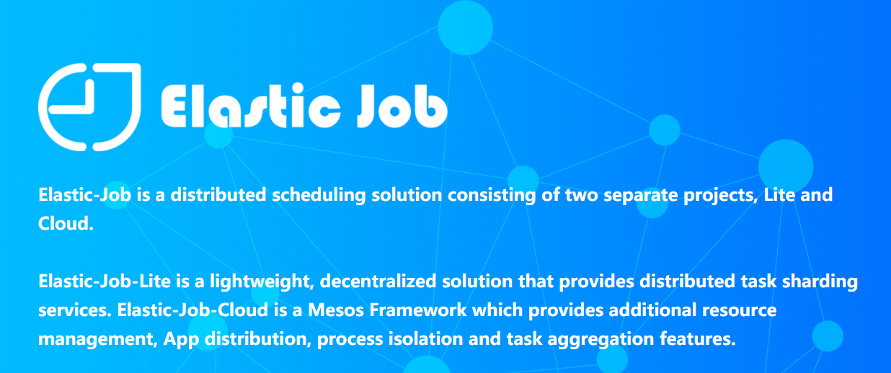
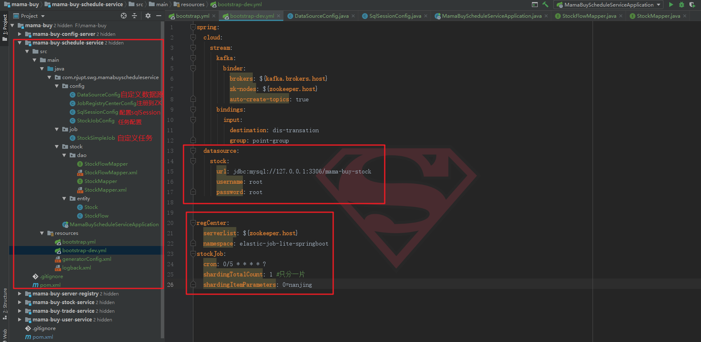
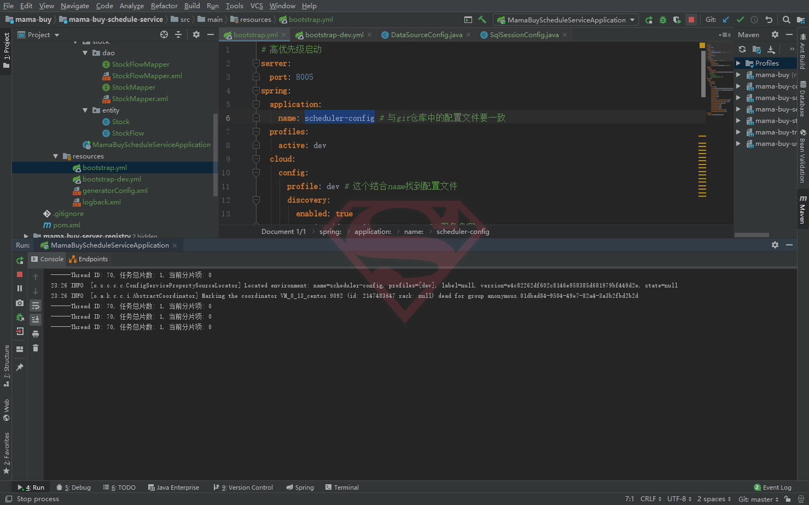

# 09-分布式定时任务

<div align="center">
    
</div>


我们上节进行了库存的扣减，解决了并发扣减库存问题和接口幂等性，操作在库存流水表中进行了记录，下面需要一个定时任务来定时将流水表中的数据同步到库存表中。

关于定时调度，我们接触过`quartz`，在单机中应用是完全没有问题的。虽然`quartz`也给我们提供了集群版本，但是是一种依赖数据库的解决方案。

本节首先尝试整合`Elastic-Job`，目标是让其每5秒钟打印一句话，所以也算是`Elastic-Job`入门demo。


根据官网整合[spring-boot的demo](https://github.com/elasticjob/elastic-job-example/tree/master/elastic-job-example-lite-springboot)的pom文件中，我们就可以大概知道要导入什么包。

## 一、相关依赖

```xml
<!--elastci job核心包-->
<dependency>
    <groupId>com.dangdang</groupId>
    <artifactId>elastic-job-lite-core</artifactId>
</dependency>
<dependency>
    <groupId>com.dangdang</groupId>
    <artifactId>elastic-job-lite-spring</artifactId>
</dependency>
<!--操作zk节点-->
<dependency>
    <groupId>org.apache.curator</groupId>
    <artifactId>curator-recipes</artifactId>
</dependency>
<dependency>
    <groupId>org.apache.curator</groupId>
    <artifactId>curator-test</artifactId>
</dependency>
...省略其他的spring-boot等依赖
```

## 二、配置文件

```properties
spring:
  cloud:
    stream:
      kafka:
        binder:
          brokers: ${kafka.brokers.host}
          zk-nodes: ${zookeeper.host}
          auto-create-topics: true
      bindings:
        input:
          destination: dis-transation
          group: point-group
  <!--以上是关于spring config的内容，可以删除-->
  
  <!--自定义数据源-->
  datasource:
    stock:
      url: jdbc:mysql://127.0.0.1:3306/mama-buy-stock
      username: root
      password: root

# 因为依赖于ZK,所以需要确定zk位置；下面是确定定时时间、分片数
regCenter:
  serverList: ${zookeeper.host}
  namespace: elastic-job-lite-springboot
stockJob:
  cron: 0/5 * * * * ?
  shardingTotalCount: 1 #只分一片
  shardingItemParameters: 0=nanjing
```

首先，按照以前的步骤创建`mama-buy-schedule-service`这个工程。

<div align="center">
    
</div>

## 三、代码层面

### 1，按照官方的demo，首先关闭自动注入数据源：

```java
@SpringBootApplication(exclude = {
        DataSourceAutoConfiguration.class
})
public class MamaBuyScheduleServiceApplication {

    public static void main(String[] args) {
        SpringApplication.run(MamaBuyScheduleServiceApplication.class, args);
    }

}
```

### 2，自定义数据源：

```java
@Configuration
public class DataSourceConfig {

    @Bean("stockDataSource")
    @ConfigurationProperties(prefix = "spring.datasource.stock")//根据配置文件前缀创建数据源
    public DataSource stockDataSource(){
        return DataSourceBuilder.create().build();
    }

}
```

### 3，创建`sqlSessionFactory`和`SqlSessionTemplate`：

```java
@Configuration
@MapperScan(basePackages = {"com.njupt.swg.mamabuyscheduleservice.stock.dao"},sqlSessionFactoryRef = "stockSqlSessionFactory")
public class SqlSessionConfig {
    @Autowired
    @Qualifier("stockDataSource")
    private DataSource stockDataSource;

    @Bean(name = "stockSqlSessionFactory")
    public SqlSessionFactory stockSqlSessionFactory() throws Exception {
        SqlSessionFactoryBean factoryBean = new SqlSessionFactoryBean();
        factoryBean.setDataSource(stockDataSource);
        return  factoryBean.getObject();
    }
    @Bean("stockSqlSessionTemplate")
    public SqlSessionTemplate stockSqlSessionTemplate () throws Exception {
        SqlSessionTemplate template = new SqlSessionTemplate(stockSqlSessionFactory());
        return template;
    }
}
```
### 4，注册到ZK上：

```java
@Configuration
@ConditionalOnExpression("'${regCenter.serverList}'.length() > 0")//注解确保有zk，没有就报错
public class JobRegistryCenterConfig {

    @Bean(initMethod = "init")
    public ZookeeperRegistryCenter regCenter(@Value("${regCenter.serverList}") final String serverList, @Value("${regCenter.namespace}") final String namespace) {
        return new ZookeeperRegistryCenter(new ZookeeperConfiguration(serverList, namespace));
    }

}
```

### 5，定义任务：

```java
public class StockSimpleJob implements SimpleJob {
    @Override
    public void execute(ShardingContext shardingContext) {
        System.out.println(String.format("------Thread ID: %s, 任务总片数: %s, 当前分片项: %s",
                Thread.currentThread().getId(), shardingContext.getShardingTotalCount(), shardingContext.getShardingItem()));


        /**
         * 实际开发中，有了任务总片数和当前分片项，就可以对任务进行分片执行了
         * 比如 SELECT * FROM user WHERE status = 0 AND MOD(id, shardingTotalCount) = shardingItem
         */
    }
}
```


### 6，任务配置类：

```java
@Configuration
public class StockJobConfig {

    @Autowired
    private ZookeeperRegistryCenter regCenter;

    @Bean
    public SimpleJob stockJob(){
        return new StockSimpleJob();
    }

    <!--直接copy-->
    @Bean(initMethod = "init")
    public JobScheduler simpleJobScheduler(final SimpleJob simpleJob, @Value("${stockJob.cron}") final String cron, @Value("${stockJob.shardingTotalCount}") final int shardingTotalCount,
                                           @Value("${stockJob.shardingItemParameters}") final String shardingItemParameters) {
        return new SpringJobScheduler(simpleJob, regCenter, getLiteJobConfiguration(simpleJob.getClass(), cron, shardingTotalCount, shardingItemParameters));
    }

    /**
     * <!--直接copy-->
     *@Description  任务配置类
     */
    private LiteJobConfiguration getLiteJobConfiguration(final Class<? extends SimpleJob> jobClass,
                                                         final String cron,
                                                         final int shardingTotalCount,
                                                         final String shardingItemParameters){
        return LiteJobConfiguration
                .newBuilder(
                        new SimpleJobConfiguration(
                                JobCoreConfiguration.newBuilder(
                                        jobClass.getName(),cron,shardingTotalCount)
                                        .shardingItemParameters(shardingItemParameters)
                                        .build()
                                ,jobClass.getCanonicalName()
                        )
                )
                .overwrite(true)
                .build();

    }
}
```
<div align="center">
    
</div>