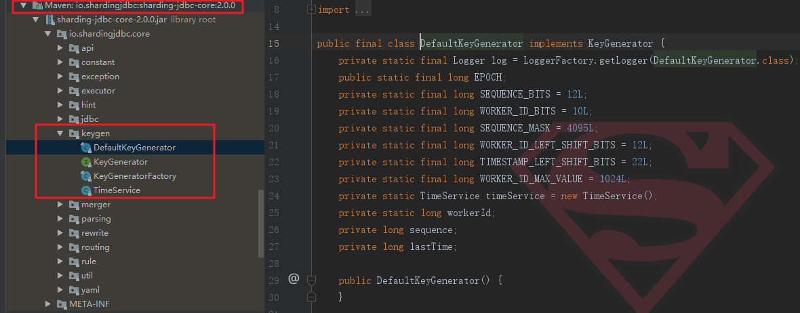
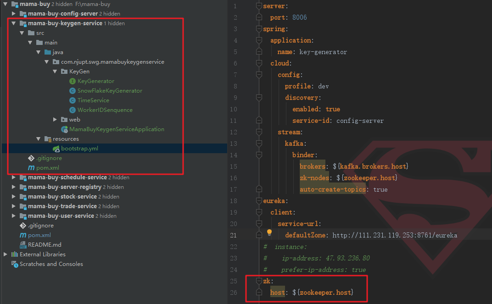
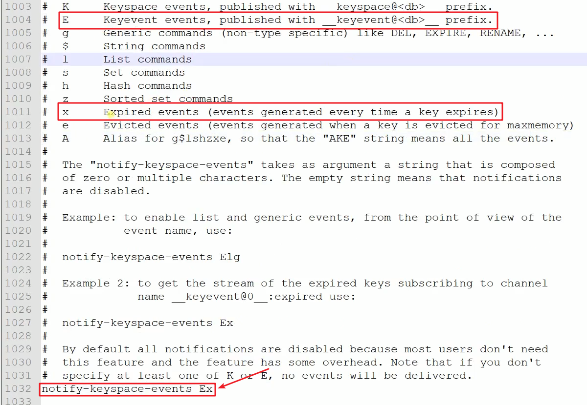

# 10-用户下单

又到了订单模块，这里直接将购物车这一块省略，假设用户已经在购物车选了很多商品之后，现在开始准备下订单。

我们知道，在库存服务中，我们已经将库存充足的商品记录在`Map`中，并且将每个商品库存扣减状态和锁定库存扣减状态都记录下来了。

在我们的下单服务中，最先想到的是为订单号生成全局唯一的ID，这里利用之前提到过的雪花算法来实现。具体的实现过程是从`ShardingJDBC`中的ID生成复制过来的：

<div align="center">
    
</div>

## 一、全局唯一ID生成服务

新建`mama-buy-keygen-service`工程：

<div align="center">
    
</div>

参照上一个写法即可，注入自己的zk地址。

要写一个接口供其他的服务调用：


```java
@RestController
@RequestMapping
public class KeyGeneratorController {

    @Autowired
    @Qualifier("snowFlakeKeyGenerator")
    private KeyGenerator keyGenerator;

    @RequestMapping("/keygen")
    public String generateKey() throws Exception {
        return String.valueOf(keyGenerator.generateKey().longValue());
    }

}
```

## 二、购物车、订单表结构分析

<div align="center">
    
</div>

其实这个关系是很明朗的了，但是我们要注意一点就是，我们知道，扣减库存服务，如果发现库存不足了或者其他问题，那么返回的是`<skuId,-1>`，如果扣减成功，返回的是`<skuId,1>`。用户在下订单的时候，可能有部分商品库存已经不足，但是又不能影响其他库存足的商品导致整个订单出问题，所以在生成订单的时候，需要将库存不足的给移除出订单详情表，价格肯定是不能算进去的，并且要提示用户这个商品库存已经不足，无法购买，继续支付的话，只能支付其他库存充足的产品。

Ok，对于关系和注意点说明清楚之后，下面就要进行实际的编码了。

## 三、创建订单逻辑

我们首先注意到订单有几种状态，我们这里简化一下状态，用枚举来表示：


```java
public enum TradeStatus {

    WAITING_PAY("等待支付",(byte)1),
    TRADE_CANCEL("订单取消",(byte)2),
    TRADE_PAIED("订单已支付",(byte)3),
    TRADE_CLOSE("订单关闭",(byte)4),
    ;

    TradeStatus(String desc, byte value) {
        this.desc = desc;
        this.value = value;
    }

    private String desc;

    private  byte value;
    
    //省略get和set方法...
}
```

controller层去创建订单：

```java
@RequestMapping("/order")
public ApiResult<List<TradeItem>> createOrder(@RequestBody List<TradeItem> tradeItemList){

    ApiResult<List<TradeItem>> result = new ApiResult(Constants.RESP_STATUS_OK,"订单提交成功");

    List<TradeItem> tradeItemSuccResult =tradeService.createOrder(tradeItemList);
    result.setData(tradeItemSuccResult);

    return  result;
}
```
现在来到我们的service层，进行创建订单的细节。思路为：

- 第一步：为订单生成唯一订单号（已经在ID生成服务中解决，调用接口即可）
- 第二步：构建扣减库存用到的reduceList（遍历传进来的`tradeItemList`接口）
- 第三步：扣减完库存，获取到是`Map<skuID,status>`，status为-1说明库存不足，无法购买；为1说明库存充足，扣减成功；
- 第四步：根据`skuID`可以拿到`skuList`，并且遍历`Map<skuID,status>`根据status将扣减失败的商品移除出`tradeItemList`
- 第五步：创建订单主表
- 第六步：遍历处理完后的`tradeItemList`配合`skuList`写入订单详情表
- 第七步：返回`tradeItemList`结束。

关于调用ID生成服务，那就需要用到`Feign`了，首先在引入依赖后在主函数上声明注解：

```java
@EnableFeignClients
```
然后找到对应的服务名+接口就可以去调用了：

```java
@FeignClient(name = "key-generator",fallback = KeyGeneratorServiceFallback.class)
public interface KeyGenServiceClient {
    @RequestMapping("/keygen")
    String keyGenerator();
}

//取不到的时候就返回null
public class KeyGeneratorServiceFallback implements KeyGenServiceClient{
    @Override
    public String keyGenerator() {
        return null;
    }
}
```
具体的service层逻辑代码：

```java
@Override
@Transactional
public List<TradeItem> createOrder(List<TradeItem> tradeItemList) {
    //拿到唯一ID
    String orderNo = keyGenServiceClient.keyGenerator();
    Long tradeNo = Long.parseLong(orderNo);
    Long userId = tradeItemList.get(0).getUserUuid();
    //构建扣减库存用到的reduceList
    List<StockReduce> stockReduceList = new ArrayList<>();
    tradeItemList.stream().forEach(
            param->{
                StockReduce stockReduce = new StockReduce();
                stockReduce.setOrderNo(tradeNo);
                stockReduce.setSkuId(param.getSkuId());
                stockReduce.setReduceCount(-param.getQuantity());

                stockReduceList.add(stockReduce);
            }
    );
    //扣减库存,只是从redis中预减库存和写入流水表，真正的库存表是在定时任务中用流水表去同步
    ApiResult<Map<Long,Integer>> stockResult =  stockServiceClient.reduceStock(stockReduceList);
    Map<Long,Integer> stockResultMap = stockResult.getData();

    //查询相关SKU的属性
    List<ProductSku> skuResult = productSkuMapper.selectBySkuIdList(stockResultMap.keySet());

    //判断库存逻辑  插入订单
    Trade trade = new Trade();
    trade.setTradeNo(tradeNo);
    trade.setStatus(TradeStatus.WAITING_PAY.getValue());
    trade.setUserUuid(userId);
    tradeMapper.insertSelective(trade);
    //将扣减库存失败的商品选出来，然后去tradeItems中去移除
    stockResultMap.keySet().stream().forEach(
            param->{
                //扣库存失败的移除
                if(stockResultMap.get(param)==-1){
                    TradeItem tradeItem =  tradeItemList.stream().filter(
                            item->item.getSkuId()==param
                    ).findFirst()
                            .get();
                    tradeItemList.remove(tradeItem);
                }
            }
    );
    //计算商品价格等信息
    tradeItemList.stream().forEach(
            param->{
                ProductSku sku = skuResult.stream().filter(
                        skuParam->param.getSkuId()==skuParam.getId()
                ).findFirst()
                        .get();
                param.setTradeNo(tradeNo);
                param.setSkuImageUrl(sku.getImgUrl());
                param.setSkuName(sku.getSkuName());
                param.setCurrentPrice(sku.getSkuPrice());
                param.setTotalPrice(sku.getSkuPrice().multiply(new BigDecimal(param.getQuantity())));

                tradeItemMapper.insertSelective(param);
            }
    );

    return tradeItemList;
}
```
## 四、创建订单可能存在的问题

这个时候，会存在一个问题，如果在redis扣减库存成功之后，后面的数据库插入抛出异常甚至出现错误，那么这个时候，订单没有存进库里，但是redis已经扣减库存成功。由于事务只能保证这里的数据库回滚，但是redis是不会回滚的，就会造成数据的不一致，这里就涉及到了分布式事务，该如何解决呢？

如果是发生了跨库，还涉及redis等情况，这里可能需要分布式事务来保证，但是这里暂时还用不到，因为这里比较特殊，虽然我库存已经扣了，但是订单没有入库，由于是这边的数据库出问题，用户那边肯定是报错的，然后用户肯定是无法进行支付的，如果还是想买，那么就重新下订单，说不定下次就可以成功，只是流水表中多了一条废弃记录而已和redis中扣了此次废弃记录对应的库存。

那么，既然还没有支付，那么这个没用的订单只是存在于流水表中。那么，我只需要有一个定时任务，去定时扫描这个流水表，如果发现这个订单已经过期了（或者可以拿着这个订单号去订单表去查，如果连记录都没有，那么说明是下单失败这种场景，直接释放锁定库存即可），这个时候锁定库存就会归位，达到了最终一致性。

定时扫描是一种比较有效的方法，但是根据其定时间隔，对于订单超时而言，可能会有一定时间的延迟才可能将其库存归位。

这里还有一种比较及时的方式是，`orderNo`为key，设置过期时间，比如15分钟，一旦到了15分钟，说明这个订单超时了（如果在超时时间内正常支付了，那么就将这个key删除掉），那么redis就进行一个事件通知，自动告诉程序：这个订单超时了（超时这里就会有两种情况：用户下单成功未支付超时；用户下单失败，订单表压根就没有这条记录，但是已经写到了流水表中并且也扣了库存这种异常情况），那么我就可以根据这个信息，获得超时的那个订单号，如果订单表存在，我将其状态进行更新为“订单超时未支付”状态；如果订单表不存在，啥都不用做或者删除流水表即可；最后，我就可以放心地释放锁定库存（更新redis，更新库存表）。

要达到redis key过期事件通知的效果，需要现在redis中配置一下过期事件：

<div align="center">
    
</div>

在创建完订单之后设置redis订单号过期:

```java
//设置redis 订单号过期
redisTemplate.opsForValue().set(tradeNo.toString(),tradeNo.toString(),20, TimeUnit.MINUTES);
```

下面要监听一个事件：


```java
@Configuration
public class OrderKeyExpriedHandler {
    @Bean
    public RedisMessageListenerContainer configRedisMessageListenerContainer(RedisConnectionFactory redisConnectionFactory){
        RedisMessageListenerContainer listenerContainer = new RedisMessageListenerContainer();
        listenerContainer.setConnectionFactory(redisConnectionFactory);
        listenerContainer.addMessageListener((message,listener)->{
        
            //处理key过期事件逻辑，new String(message.getBody())就是设置进去的orderNo
            System.out.println("------redis过期事件"+new String(message.getBody()));
            
        }, new PatternTopic("__keyevent@*__:expired"));
        return listenerContainer;
    }
}
```

由于网络抖动，可能会出现各种情况，导致这种事件发不出来或者监听不到，所以我们还要用清点库存定时任务来辅助，自动再去扫描一遍流水表或者订单表，看看是不是还有过期没有释放的记录。