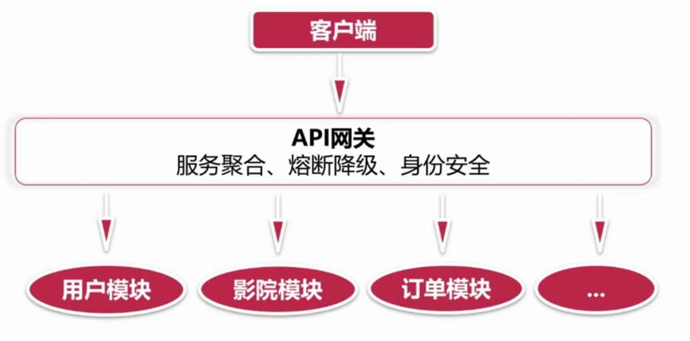
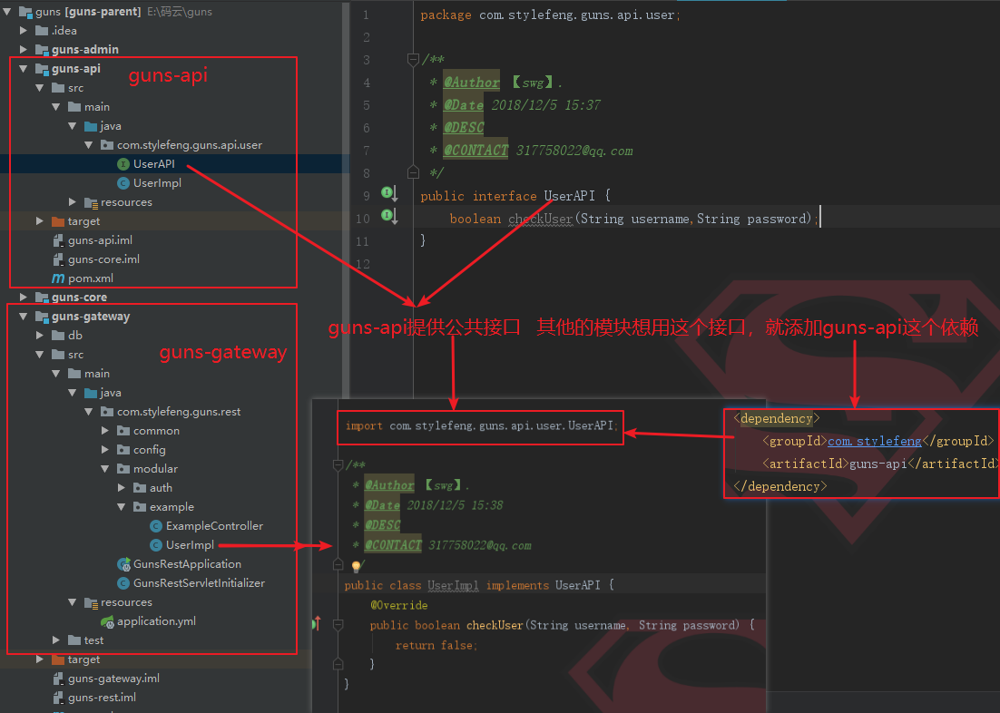

# 猫眼电影项目实战2-构建基于Guns+SpringBoot+Dubbo的框架

## API网关


关于网关，在学习spring cloud的时候，已经详细介绍过了。简单说一说网关的好处，一个是可以屏蔽掉访问内部接口的细节，比如ip地址和端口号，网关直接给你一个入口，你调用这个无内部细节的入口就可以调用到里面实际的服务器的接口，一定程度上保证了安全性；另一个是用户访问的服务，往往是几个服务的串联，比如用户查看订单，那么就要先判断是否登陆，可能走的是UserService，然后要将订单调出来，同时订单里面有商品信息，那么还要走ProductService，很麻烦，网关可以聚合这些服务，给一个统一入口，用户只要调一次即可。还有其他的一些好处，网关可以做安全校验，可以做负载均衡，可以做静态处理，可以做检测，可以屏蔽掉不同系统的通信协议等等等。


总结来说，API网关是微服务系统的门面。


<div align="center">
    
</div>

## Guns

[Guns](https://gitee.com/naan1993/guns/tree/v3.1/)基于SpringBoot,致力于做更简洁的后台管理系统,完美整合springmvc + shiro + mybatis-plus + beetl + flowable的一个开源整合系统。基于他，我们可以快速地搭建应用系统。这里主要用的是V4.0版本。

首先根据guns-rest下的db创建响应的数据库和表。并注意application.yml中的连接数据库的用户名和密码。

启动guns-rest的时候可能会报错。

第一次报错：提示log4j包找不到.我们只需要去给他添加依赖即可：


```xml
<dependency>
    <groupId>log4j</groupId>
    <artifactId>log4j</artifactId>
    <version>1.2.17</version>
</dependency>
```

第二次报错说myabtis那边连接有点问题。修改application.yml下数据源的url为：


```
url: jdbc:mysql://127.0.0.1:3306/guns_rest?autoReconnect=true&useUnicode=true&characterEncoding=utf8&serverTimezone=GMT%2B8
```


这样就应该可以正常启动了，为了测试，在浏览器中输入：

http://localhost/auth?userName=admin&password=admin

看是否返回一个token。这是[JWT](https://www.jianshu.com/p/576dbf44b2ae)的一个应用。

那么guns基本就引入成功了。


## API网关

拷贝一份guns-rest，重新命名为guns-api，作为我们的API网关服务。他要依赖于dubbo和zookeeper。所以要整合这两者。具体不再赘述。

## API公共接口

因为很多接口是公共依赖的，所以需要将这些接口单独抽取出来放在一起，然后统一以jar包的形式提供。这就需要将 guns-core 拷贝一份叫做 guns-api 。

可以在里面测试一下，写一个接口`UserAPI`.

然后在 guns-gateway 中依赖于这个 guns-api ，然后拿到这个接口。比较简单，具体看代码。

==这边要特别注意==：一个是要对写好的这个 guns-api 进行 maven 的 install 操作。另一个是要在 parent 的 Pom 文件里面添加这个jar包的依赖:


<div align="center">
    
</div>


注意，别忘记在 parent 中要将我们新加入的 module 添加管理。

这里将新建的 guns-user 模块添加进来做一个测试。

首先是从 guns-gateway 这里拷贝一份。这个服务主要是提供关于用户的一些基本操作。比如登陆等功能。这里主要测试一下网关调用用户服务功能，使其打通。

那么，显然，现在的关系是， guns-user 是服务提供者， guns-gateway 是服务调用者。我在 guns-api 中定义一个接口叫做 login 。


```java
public interface UserAPI {
    String login(String username,String password);
}
```


然后 guns-user 要集成 dubbo 和 zk ，注意他不需要进行鉴权，所以 application.yml 文件中的配置改为：


```
rest:
  auth-open: false #jwt鉴权机制是否开启(true或者false)
  sign-open: false #签名机制是否开启(true或false)
```

并且给他分配一个端口号，我这里是8081.这里我主要定义一个实现类来实现login接口


```java
@Component
@Service(interfaceClass = UserAPI.class)
public class UserServiceImpl implements UserAPI{
    @Override
    public String login(String username, String password) {
        return "=====username="+username+",password="+password;
    }
}
```
在我的 guns-gateway 中调用这个 login 方法。为了方便测试，直接在 guns-gateway 中的 AuthController 鉴权的时候进行测试。

```java
@RestController
public class AuthController {

    @Reference(interfaceClass = UserAPI.class)
    private UserAPI userAPI;

    @Autowired
    private JwtTokenUtil jwtTokenUtil;

    @Resource(name = "simpleValidator")
    private IReqValidator reqValidator;

    @RequestMapping(value = "${jwt.auth-path}")
    public ResponseEntity<?> createAuthenticationToken(AuthRequest authRequest) {
        //测试能不能接受参数并且调用成功gate-user里面的Login方法
        System.out.println(userAPI.login(authRequest.getUserName(),authRequest.getPassword()));
        
        ...
```

浏览器访问：http://localhost:8080/auth?userName=admin&password=admin

看控制台结果。