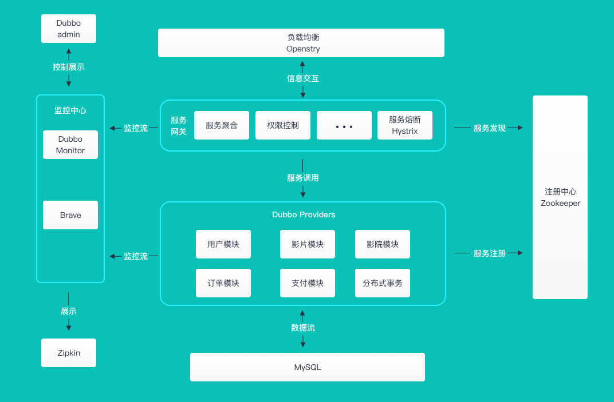
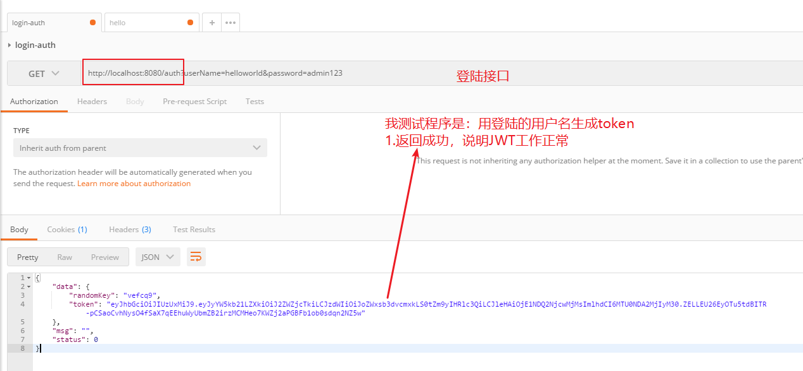
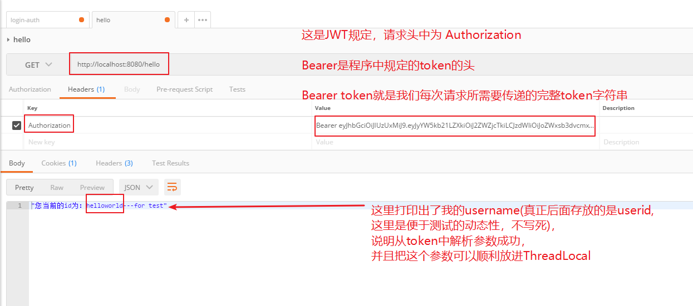
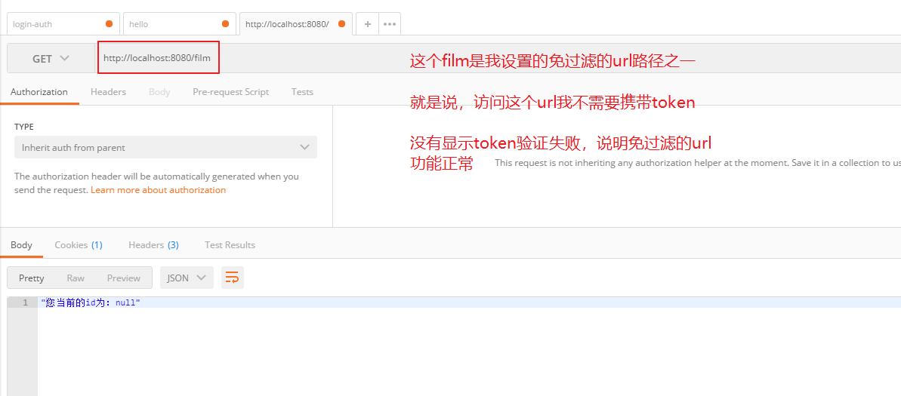
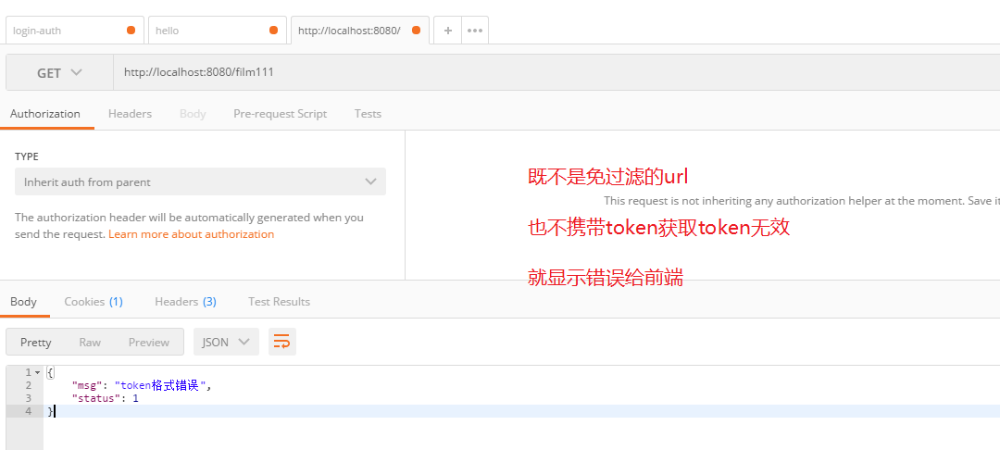
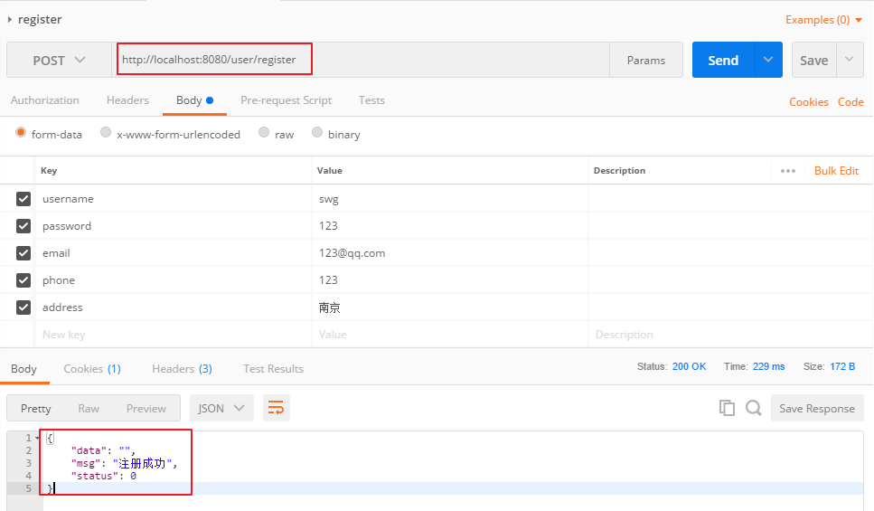
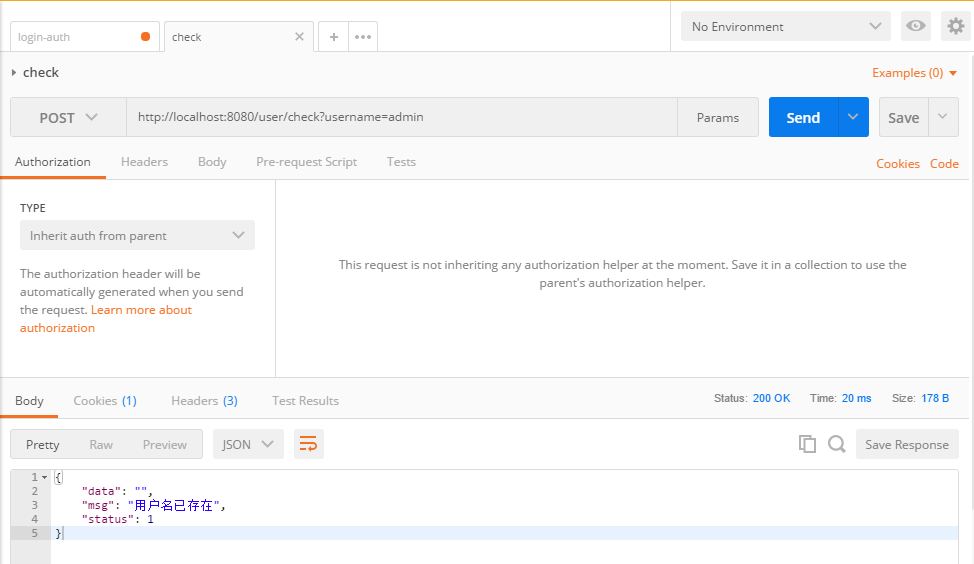
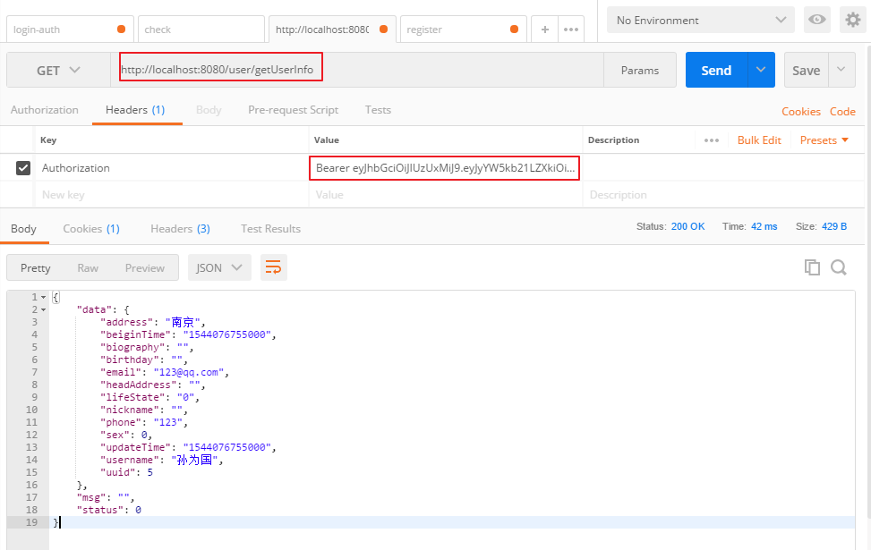
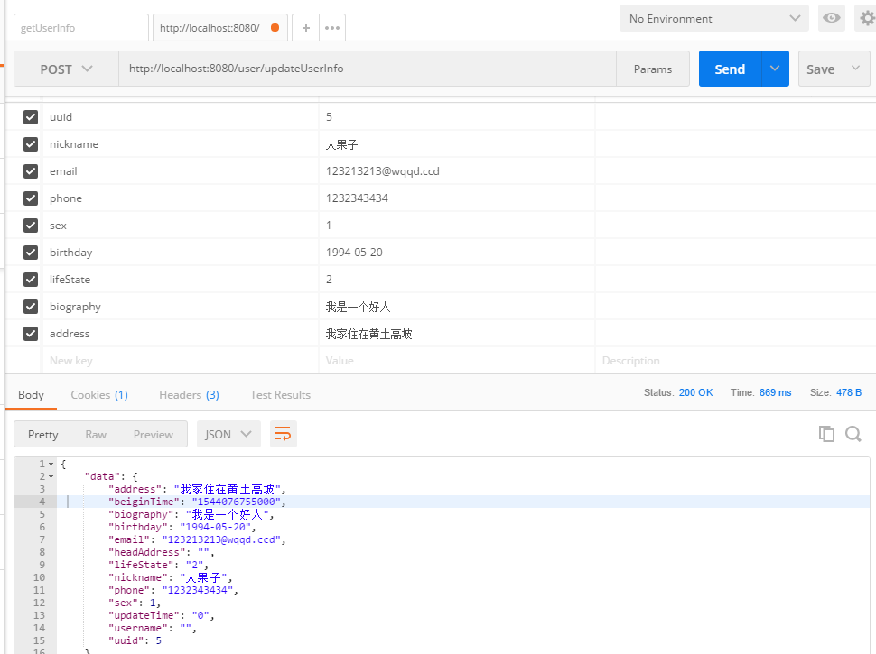

# 猫眼电影项目实战3-用户模块

首先，从整体看一下项目架构。

<div align="center">
    
</div>

我们注意到，负载均衡和网关服务其实跟代码没什么关系，是单独在一个地方。

核心的业务模块分别为：用户模块，影片模块，影院模块，订单模块，支付模块这五大模块。

将这些模块全部注册到ZK上，通过dubbo进行互相的服务调用。

最后，是mysql数据库以及链路监控。

实现了微服务中最基本也是最核心的一套服务治理方案。本节主要是完成用户模块的开发。

核心的内容是：

- API网关权限验证和其他服务交互
- dubbo负载均衡
- 修改JWT模块
    - 增加忽略URL配置
    - 修改返回内容匹配业务
    - 增加ThreadLocal的用户信息保存


### 1. 忽略列表

在`guns-gateway`项目中，我们需要配置一些路径使其不受JWT验证，该如何做呢？

找到`application.yml`文件，找到jwt前缀，增加一个属性`ignore-url`：


```
jwt:
  header: Authorization   #http请求头所需要的字段
  secret: mySecret        #jwt秘钥
  expiration: 604800      #7天 单位:秒
  auth-path: auth         #认证请求的路径
  md5-key: randomKey      #md5加密混淆key
  ignore-url: /user/,/film #忽略列表
```

因为这是自定义的一个属性，我们需要让他知道，在路径/config/JwtPropertiws中增加这个属性，并且添加get和set方法。


```java
//新自定义的忽略列表
private String ignoreUrl = "";

public String getIgnoreUrl() {
    return ignoreUrl;
}

public void setIgnoreUrl(String ignoreUrl) {
    this.ignoreUrl = ignoreUrl;
}
```
那么，在哪里真正地匹配呢？显然是找到他的一个过滤器类：`AuthFilter`

对路径进行判断：


```java
//配置忽略列表
String ignoreUrl = jwtProperties.getIgnoreUrl();
String[] ignoreUrls = ignoreUrl.split(",");
for(String url:ignoreUrls){
    if(request.getServletPath().equals(url)){
        //忽略
        chain.doFilter(request, response);
        return;
    }
}
```
### 2. 统一的响应格式


```java
@Data
public class ResponseVO<M> {
    //0标识成功，1标识业务失败，999标识系统异常
    private int status;
    private String msg;
    private M data;

    private ResponseVO(){}

    public static<M> ResponseVO success(M data){
        ResponseVO responseVO = new ResponseVO();
        responseVO.setStatus(0);
        responseVO.setData(data);
        return responseVO;
    }

    public static<M> ResponseVO serviceFail(String message){
        ResponseVO responseVO = new ResponseVO();
        responseVO.setStatus(1);
        responseVO.setMsg(message);
        return responseVO;
    }

    public static<M> ResponseVO appFail(String message){
        ResponseVO responseVO = new ResponseVO();
        responseVO.setStatus(999);
        responseVO.setMsg(message);
        return responseVO;
    }
}
```
那么对于`AuthController`中的验证用户名和密码的方法中，在通过验证之后，我们就需要将`userid`放进`token`中，然后以`ResponseVO`返回。


在以后每次请求需要登陆的页面时，请求先来到`AuthFilter`中，需要将token中的`userId`拿出来重新放进`ThreadLocal`中。

所以下面时定义一个线程本地类。

### 3. ThreadLocal

新建一个类叫`CurrentUser`:


```java
public class CurrentUser {
    private static final ThreadLocal<String> threadLocal = new ThreadLocal<String>();

    public static void saveUserId(String userId){
        threadLocal.set(userId);
    }

    public static String getUserId(){
        return threadLocal.get();
    }
}
```

为了测试方便，我们在`AuthController`直接给定一个`userId`给他生成token：


```java
@RestController
public class AuthController {
    @Autowired
    private JwtTokenUtil jwtTokenUtil;

    @Reference(interfaceClass = UserAPI.class)
    private UserAPI userAPI;

    @RequestMapping(value = "${jwt.auth-path}")
    public ResponseVO createAuthenticationToken(AuthRequest authRequest) {
        boolean validate = true;


        //验证用户名和密码，如果通过，就将其userid返回，放进jwt中生成token
//        int userId = userAPI.login(authRequest.getUserName(),authRequest.getPassword());
//        if(userId == 0){
//            validate = false;
//        }

        String userId = authRequest.getUserName()+"---for test";

        if (validate) {
            final String randomKey = jwtTokenUtil.getRandomKey();
            //用userid生成token
            final String token = jwtTokenUtil.generateToken(userId+"", randomKey);
            return ResponseVO.success(new AuthResponse(token, randomKey));
        } else {
            return ResponseVO.serviceFail("用户名或者密码错误");
        }
    }
}
```
生成之后，我们请求/hello这个路径，看能不能把`userId`打印出来：


```java
@Controller
@RequestMapping("/hello")
public class ExampleController {

    @RequestMapping("")
    public ResponseEntity hello() {

        System.out.println(CurrentUser.getUserId());

        return ResponseEntity.ok("您当前的id为："+CurrentUser.getUserId());
    }
}
```
### 4. postman测试

首先是启动`zk`，然后依次启动`guns-user`和`guns-gateway`，因为`guns-gateway`中依赖了`guns-user`的方法。顺序反的话会报错。


首先测试登陆验证接口`localhost://8080/auth`，看是否正常返回一个token

<div align="center">
    
</div>

请求hello接口，这个接口是需要token的，看能不能正常解析token：

<div align="center">
    
</div>

测试免过滤的接口：

<div align="center">
    
</div>

测试需要登陆的接口，看是否返回指定的提示信息：

<div align="center">
    
</div>

ok，一切正常，说明JWT这一块设计的验证、解析token、放进ThreadLocal、免过滤url设定、成功和失败的返回信息格式都是正确的。下面开始实现真正的用户模块功能。


## 用户模块

### 登陆

因为系统已经默认集成了auth鉴权，这可以作为一个登陆的入口。只是需要在其基础上除了增加以上的功能，还需要增加一个真正的登陆功能。

逻辑是：在JWT验证成功返回token之前，需要进行login的逻辑校验。对于用户名和密码都校验通过后，再返回token。


```java
public int login(String username, String password) {
    MoocUserT moocUserT = new MoocUserT();
    moocUserT.setUserName(username);
    MoocUserT result = moocUserTMapper.selectOne(moocUserT);
    if(result != null && result.getUuid() > 0){
        String md5PassWd = MD5Util.encrypt(password);
        if(result.getUserPwd().equals(md5PassWd)){
            return result.getUuid();
        }
    }
    return 0;
}
```


### 注册

逻辑业务写在`guns-user`中，暴露接口。调用在`guns-gateway`中，比较简单。
```java
@PostMapping("/register")
public ResponseVO register(UserModel userModel){
    //验证用户名不能为空
    if(userModel.getUsername() == null || userModel.getUsername().trim().length() == 0){
        return ResponseVO.serviceFail("用户名不能为空");
    }
    //验证密码不能为空
    if(userModel.getPassword() == null || userModel.getPassword().trim().length() == 0){
        return ResponseVO.serviceFail("密码不能为空");
    }
    boolean isSuccess = userAPI.register(userModel);
    if(isSuccess){
        return ResponseVO.success("注册成功");
    }
    return ResponseVO.serviceFail("注册失败");
}


@Override
public boolean register(UserModel userModel) {
    MoocUserT moocUserT = new MoocUserT();

    //将注册信息转换为数据实体
    moocUserT.setUserName(userModel.getUsername());
    moocUserT.setUserPwd(MD5Util.encrypt(userModel.getPassword()));//加密
    moocUserT.setEmail(userModel.getEmail());
    moocUserT.setAddress(userModel.getAddress());
    moocUserT.setUserPhone(userModel.getPhone());

    //存进数据库
    Integer insertResult = moocUserTMapper.insert(moocUserT);
    if(insertResult > 0){
        return true;
    }
    return false;
}
```

<div align="center">
    
</div>

### 校验username

就是给一个接口，校验用户名是否已经存在，比较简单。

<div align="center">
    
</div>

### 登出

比较完善的写法是JWT结合redis，这个后续可以完善一下。

完善的思想暂定为：

首先是JWT会生成一个token，他的有效期为配置文件中默认的7天。

将userid-token一一对应存在redis中，设置缓存时间比如为30min。

在用户进行任何操作的时候，首先是从redis中拿，看这个userid-token是否还存在，存在说明是活跃用户，那么就刷新他的缓存时间。如果已经不存在，就提醒用户重新登陆。

对于登出功能，那么删除缓存就可以啦。

### 获取用户信息

也是非常简单的，注意的一点是，一个从本地线程中拿的，一个是从参数中传递来的，这两者校验一下是否相等，防止横向越权。

<div align="center">
    
</div>

### 更新用户信息

更新用户同上。

<div align="center">
    
</div>

个人觉得，完成的有点粗糙。。。