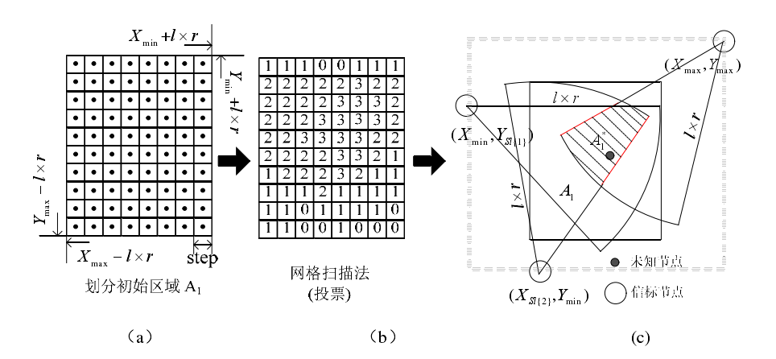

# 三、关于引入泰森多边形+网格扫描+模拟退火算法的可行性研究

为了避免全局洪泛带来的能量损耗，引入泰森多边形。同时采用未知节点跳数信息和与信标节点的距离作为约束条件，运用网格扫描迭代缩小小未知节点的范围，最后，通过模拟退火完全确定位置节点的位置。

这种方案一方面是考虑极大空间上节点定位的性能损耗，另一方面，逐渐缩小区间来提高定位精度，我认为是一种比较好并且可行的方案。

## 泰森多边形

泰森多边形，又叫冯洛诺伊图(Voronoi diagram)，它由一组连接两邻点直线的垂直平分线组成的连续多边形组成。n 个离散点随机分布在一个平面上，根据最邻近的原则对平面进行划分形成多个多边形，多边形中的所有点距离相应离散点
最近。

通过简单地画个图，我们就可以知道，如果按照某几个点进行划分出来的几个区域，在这个区域内的所有点到该节点的距离一定是最小的。

	

那么，我们就可以通过这种划分，不需要获取其他区域的信标节点的位置了，只要考虑本区域内信标节点来求出未知节点的坐标。

算法的实施步骤：

* 首先一级信标节点(假设r = 3)向邻居节点广播自身位置信息的分组。网络中的未知节点通过节点间的信息交换，得到距离各一级信标节点的最小跳数。
* 网络中节点根据最小跳数寻找自己所属泰森多边形(由一级信标节点对区域划分得到)。当未知节点到多个一级信标节点最小跳数相同时，则采用最先得到跳数的一级信标节点。
* 在每个泰森多边形中，信标节点(所有信标节点，包括一级信标节点和二级信标节点)根据其它信标节点的位置和相隔最小跳数来计算平均每跳距离，并将其广播至网络中。
* 未知节点根据第一次收到的跳距值，及到所属多边形中每个信标节点的最小跳数，来计算自身到各信标节点的距离。并联合未知节点跳数信息，及与信标节点的距离作为约束条件，对未知节点的坐标值进行求解。

方案中使用泰森多边形将网络划分r个区域，使未知节点只接收距离较近的局部范围内的信标节点信息，限制了未知节点接收一定跳数范围的数据包，这样减少了通信开销的同时也改善了定位性能，并且解决了由于MAC层冲突产生的较大跳数的错误节点信息。

## 网格扫描

光用泰森多边形，还是不够，虽然他完美划分了区域，避免了很多的问题，但是精度还是不能保证。

在未知节点获得距所属的泰森多边形中所有信标节点的最小跳数时，采用网格扫描法，迭代求解缩小未知节点的范围。最后用模拟退火根据约束找出最优的坐标。

算法的思想：

- 确定泰森多边形中未知节点S每跳信标节点的集合； 
- 初步确定未知节点S所在区域：对于最小跳数集合(HopS)中具有最小值(假如是l跳，最大值h，因为算法中使用泰森多边形将监测区域划分为了r个小区域，因此h和l差值不会太大，防止了算法的计算量过于复杂)的信标节点集合。

我们可以根据这个集合，比如是1-5跳的所有集合都在这。我们先从1跳的信标节点集合触发，确定最原始的位置，为什么可以这么做呢?因为节点只能与在其通信范围内的节点通信，那么，我的这个未知节点周围一圈的一跳的信标节点所构成的范围必然将未知节点包围，所以我取最右上角和最左下角的信标节点构成的矩形作为初始区域，并且未知节点一定在这个初识区域里面。

拿到这个矩形之后，对其以某个值进行划分，将其划分为N*N的一个网格。算法初始化每个网格中数值为0.

下面就是再拿到2跳的所有信标节点，按照上面的步骤，也画出一个区域，算法计算其重叠区域，将重叠的区域的值加1。

不断迭代，直到我们规定的迭代的最大的跳数为止。这个时候我们就可以得到一个相对比较小的一个区域，未知节点一定是属于这个区域的。

	

## 模拟退火

ok，拿到这个区域之后，就比较简单了，我们已经知道的条件有：

- 未知节点到这个区域中所有信标节点的最小跳数和对应信标节点的坐标信息
- 拿上面个条件作为约束，就是说，我要求的坐标要求距离这些信标节点的距离越小，那么这个点就越可能是我未知节点的坐标，那么约束条件就可以是某个坐标到信标节点距离之和的最小值
- 再加上迭代出来的区域，结合模拟退火算法的尝试，在这个区域内找出最满足约束条件的那个坐标

## 总结

本想法是基于硕士论文：《无线传感器网络非测距定位算法研究》中的“一种基于区域划分网格扫描的非测距定位算法”进行模拟退火的改造。作者是：王晓丽