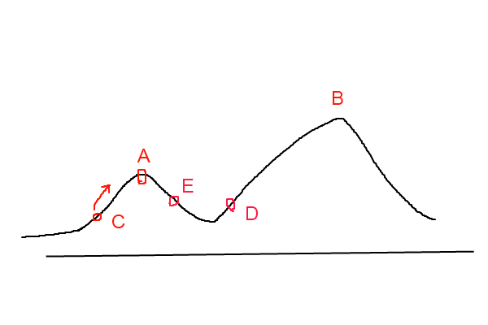

    

## 一. 爬山算法 ( Hill Climbing )

爬山算法是一种简单的贪心搜索算法，该算法每次从当前解的临近解空间中选择一个最优解作为当前解，直到达到一个局部最优解。

爬山算法实现很简单，其主要缺点是会陷入局部最优解，而不一定能搜索到全局最优解。如图1所示：假设C点为当前解，爬山算法搜索到A点这个局部最优解就会停止搜索，因为在A点无论向那个方向小幅度移动都不能得到更优的解。

    

## 二. 模拟退火(SA,Simulated Annealing)思想

爬山法是完完全全的贪心法，每次都鼠目寸光的选择一个当前最优解，因此只能搜索到局部的最优值。模拟退火其实也是一种贪心算法，但是它的搜索过程引入了随机因素。模拟退火算法以一定的概率来接受一个比当前解要差的解，因此有可能会跳出这个局部的最优解，达到全局的最优解。以图1为例，模拟退火算法在搜索到局部最优解A后，会以一定的概率接受到E的移动。也许经过几次这样的不是局部最优的移动后会到达D点，于是就跳出了局部最大值A。

模拟退火算法描述：

> 若J( Y(i+1) )>= J( Y(i) )  (即移动后得到更优解)，则总是接受该移动
> 
> 若J( Y(i+1) )< J( Y(i) )  (即移动后的解比当前解要差)，则以一定的概率接受移动，而且这个概率随着时间推移逐渐降低（逐渐降低才能趋向稳定）

这里的“一定的概率”的计算参考了金属冶炼的退火过程，这也是模拟退火算法名称的由来。

根据热力学的原理，在温度为T时，出现能量差为dE的降温的概率为`P(dE)`，表示为：

> P(dE) = exp( dE/(kT) )

其中`k`是一个常数，`exp`表示自然指数，且`dE<0`。这条公式说白了就是：温度越高，出现一次能量差为`dE`的降温的概率就越大；温度越低，则出现降温的概率就越小。又由于`dE`总是小于0（否则就不叫退火了），因此`dE/kT < 0` ，所以`P(dE)`的函数取值范围是(0,1) 。

随着温度`T`的降低，`P(dE)`会逐渐降低。

我们将一次向较差解的移动看做一次温度跳变过程，我们以概率`P(dE)`来接受这样的移动。

- https://www.cnblogs.com/heaad/archive/2010/12/20/1911614.html
- https://blog.csdn.net/qq_34861102/article/details/77899555