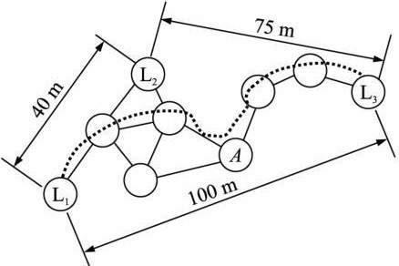
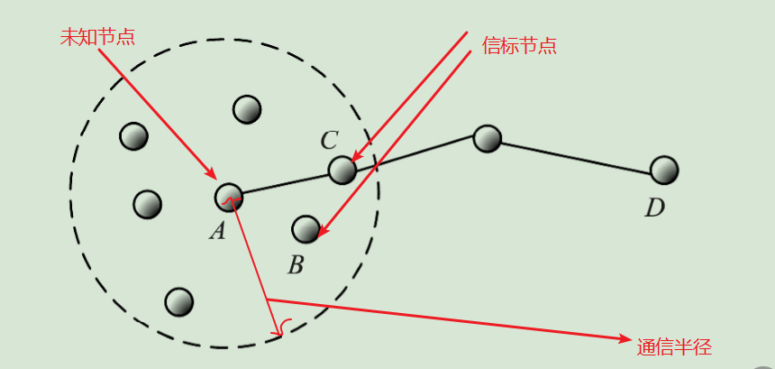
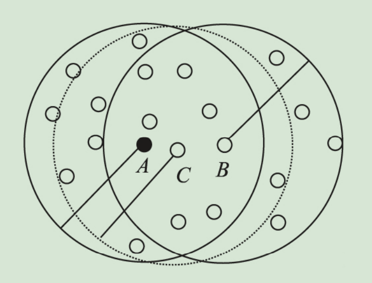

# 四、引入相近度结合模拟退火来改进DV-Hop算法定位精度的简单想法

## DV-Hop算法的基本思想

* 计算跳数

每个传感器节点都维护着自己的一张表{ID, x, y,hop}，其中ID 表示锚节点的唯一标识，(x, y) 是锚节点的坐标，hop 是未知节点到锚节点的最小跳数。

锚节点首先通过洪泛(Flooding)方式广播自身坐标信息到网络中，其中跳数hop初始为0，未知节点接收广播数据并将到每个锚节点的最小跳数记录在表中，与到同一锚节点的其他路径中的跳数做比较，如果其他路径跳数大则直接忽略，保证节点的跳数是它到锚节点的最小跳数，将跳数值加1之后，然后分发给邻居节点。

通过此阶段，将保证所有节点得到全部锚节点的坐标和最小跳数。

* 估计距离

锚节点根据其他锚节点的坐标和最小跳数，可以算出每个锚节点自身的平均跳距。

当锚节点计算出自身的平均跳距之后，便将计算的平均跳距广播分发在整个网络，之后未知节点只接收和记录离它最近锚节点的平均跳距，并把它直接转发给邻居节点。

* 节点定位

通过第(2)阶段，未知节点接收到离它最近锚节点的平均跳距和跳数后，根据到至少3个锚节点的距离，采用三边定位或极大似然估计法来实现节点定位。

 
* 举例

	

如图所示， 经过第1和第2阶段， 能够计算出信标节点L1 与L2、L3 之间的距离和跳数。信标节点L2 计算得到校正值（即每跳平均距离）为（ 40 +75） / （ 2+ 5） = 16. 42.假设未知节点A 从L2 获得校正值， 则它与3 个信标节点之间的距离分别为L1: 3 ×16. 42, L2: 2 ×16. 42, L3: 3×16. 42, 最后可利用三边测量法确定节点A 的位置。

我们从图中也能看出，在这种信标节点分布不均匀的时候，用这种平均距离来计算误差会很大，而且误差会随着未知节点到锚节点跳数的增加而累加。所以下面第一步是对这种测距的值要进行优化。

## 测距值优化

考虑一个简单的问题：

	

假定 A 是未知节点。B、C、D 为锚节点。从图中可知，节点 A 离锚节点 B、C 均是一跳。依据DV-Hop原始的算法计算，节点 A 离锚节点 B、C 距离是相等的。而实际上，它们的距离并不相等。

此时，如果未知节点A是从信标节点B上获取了平均跳距，显然会比从信标节点C上获取的误差大。并且随跳数增加而被累积。显然，在利用单一平均跳距进行测距时，增加测距误差。因此，必须对测距值进行修正。

具体而言，未知节点先计算离各锚节点的距离远近，再依据远近程度对测距值进行修正。

那如何标识远近呢？引用相近度变量来反映。比如有三个节点，判断AC短还是AB短？在我们的节点定位中，将两个节点通信半径内的节点个数并集除以交集，可以有效地反应节点的远近。

	

以上图为例。Crad(Set A ∪Set B )= 21、Crad(Set A ∩Set B )= 7。因此，节点 A 与 B 的相近度 λ AB=21/7=3

λ Ac = 17/12≈1．42，由于 λ AB ＞λ AC ，说明节点C离节点A更近，而节点B离节点A更远，其更接近于通信半径 Ｒ。

那么，对于未知节点来说，在他的通信半径内，我们可以求出一个信标节点与之有最大的相近度，以这个最大相近度为近似于通信半径R，那么根据到通信范围内其他信标节点的相近度，按照比例可以很好地对其距离进行修正。

对于本方案，结合所有可以与未知节点通信的信标节点综合考虑。对于R内的信标节点(一跳)，通过相近度修正距离；对于2*R范围内的信标节点（两跳），同样的方式修正距离。。。

那么，我们就可以初步得到这个未知节点到所有可以通信的节点的估计距离了。

最后结合模拟退火算法和估计距离的约束来求出该未知节点的最优坐标。