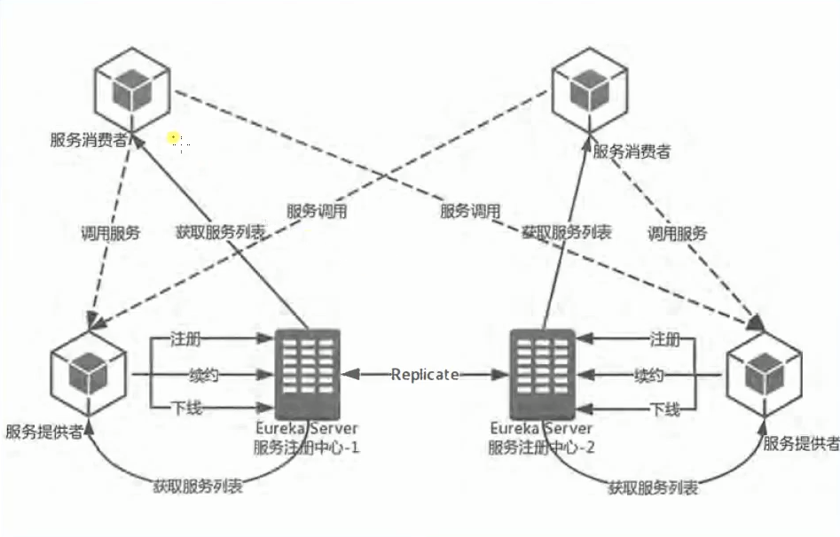
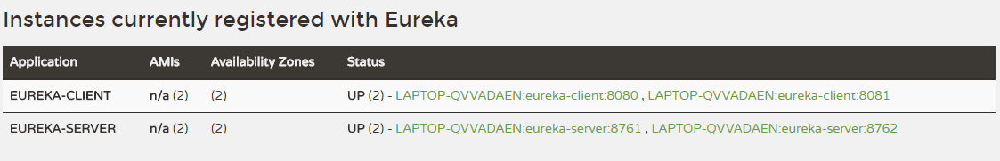

# 1.Eureka服务治理

关于Eureka的基本使用，在另外一篇文章中详细介绍了：[7.天气预报系统-微服务的注册和发现](https://github.com/sunweiguo/swgBook/blob/master/spring-cloud-weather-action/07/7.%E5%A4%A9%E6%B0%94%E9%A2%84%E6%8A%A5%E7%B3%BB%E7%BB%9F-%E5%BE%AE%E6%9C%8D%E5%8A%A1%E7%9A%84%E6%B3%A8%E5%86%8C%E5%92%8C%E5%8F%91%E7%8E%B0.md)，不再赘述。

本章搭建一个高可用的集群。

## 前言

首先来看看Eureka高可用的架构。

<div align="center">
    
</div>

其中，续约是指：服务端维持一个有过期时间的服务列表，当客户端访问一次，我就刷新一下过期时间。

```
# 90秒不来续约就剔除
lease-expiration-duration-in-seconds: 90
# 每隔30秒自动续约一次
lease-renewal-interval-in-seconds: 30
```

在客户端也可以设置一个定时任务，每隔多长时间去请求一下服务器，刷新一下服务列表：


```
# 默认每隔30去请求一下服务器
registry-fetch-interval-seconds: 30
```

## 总结

Eureka包含两个组件：Eureka Server 和 Eureka Client，它们的作用如下：

- Eureka Client是一个Java客户端，用于简化与Eureka Server的交互；
- Eureka Server提供服务发现的能力，各个微服务启动时，会通过Eureka Client向Eureka Server进行注册自己的信息（例如网络信息），Eureka Server会存储该服务的信息；
- 微服务启动后，会周期性地向Eureka Server发送心跳（默认周期为30秒）以续约自己的信息。如果Eureka Server在一定时间内没有接收到某个微服务节点的心跳，Eureka Server将会注销该微服务节点（默认90秒）；
- 每个Eureka Server同时也是Eureka Client，多个Eureka Server之间通过复制的方式完成服务注册表的同步；
- Eureka Client会缓存Eureka Server中的信息。即使所有的Eureka Server节点都宕掉，服务消费者依然可以使用缓存中的信息找到服务提供者。

## 集群配置

Server1端配置文件：


```
server:
  port: 8761
eureka:
  instance:
    hostname: eureka
  client:
    service-url:
      defaultZone: http://localhost:8762/eureka
spring:
  application:
    name: eureka-server
```
Server2端配置文件：


```
server:
  port: 8762
eureka:
  instance:
    hostname: eureka
  client:
    service-url:
      defaultZone: http://localhost:8761/eureka
spring:
  application:
    name: eureka-server
```

就是说两个server互相注册。形成一个server集群。


client1配置文件：


```
server:
  port: 8080
spring:
  application:
    name: eureka-client
eureka:
  client:
    service-url:
      defaultZone: http://localhost:8761/eureka,http://localhost:8762/eureka
```

client2也是如此。


```
server:
  port: 8081
spring:
  application:
    name: eureka-client
eureka:
  client:
    service-url:
      defaultZone: http://localhost:8761/eureka,http://localhost:8762/eureka
```
分别启动之后，我们会看到效果：

<div align="center">
    
</div>


