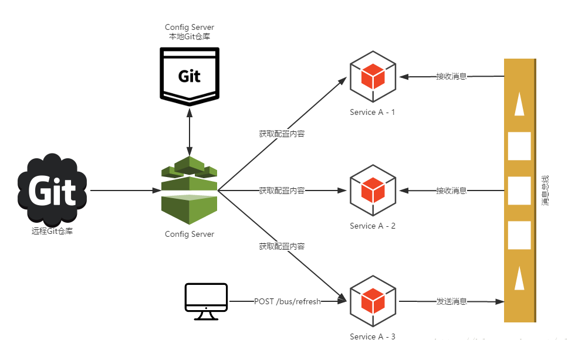
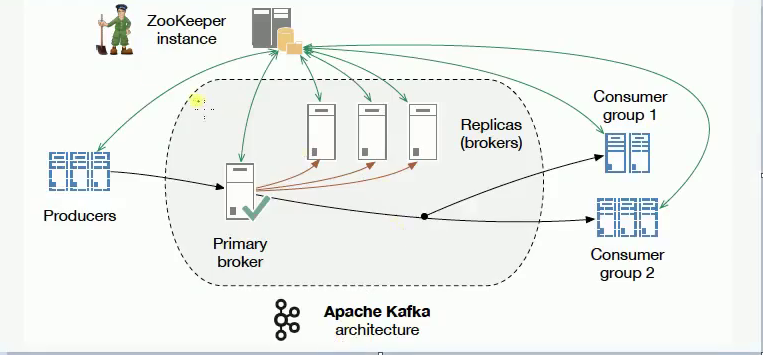

# 8.Bus消息总线

## 一、前言

注：本篇文章是基于`spring boot 2.x`，主要参考 https://www.cnblogs.com/huangjuncong/p/9077099.html 这篇文章而写。但是他的版本比较低，有一两个坑需要注意。

上一篇我们讲到，我们如果要去更新所有微服务的配置，在不重启的情况下去更新配置，只能依靠`spring cloud config`了，但是，是我们要一个服务一个服务的发送post请求，

我们能受的了吗？这比之前的没配置中心好多了，那么我们如何继续避免挨个挨个的向服务发送Post请求来告知服务，你的配置信息改变了，需要及时修改内存中的配置信息。

这时候我们就不要忘记消息队列的发布订阅模型。让所有为服务来订阅这个事件，当这个事件发生改变了，就可以通知所有微服务去更新它们的内存中的配置信息。这时Bus消息总线就能解决，你只需要在`springcloud Config Server`端发出`refresh`，就可以触发所有微服务更新了。

如下架构图所示：


<div align="center">
    
</div>

`Spring Cloud Bus`除了支持`RabbitMQ`的自动化配置之外，还支持现在被广泛应用的`Kafka`。在本文中，我们将搭建一个Kafka的本地环境，并通过它来尝试使用`Spring Cloud Bus`对`Kafka`的支持，实现消息总线的功能。

## 二、Kafka

`Kafka`使用`Scala`实现，被用作LinkedIn的活动流和运营数据处理的管道，现在也被诸多互联网企业广泛地用作为数据流管道和消息系统。

Kafak架构图如下:


<div align="center">
    
</div>

`Kafka`是基于消息发布/订阅模式实现的消息系统，其主要设计目标如下：

1. **消息持久化**：以时间复杂度为O(1)的方式提供消息持久化能力，即使对TB级以上数据也能保证常数时间复杂度的访问性能。
2. **高吞吐**：在廉价的商用机器上也能支持单机每秒100K条以上的吞吐量
3. **分布式**：支持消息分区以及分布式消费，并保证分区内的消息顺序
4. **跨平台**：支持不同技术平台的客户端（如：Java、PHP、Python等）
5. **实时性**：支持实时数据处理和离线数据处理
6. **伸缩性**：支持水平扩展

`Kafka`中涉及的一些基本概念：

1. **Broker**：Kafka集群包含一个或多个服务器，这些服务器被称为Broker。
2. **Topic**：逻辑上同Rabbit的Queue队列相似，每条发布到Kafka集群的消息都必须有一个Topic。（物理上不同Topic的消息分开存储，逻辑上一个Topic的消息虽然保存于一个或多个Broker上，但用户只需指定消息的Topic即可生产或消费数据而不必关心数据存于何处）
3. **Partition**：Partition是物理概念上的分区，为了提供系统吞吐率，在物理上每个Topic会分成一个或多个Partition，每个Partition对应一个文件夹（存储对应分区的消息内容和索引文件）。
4. **Producer**：消息生产者，负责生产消息并发送到Kafka Broker。
5. **Consumer**：消息消费者，向Kafka Broker读取消息并处理的客户端。
6. **Consumer Group**：每个Consumer属于一个特定的组（可为每个Consumer指定属于一个组，若不指定则属于默认组），组可以用来实现一条消息被组内多个成员消费等功能。

可以从`kafka`的架构图看到`Kafka`是需要`Zookeeper`支持的，你需要在你的`Kafka`配置里面指定`Zookeeper`在哪里，它是通过`Zookeeper`做一些可靠性的保证，做`broker`的主从，我们还要知道`Kafka`的消息是以`topic`形式作为组织的，`Producers`发送`topic`形式的消息，
`Consumer`是按照组来分的，所以，一组`Consumers`都会接收同样的`topic`形式的消息。在服务端，它还做了一些分片，那么一个`Topic`可能分布在不同的分片上面，方便我们拓展部署多个机器，`Kafka`是天生分布式的。

首先是要下载对应的kafka：https://www.apache.org/dyn/closer.cgi?path=/kafka/2.1.0/kafka_2.11-2.1.0.tgz

解压之后进去/bin/windows/目录下：

首先启动`zookeeper`:


```
.\zookeeper-server-start.bat D:\kafka_2.11-2.1.0\config\zookeeper.properties
```
如果出现错误：


```
命令语法不正确。
错误: 找不到或无法加载主类 Files\Java\jdk1.8.0_121\lib\dt.jar;C:\Program
PS D:\kafka_2.11-2.1.0\bin\windows> .\zookeeper-server-start.bat D:\kafka_2.11-2.1.0\config/zookeeper.properties
```

方法是：

> 首先我们进到下载好的Kafka目录中kafka_2.11-1.1.0\bin\windows 下编辑kafka-run-class.bat如下：
> 
> 找到这条配置 如下：
> 
> set COMMAND=%JAVA% %KAFKA_HEAP_OPTS% %KAFKA_JVM_PERFORMANCE_OPTS% %KAFKA_JMX_OPTS% %KAFKA_LOG4J_OPTS% -cp %CLASSPATH% %KAFKA_OPTS% %*
>  
> 
> 可以看到%CLASSPATH%没有双引号，
> 
> 因此用双引号括起来，不然启动不起来的，报你JDK没安装好，修改后如下：
> 
> set COMMAND=%JAVA% %KAFKA_HEAP_OPTS% %KAFKA_JVM_PERFORMANCE_OPTS% %KAFKA_JMX_OPTS% %KAFKA_LOG4J_OPTS% -cp "%CLASSPATH%" %KAFKA_OPTS% %*

后面启动`kafka`:


```
.\kafka-server-start.bat D:\kafka_2.11-2.1.0\config\server.properties
```

这两者配置文件直接默认即可。启动成功之后，就放那吧！

## 消息总线

在上一章的`spring-cloud-config-server`以及`client`继续集成。`spring boot`版本是`2.0.3.RELEASE`.

第一步：`spring cloud config`服务端和客户端(搞两个客户端)都要引入`kafka`依赖，以`config server`端为例：


```xml
<dependencies>
    <dependency>
        <groupId>org.springframework.boot</groupId>
        <artifactId>spring-boot-starter-web</artifactId>
    </dependency>

    <dependency>
        <groupId>org.springframework.boot</groupId>
        <artifactId>spring-boot-starter-test</artifactId>
        <scope>test</scope>
    </dependency>

    <!--Eureka client-->
    <dependency>
        <groupId>org.springframework.cloud</groupId>
        <artifactId>spring-cloud-starter-netflix-eureka-client</artifactId>
    </dependency>

    <!--config server-->
    <dependency>
        <groupId>org.springframework.cloud</groupId>
        <artifactId>spring-cloud-config-server</artifactId>
    </dependency>

    <!--kafka MQ-->
    <dependency>
        <groupId>org.springframework.cloud</groupId>
        <artifactId>spring-cloud-starter-bus-kafka</artifactId>
    </dependency>

</dependencies>
```

第二步：配置文件(服务端)


```
server:
  port: 8085
spring:
  application:
    name: config-server
  cloud:
    config:
      server:
        git:
          uri: https://github.com/sunweiguo/spring-cloud-config-center.git
          username: sunweiguo
          password: 22daguozi
eureka:
  client:
    service-url:
      defaultZone: http://localhost:8761/eureka,http://localhost:8762/eureka
management:
  endpoints:
    web:
      exposure:
        include: bus-refresh
```


注意，在1.x版本中一般配置


```
#是否需要权限拉去，默认是true,如果不false就不允许你去拉取配置中心Server更新的内容
management:
  security:
    enabled: false
```

而在2.x版本中已经把这个改掉了。所以要注意。不配置的话会报错405.可以尝试去掉，用postman测试一把。

第三步：添加注解

在服务端和客户端的启动函数上都增加一条注解`@RefreshScope`

ok,至此，集成完毕。消息总线的功能就有了。

启动全部工程。修改git上的内容。然后发现客户端都没更新。下面启动postman来对`config server`发送一条post请求：


```
localhost:8085/actuator/bus-refresh
```
再刷新浏览器，就会发现所有的客户端都自动更新了。我们也可以指定要刷新的客户端具体实例或者通配符符合的客户端。