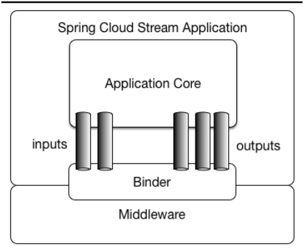
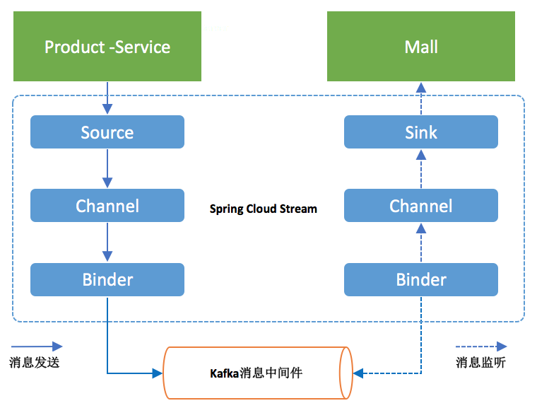

# 9.Stream消息驱动

## 一、为什么需要SpringCloud Stream消息驱动呢？

比方说我们用到了`RabbitMQ`和`Kafka`，由于这两个消息中间件的架构上的不同，像`RabbitMQ`有`exchange`，`kafka`有`Topic`，`partitions`分区，这些中间件的差异性导致我们实际项目开发给我们造成了一定的困扰，我们如果用了两个消息队列的其中一种，

后面的业务需求，我想往另外一种消息队列进行迁移，这时候无疑就是一个灾难性的，一大堆东西都要重新推倒重新做，因为它跟我们的系统耦合了，这时候`springcloud Stream`给我们提供了一种解耦合的方式。

<div align="center">
    
</div>

`Spring Cloud Stream`由一个中间件中立的核组成。应用通过`Spring Cloud Stream`插入的`input`(相当于消费者`consumer`，它是从队列中接收消息的)和`output`(相当于生产者`producer`，它是从队列中发送消息的。)通道与外界交流。

通道通过指定中间件的`Binder`实现与外部代理连接。业务开发者不再关注具体消息中间件，只需关注`Binder`对应用程序提供的抽象概念来使用消息中间件实现业务即可。

Binder

通过定义绑定器作为中间层，实现了应用程序与消息中间件(`Middleware`)细节之间的隔离。通过向应用程序暴露统一的`Channel`通道，使得应用程序不需要再考虑各种不同的消息中间件的实现。当需要升级消息中间件，或者是更换其他消息中间件产品时，我们需要做的就是更换对应的`Binder`绑定器而不需要修改任何应用逻辑 。甚至可以任意的改变中间件的类型而不需要修改一行代码。目前只提供了`RabbitMQ`和`Kafka`的`Binder`实现。

`Springcloud Stream`还有个好处就是像`Kafka`一样引入了一点分区的概念，像`RabbitMQ`不支持分区的队列，你用了`SpringCloud Stream`技术，它就会帮`RabbitMQ`引入了分区的特性，`SpringCloud Stream`就是天然支持分区的，我们用起来还是很方便的。

## 二、简单的演示

首先我们要新建三个项目，分别是`spring-cloud-stream`，`spring-cloud-stream1`，`spring-cloud-stream2`，其中`spring-cloud-stream`作为生产者进行发消息模块，`spring-cloud-stream-1`，`spring-cloud-stream-2`作为消息接收模块。

### 第一步：


对于这三个项目，都要引入依赖：

```xml
<?xml version="1.0" encoding="UTF-8"?>
<project xmlns="http://maven.apache.org/POM/4.0.0" xmlns:xsi="http://www.w3.org/2001/XMLSchema-instance"
         xsi:schemaLocation="http://maven.apache.org/POM/4.0.0 http://maven.apache.org/xsd/maven-4.0.0.xsd">
    <modelVersion>4.0.0</modelVersion>

    <groupId>com.swg</groupId>
    <artifactId>spring-cloud-stream-producer</artifactId>
    <version>0.0.1-SNAPSHOT</version>
    <packaging>jar</packaging>

    <name>spring-cloud-stream-producer</name>
    <description>Demo project for Spring Boot</description>

    <parent>
        <groupId>org.springframework.boot</groupId>
        <artifactId>spring-boot-starter-parent</artifactId>
        <version>2.0.0.RELEASE</version>
        <relativePath/> <!-- lookup parent from repository -->
    </parent>

    <properties>
        <project.build.sourceEncoding>UTF-8</project.build.sourceEncoding>
        <project.reporting.outputEncoding>UTF-8</project.reporting.outputEncoding>
        <java.version>1.8</java.version>
    </properties>

    <dependencyManagement>
        <dependencies>
            <dependency>
                <groupId>org.springframework.cloud</groupId>
                <artifactId>spring-cloud-stream-dependencies</artifactId>
                <version>Elmhurst.SR2</version>
                <type>pom</type>
                <scope>import</scope>
            </dependency>
        </dependencies>
    </dependencyManagement>
    <dependencies>
        <dependency>
            <groupId>org.springframework.boot</groupId>
            <artifactId>spring-boot-starter-web</artifactId>
        </dependency>
        <dependency>
            <groupId>org.springframework.cloud</groupId>
            <artifactId>spring-cloud-stream</artifactId>
        </dependency>
        <dependency>
            <groupId>org.springframework.cloud</groupId>
            <artifactId>spring-cloud-starter-stream-kafka</artifactId> <!-- or '*-stream-kafka' -->
        </dependency>
    </dependencies>

    <build>
        <plugins>
            <plugin>
                <groupId>org.springframework.boot</groupId>
                <artifactId>spring-boot-maven-plugin</artifactId>
            </plugin>
        </plugins>
    </build>
</project>
```
### 第二步：

对于`spring-cloud-stream`，是信息的生产方，配置文件为：


```
server:
  port: 8081
spring:
  application:
    name: producer
  cloud:
    stream:
      kafka:
        binder:
          #Kafka的消息中间件服务器
          brockers: localhost:9092
          #Zookeeper的节点，如果集群，后面加,号分隔
          zk-nodes: localhost:2181
          #如果设置为false,就不会自动创建Topic 有可能你Topic还没创建就直接调用了。
          auto-create-topics: true
      bindings:
        #这里用stream给我们提供的默认output，后面会讲到自定义output
        output:
          #消息发往的目的地
          destination: stream-demo
          #消息发送的格式，接收端不用指定格式，但是发送端要
          content-type: text/plain
```

这里指定了kafka和zk的地址，最终的是，指定了我们要用的`output`，就是消息的生产通道，这里用的是自定义。下面指定了消息的目的地。

发送的程序`SendService`：


```java
@EnableBinding(Source.class)
public class SendService {

    @Autowired
    private Source source;


    public void sendMsg(String msg){
        source.output().send(MessageBuilder.withPayload(msg).build());
    }

}
```

这里就是接口一个字符串，然后把消息通过`output`发送到指定的目的地。`@EnableBinding(Source.class)`这个注解给我们绑定消息通道的，Source是Stream给我们提供的，可以点进去看源码，可以看到output和input,这和配置文件中的output，input对应的。

最后就是浏览器传入值：


```java
@RestController
public class HelloController {

    @Autowired
    private SendService sendService;


    @RequestMapping("/send/{msg}")
    public void send(@PathVariable("msg") String msg){
        System.out.println("发送了。。。"+msg);
        sendService.sendMsg(msg);
    }

}
```
### 第三步：

消息的发送端已经搞好了，下面配置消息的消费端。配置文件为：


```
server:
  port: 8082
spring:
  application:
    name: consumer_1
  cloud:
    stream:
      kafka:
        binder:
          brockers: localhost:9092
          zk-nodes: localhost:2181
          auto-create-topics: true
      bindings:
        #input是接收，注意这里不能再像前面一样写output了
        input:
          destination: stream-demo
```

接收的service：

```java
//消息接受端，stream给我们提供了Sink,Sink源码里面是绑定input的，要跟我们配置文件的imput关联的。
@EnableBinding(Sink.class)
public class RecieveService {

    @StreamListener(Sink.INPUT)//其实就是@StreamListener(“input”)，监听这个通道有没有消息过来，有就消费
    public void recieve(Object payload){
        System.out.println("====="+payload);
    }

}
```

### 第四步

启动kafka和zk，上一章已经讲过了如何启动。打开浏览器输入对应的url进行测试，看两个消费端是否都可以打印出来传入的信息。

### 总结

其实上面的一个流程就可以概括为下面一张图：

<div align="center">
    
</div>

一个是产品的生产者，一个是商店消费者，生产者将产品通过通道，这里就是`Source`中默认的`output`，将产品发送到`binder`中，给他一个`topic`，告诉消费者这个消息的名字(位置，这里是`stream-demo`)。消费者通过监听`Sink`中的默认的`input`通道来看看有没有自己感兴趣的消息。


```java
public interface Source {
    String OUTPUT = "output";

    @Output("output")
    MessageChannel output();
}

public interface Sink {
    String INPUT = "input";

    @Input("input")
    SubscribableChannel input();
}
```


到这里，最基本的一个消息的生产消费流程就走完了。


## 三、自定义消息通道

到现在为止，我们进行了一个简单的消息发送和接收，用的是`Stream`给我们提供的默认`Source`，`Sink`，接下来我们要自己进行自定义，这种方式在工作中还是用的比较多的，因为我们要往不同的消息通道发消息，

必然不能全都叫input,output的，那样的话就乱套了，因此首先自定义一个接口，如下：


```java
/**
 * Created by cong on 2018/5/28.
 */
public interface MySource {

    @Output("myOutput")
    MessageChannel myOutput();

}
```

其实就是将默认的`Source`里的`output`改个名字而已，十分简单，在配置文件中指定通道的地方就要响应地修改为我们自己定义的通道就可以了。


```
server:
  port: 7888
spring:
  application:
    name: producer
  cloud:
    stream:
      kafka:
        binder:
#Kafka的消息中间件服务器
          brockers: localhost:9092
#Zookeeper的节点，如果集群，后面加,号分隔
          zk-nodes: localhost:2181
#如果设置为false,就不会自动创建Topic 有可能你Topic还没创建就直接调用了。
          auto-create-topics: true
      bindings:
#自定义output
        myOutput:
#消息发往的目的地
            destination: stream-demo
#消息发送的格式，接收端不用指定格式，但是发送端要
            content-type: text/plain
```

下面发送消息的时候，就是注入我们自己定义的`source`即可：


```java
@EnableBinding(MySource.class)
public class SendService {
    
    @Autowired
    private MySource source;

    public void sendMsg(String msg){
        source.myOutput().send(MessageBuilder.withPayload(msg).build());
    }

}
```
消费者同样如此，就是改一下`Sink`的名字即可。

## 四、消息中转站

这是一个比较有意思的功能，就是消息经过中间一个加工一下，再传给下一个消费者。就是一个链式的调用。

那么，我们这里改造一下`spring-cloud-stream-consumer-1`为`spring-cloud-stream-trans`:


第一步：
```
server:
  port: 7889
spring:
  application:
    name: consumer_1
  cloud:
    stream:
      kafka:
        binder:
          brockers: localhost:9092
          zk-nodes: localhost:2181
          auto-create-topics: true
      bindings:
#input是接收，注意这里不能再像前面一样写output了
          input:
            destination: stream-demo
 #进行消息中转处理后，在进行转发出去           
          output:
            destination: stream-demo-trans
```

第二步：接着在新建一个消息中转类，代码如下：


```java
package hjc.consumer;

import org.springframework.cloud.stream.annotation.EnableBinding;
import org.springframework.cloud.stream.messaging.Processor;
import org.springframework.integration.annotation.ServiceActivator;

@EnableBinding(Processor.class)
public class TransFormService {

    @ServiceActivator(inputChannel = Processor.INPUT,outputChannel = Processor.OUTPUT)
    public Object transform(Object payload){
        System.out.println("消息中转站："+payload);
        return payload;
    }

}
```

记得要将拷贝过来的工程中的`SendService`里面的注解全部删除掉，要不然程序启动会报错。

接着要修改消息中转站发送消息出去的接收端springcloud-stream2的配置,`input`的值改为`stream-demo-trans`即可。


## 四、消息分组

我们都是一端发消息，两个消息接受者都接收到了，但是有时候有些业务场景我只想让其中一个消息接收者接收到消息，那么该怎么办呢？

`Group`，如果使用过 `Kafka` 的读者并不会陌生。`Spring Cloud Stream` 的这个分组概念的意思基本和 `Kafka` 一致。微服务中动态的缩放同一个应用的数量以此来达到更高的处理能力是非常必须的。对于这种情况，同一个事件防止被重复消费，

只要把这些应用放置于同一个 `group` 中，就能够保证消息只会被其中一个应用消费一次。不同的组是可以消费的，同一个组内会发生竞争关系，只有其中一个可以消费。

修改消费段的配置文件，将他们都配置到同一个组下面：


```
server:
  port: 7889
spring:
  application:
    name: consumer_1
  cloud:
    stream:
      kafka:
        binder:
          brockers: localhost:9092
          zk-nodes: localhost:2181
          auto-create-topics: true
      bindings:
          #input是接收，注意这里不能再像前面一样写output了
          input:
            destination: stream-demo
            #分组的组名
            group: group
```
可以看到`springcloud-stream1`和`springcloud-stream2`是属于同一组的。`springcloud-stream`模块的发的消息只能被`springcloud-stream1`或`springcloud-stream2`其中一个接收到，这样避免了重复消费。