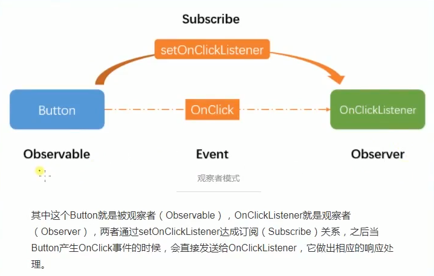

# 3.Hystrix请求熔断服务降级

## 一、前言

基本的介绍和基本的演示都已经在[11.天气预报系统-熔断机制](https://github.com/sunweiguo/swgBook/blob/master/spring-cloud-weather-action/11/11.%E5%A4%A9%E6%B0%94%E9%A2%84%E6%8A%A5%E7%B3%BB%E7%BB%9F-%E7%86%94%E6%96%AD%E6%9C%BA%E5%88%B6.md)中说明和演示了。


比如拿我上一章中的代码，我们将`spring-eureka-ribbon`升级为`spring-cloud-ribbon-hystrix`:

无非是引入依赖，主函数添加一个允许熔断的声明。

```java
@Service
public class HelloServiceImpl implements IHelloServie {

    @Autowired
    RestTemplate restTemplate;

    @Override
    @HystrixCommand(fallbackMethod = "helloFallBack")
    public String hiService(String name) {
        return restTemplate.getForEntity("http://SERVICE-HI/hello?name="+name,String.class).getBody();
    }

    public String helloFallBack(String name){
        return "<font color='red'>error</font>";
    }
}
```

注意，我们的fallBack方法的参数必须与被注解的方法的参数一致，否则会报错。

启动项目：`spring-cloud-eureka-server-1`,`spring-cloud-eureka-server-2`,`spring-cloud-eureka-client-1`,`spring-cloud-eureka-client-2`,`spring-cloud-ribbon-hystrix`.

然后关闭一个client，看是否触发服务降级，显示红色的error.


## 二、用法进阶-实现异步消费

我们不用注解来实现上面个功能。代码见`spring-cloud-eureka-ribbon-hystrix-02`


```java
@RestController
public class HelloController {

    @Autowired
    private RestTemplate restTemplate;

    @RequestMapping("hello")
    public String hello(){
        HelloServiceCommand command = new HelloServiceCommand("hello",restTemplate);
        String res = command.execute();
        return res;
    }

}
```
其中核心的`HelloServiceCommand`:

```java
public class HelloServiceCommand extends HystrixCommand<String> {

    private RestTemplate restTemplate;

    public HelloServiceCommand(String commandGroupKey,RestTemplate restTemplate) {
        super(HystrixCommandGroupKey.Factory.asKey(commandGroupKey));
        this.restTemplate = restTemplate;
    }

    @Override
    protected String run() throws Exception {
        return restTemplate.getForEntity("http://SERVICE-HI/hello?name='swg'",String.class).getBody();
    }

    @Override
    protected String getFallback() {
        return "<font color='red'>error</font>";
    }
}
```
这样就可以用代码实现上面的注解的功能。


我们可以发现，`run()`方法里调用其他的服务（多个），如果是串行执行，那么时间是所有服务执行时间之和。那么，有没有办法使他并行执行呢？达到一种NIO的效果。

NIO的两个实现方式：`Future`将来式和`Callable`回调式，这里使用将来式。

其实核心就是`Future<String> future = command.queue();`，让这个方法自己另开一个线程去默默执行，本线程还继续往下，等我想到结果的时候，再去调用`String res = future.get();`阻塞地获取结果，如果结果已经准备好了，那么就直接拿到。

在代码`spring-cloud-eureka-ribbon-hystrix-03`中的`controller`中进行测试：


```java
@RequestMapping("hello")
public String hello() throws ExecutionException, InterruptedException {
    HelloServiceCommand command = new HelloServiceCommand("hello",restTemplate);
    long now = System.currentTimeMillis();
    Future<String> future = command.queue();
    System.out.println("start");
    long end = System.currentTimeMillis();
    System.out.println(end - now);
    String res = future.get();
    long last = System.currentTimeMillis()-end;
    System.out.println(last);
    return res;
}
```


测试的目的就是看调用`command.queue()`之后会不会阻塞本线程的执行，我们让`client`中的方法睡眠一会：


```java
@RequestMapping("hello")
public String hello(@RequestParam("name")String name) throws InterruptedException {
    System.out.println("方法开始执行。。。");
    Thread.sleep(800);
    System.out.println("方法执行结束。。。");
    return "hi "+ name +",you are from " + port;
}
```
结果打印：


```
start
1
817
```

就是说将执行其他服务这个操作异步到了另外一个线程中执行，本线程立即执行下面的逻辑。这样，提高了效率。

好了，用非注解的方式来实现了一下NIO的实现方式，那么肯定还是使用注解比较方便，那么基于注解的话，我们如何实现`future`的方式来执行呢？代码`spring-cloud-eureka-ribbon-hystrix-04`

我们只需要将原来的`HelloServiceImpl`中的`hiService`方法改为：


```java
import com.netflix.hystrix.contrib.javanica.command.AsyncResult;

@Override
@HystrixCommand(fallbackMethod = "helloFallBack")
public String hiService(String name) throws ExecutionException, InterruptedException {
    Future<String> future = new AsyncResult<String>() {
        @Override
        public String invoke() {
            return restTemplate.getForEntity("http://SERVICE-HI/hello?name="+name,String.class).getBody();
        }
    };
    return future.get();
}
```
就可以实现这种异步的方式调用了。


## 三、观察者模式来实现

<div align="center">
    
</div>

订阅者来监听自己感兴趣的事件，可以实现多个请求集中处理。

代码不想去搞了...

## 四、总结

这里主要是实现熔断的功能，一开始的`@HystrixCommand`+`fallback`，到后面自己用`HystrixCommand`代码实现的，再到后来用`Future`来实现异步消费，到最后介绍的用观察者模式来实现的方式`HystrixObserverCommand`。