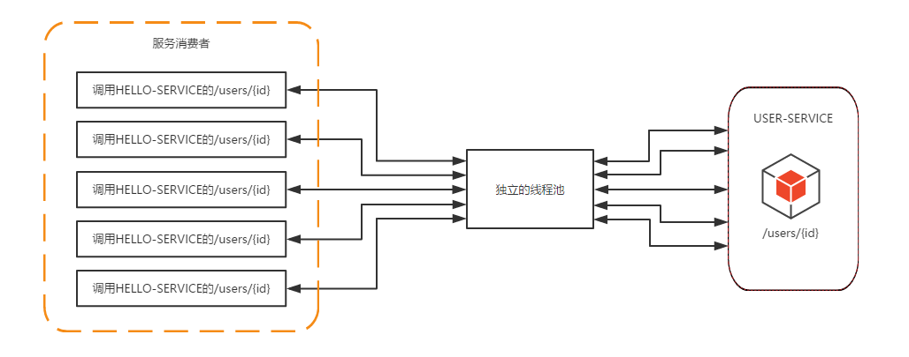
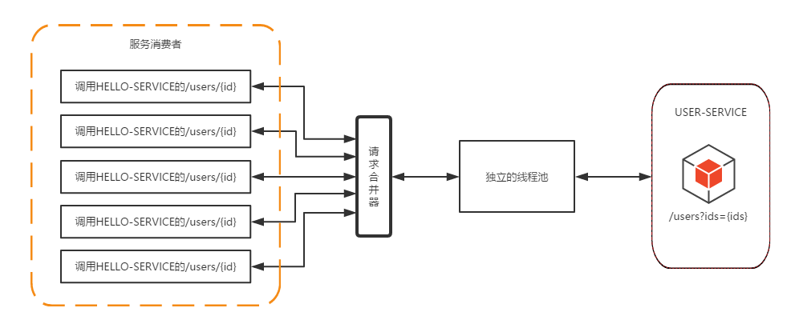

# 4.Hystrix线程隔离请求缓存请求合并

## 一、请求缓存

是基于`request`域的，基本没什么用，这里不讨论。

## 二、请求合并

在微服务架构中，我们将一个项目拆分成很多个独立的模块，这些独立的模块通过远程调用来互相配合工作，但是，在高并发情况下，通信次数的增加会导致总的通信时间增加，同时，线程池的资源也是有限的，高并发环境会导致有大量的线程处于等待状态，进而导致响应延迟，为了解决这些问题，我们需要来了解Hystrix的请求合并。

hystrix中的请求合并，就是利用一个合并处理器，将对同一个服务发起的连续请求合并成一个请求进行处理(这些连续请求的时间窗默认为10ms)，在这个过程中涉及到的一个核心类就是`HystrixCollapser`。

请求不合并之前：


下图展示了在未使用`HystrixCollapser`请求合并器之前的线程使用情况。可以看到当服务消费者同时对`USER-SERVICE`的`/users/{id}`接口发起了五个请求时，会向该依赖服务的独立线程池中申请五个线程来完成各自的请求操作。


<div align="center">
    
</div>

而在使用了`HystrixCollapser`请求合并器之后，相同情况下的线程占用如下图所示。由于同一时间发生的五个请求处于请求合并器的一个时间窗内，这些发向`/users/{id}`接口的请求被请求合并器拦截下来，并在合并器中进行组合，然后将这些请求合并成一个请求发向`USER-SERVICE`的批量接口`/users?ids={ids}`，在获取到批量请求结果之后，通过请求合并器再将批量结果拆分并分配给每个被合并的请求。从图中我们可以看到以来，通过使用请求合并器有效地减少了对线程池中资源的占用。所以在资源有效并且在短时间内会产生高并发请求的时候，为避免连接不够用而引起的延迟可以考虑使用请求合并器的方式来处理和优化。


<div align="center">
    
</div>


本着简单的目的，所以非注解的方式我就没做。具体参考文章：https://blog.csdn.net/u012702547/article/details/78213270


### 2.1 服务提供者

首先是需要服务提供者提供两个接口，一个是返回集合，模拟在同一时间多个线程同时来请求书籍信息。


```java
@RequestMapping("/getbooks")
public List<Book> books(String ids) {
    System.out.println("ids>>>>>>>>>>>>>>>>>>>>>" + ids);
    ArrayList<Book> books = new ArrayList<>();
    books.add(new Book("《李自成》", 55, "姚雪垠", "人民文学出版社"));
    books.add(new Book("中国文学简史", 33, "林庚", "清华大学出版社"));
    books.add(new Book("文学改良刍议", 33, "胡适", "无"));
    books.add(new Book("ids", 22, "helloworld", "haha"));
    return books;
}
```

### 2.2 服务消费者

首先在BookService中添加两个方法用来调用服务提供者提供的接口，如下：


```java
@HystrixCollapser(batchMethod = "test11",collapserProperties = {@HystrixProperty(name ="timerDelayInMilliseconds",value = "100")})
public Future<Book> test10(Long id) {
    return null;
}

@HystrixCommand
public List<Book> test11(List<Long> ids) {
    System.out.println("test9---------"+ids+"Thread.currentThread().getName():" + Thread.currentThread().getName());
    Book[] books = restTemplate.getForObject("http://SERVICE-HI/getbooks?ids={1}", Book[].class, StringUtils.join(ids, ","));
    return Arrays.asList(books);
}
```

在`test10`方法上添加`@HystrixCollapser`注解实现请求合并，用`batchMethod`属性指明请求合并后的处理方法，`collapserProperties`属性指定其他属性:**为请求合并器设置了时间延迟属性，合并器会在该时间窗内收集获取单个Book的请求并在时间窗结束时进行合并组装成单个批量请求**。

### 2.3 调用消费服务
下面就是直接调用`test10`即可：


```java
@RequestMapping("/books")
public void test7() throws ExecutionException, InterruptedException {
    HystrixRequestContext context = HystrixRequestContext.initializeContext();
    Future<Book> f1 = bookService.test10(1l);
    Future<Book> f2 = bookService.test10(2l);
    Future<Book> f3 = bookService.test10(3l);
    Book b1 = f1.get();
    Book b2 = f2.get();
    Book b3 = f3.get();
    Thread.sleep(3000);
    Future<Book> f4 = bookService.test10(4l);
    Book b4 = f4.get();
    System.out.println("b1>>>"+b1);
    System.out.println("b2>>>"+b2);
    System.out.println("b3>>>"+b3);
    System.out.println("b4>>>"+b4);
    context.close();
}
```
### 2.3 运行结果

```
test9---------[3, 1, 2]Thread.currentThread().getName():hystrix-BookService-6
test9---------[4]Thread.currentThread().getName():hystrix-BookService-7
b1>>>com.swg.springcloudeureka.Book@5a901d44
b2>>>com.swg.springcloudeureka.Book@3305e39
b3>>>com.swg.springcloudeureka.Book@2282567c
b4>>>com.swg.springcloudeureka.Book@52e7b4ea
```
前三个请求会进行合并，第四个请求会单独执行.

## 四、总结

请求合并的优点小伙伴们已经看到了，多个请求被合并为一个请求进行一次性处理，可以有效节省网络带宽和线程池资源，但是，有优点必然也有缺点，设置请求合并之后，本来一个请求可能5ms就搞定了，但是现在必须再等10ms看看还有没有其他的请求一起的，这样一个请求的耗时就从5ms增加到15ms了，不过，如果我们要发起的命令本身就是一个高延迟的命令，那么这个时候就可以使用请求合并了，因为这个时候时间窗的时间消耗就显得微不足道了，另外高并发也是请求合并的一个非常重要的场景。