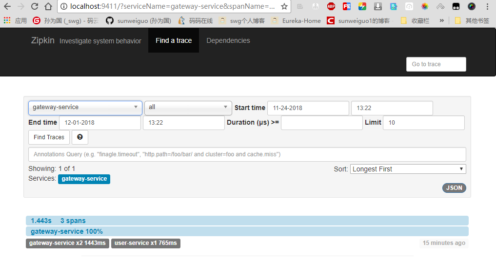
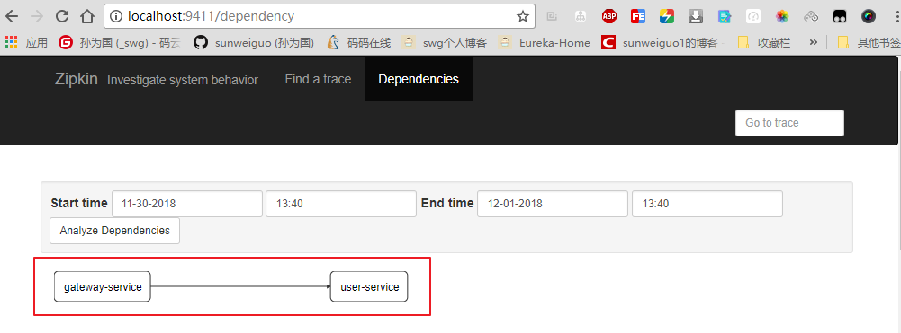

# 10.Sleuth服务追踪

## 一、为什么需要进行分布式链路追踪springcloud-sleuth呢？

随着分布式系统越来越复杂，你的一个请求发过发过去，各个微服务之间的跳转，有可能某个请求某一天压力太大了，一个请求过去没响应，一个请求下去依赖了三四个服务，但是你去不知道哪一个服务出来问题，这时候我是不是需要对微服务进行追踪呀？监控一个请求的发起，从服务之间传递之间的过程，我最好记录一下，记录每一个的耗时多久，一旦出了问题，我们就可以针对性的进行优化，是要增加节点，减轻压力，还是服务继续拆分，让逻辑更加简单点呢？这时候springcloud-sleuth集成zipkin能帮我们解决这些服务追踪问题。

## 二、创建工程

本工程的`Spring Boot`的版本为`1.5.8`，`Spring Cloud`版本为`Dalston.RELEASE`。包含了`eureka-server`工程，作为服务注册中心，`eureka-server`的创建过程这里不重复；`zipkin-server`作为链路追踪服务中心，负责存储链路数据；`gateway-service`作为服务网关工程，负责请求的转发,同时它也作为链路追踪客户端，负责产生数据，并上传给`zipkin-service`；`user-service`为一个应用服务，对外暴露API接口，同时它也作为链路追踪客户端，负责产生数据。


### 1.构建eureka-server

这个服务就比较简单了，就是eureka的服务端，用来注册服务。见代码`eureka-server`.


### 2.构建zipkin-server

依赖：


```xml
<dependencies>
    <dependency>
        <groupId>org.springframework.boot</groupId>
        <artifactId>spring-boot-starter-web</artifactId>
    </dependency>

    <dependency>
        <groupId>org.springframework.boot</groupId>
        <artifactId>spring-boot-starter-test</artifactId>
        <scope>test</scope>
    </dependency>

    <!--eureka服务端-->
    <dependency>
        <groupId>org.springframework.cloud</groupId>
        <artifactId>spring-cloud-starter-eureka</artifactId>
    </dependency>
    <!--zipkin服务端-->
    <dependency>
        <groupId>io.zipkin.java</groupId>
        <artifactId>zipkin-server</artifactId>
    </dependency>
    <!--显示的页面-->
    <dependency>
        <groupId>io.zipkin.java</groupId>
        <artifactId>zipkin-autoconfigure-ui</artifactId>
    </dependency>
</dependencies>
```

主函数上打上两个注解开启`ZipkinServer`的功能：


```
@EnableEurekaClient
@EnableZipkinServer
```
配置文件上也很简单，注册到`eureka`上和指定好启动的端口即可。


```
eureka:
  client:
    serviceUrl:
      defaultZone: http://localhost:8761/eureka/
server:
  port: 9411
spring:
  application:
    name: zipkin-server
```


### 3.构建user-service

新建一个工程，取名为`user-service`，作为应用服务，对外暴露API接口.

依赖：


```xml
<dependencies>
    <dependency>
        <groupId>org.springframework.boot</groupId>
        <artifactId>spring-boot-starter-web</artifactId>
    </dependency>

    <dependency>
        <groupId>org.springframework.boot</groupId>
        <artifactId>spring-boot-starter-test</artifactId>
        <scope>test</scope>
    </dependency>

    <dependency>
        <groupId>org.springframework.cloud</groupId>
        <artifactId>spring-cloud-starter-eureka</artifactId>
    </dependency>

    <dependency>
        <groupId>org.springframework.cloud</groupId>
        <artifactId>spring-cloud-starter-zipkin</artifactId>
    </dependency>
</dependencies>
```
打上`eureka`注解。配置文件为：


```
eureka:
  client:
    serviceUrl:
      defaultZone: http://localhost:8761/eureka/
server:
  port: 8080
spring:
  application:
    name: user-service
  zipkin:
    base-url: http://localhost:9411
  sleuth:
    sampler:
      percentage: 1.0
```

`Zipkin Server`地址为`http://localhost:9411`。`spring.sleuth.sampler.percentage`为1.0,即100%的概率将链路的数据上传给`Zipkin Server`，在默认的情况下，该值为0.1.

测试的api为：


```java
@RestController
@RequestMapping("/user")
public class UserController {

    @GetMapping("/hello")
    public String hi(){
        return "hello user!";
    }
}
```


### 4.构建gateway-service

新建一个名为`gateway-service`工程，这个工程作为服务网关，将请求转发到`user-service`，作为`Zipkin`客户端，需要将链路数据上传给`Zipkin Server`，同时它也作为`Eureka Client`。

依赖：

```xml
<dependencies>
    <dependency>
        <groupId>org.springframework.cloud</groupId>
        <artifactId>spring-cloud-starter-eureka</artifactId>
    </dependency>
    <dependency>
        <groupId>org.springframework.cloud</groupId>
        <artifactId>spring-cloud-starter-zuul</artifactId>
    </dependency>
    <dependency>
        <groupId>org.springframework.boot</groupId>
        <artifactId>spring-boot-starter-web</artifactId>
    </dependency>
    <dependency>
        <groupId>org.springframework.cloud</groupId>
        <artifactId>spring-cloud-starter-zipkin</artifactId>
        <version>RELEASE</version>
    </dependency>
</dependencies>
```

注解：


```
@EnableEurekaClient
@EnableZuulProxy
```

配置文件：


```
eureka:
  client:
    serviceUrl:
      defaultZone: http://localhost:8761/eureka/

server:
  port: 8081
spring:
  application:
    name: gateway-service
  sleuth:
    sampler:
      percentage: 1.0
  zipkin:
    base-url: http://localhost:9411

zuul:
  routes:
    api-a:
      path: /user-api/**
      serviceId: user-service
```
以`“/user-api/**”`开头的Uri请求，转发到服务名为 `user-service` 的服务


## 三、演示效果

完整的项目搭建完毕，依次启动`eureka-server`、`zipkin-server`、`user-service`、`gateway-service`。在浏览器上访问http://localhost:8081/user-api/user/hi

访问http://localhost:9411，即访问Zipkin的展示界面，界面显示如图所示：


<div align="center">
    
</div>

这个界面主要用来查找服务的调用情况，可以根据服务名、开始时间、结束时间、请求消耗的时间等条件来查找。点击“Find Traces”按钮，界面如图所示。从图可知服务的调用情况，比如服务调用时间、服务的消耗时间，服务调用的链路情况。

点击`Dependences`按钮，可以查看服务的依赖关系，在本案例中，`gateway-service`将请求转发到了`user-service`，它们的依赖关系如图：


<div align="center">
    
</div>

参考文章：https://blog.csdn.net/forezp/article/details/76795269