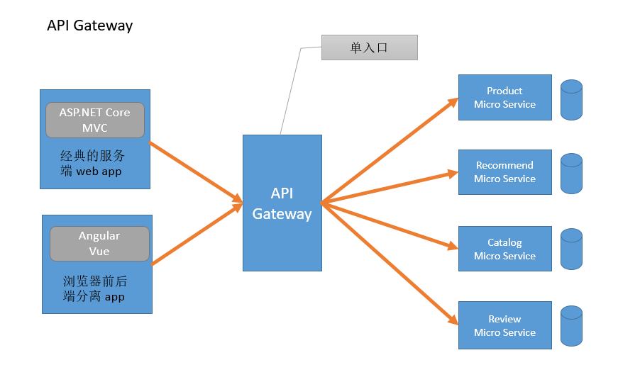
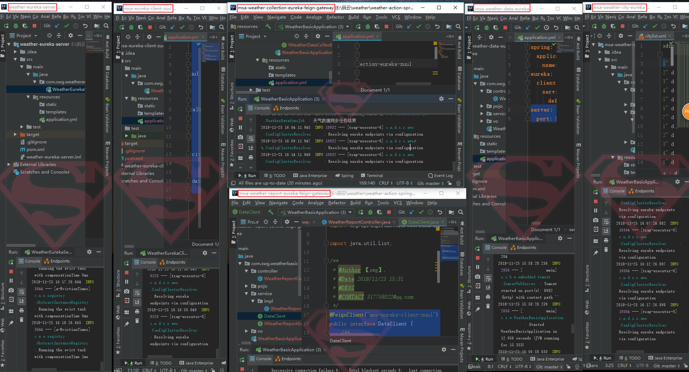

# 9.天气预报系统-API网关

## 一、背景

理论上，客户端可以直接向微服务发送请求，每个微服务都有一个公开的URL，该URL将映射到微服务的负载均衡器，由它负责在可用实例之间分发请求。

但是我们知道在微服务架构风格中，一个大应用被拆分成为了多个小的服务系统提供出来，这些小的系统他们可以自成体系，也就是说这些小系统可以拥有自己的数据库，框架甚至语言等，这些小系统通常以提供 Rest Api 风格的接口来被 H5, Android, IOS 以及第三方应用程序调用。

但是在UI上进行展示的时候，我们通常需要在一个界面上展示很多数据，这些数据可能来自于不同的微服务中，举个例子。

在一个电商系统中，查看一个商品详情页，这个商品详情页包含商品的标题，价格，库存，评论等，这些数据对于后端来说可能是位于不同的微服务系统之中，可能我后台的系统是这样来拆分我的服务的：

产品服务 - 负责提供商品的标题，描述，规格等。
价格服务 - 负责对产品进行定价，价格策略计算，促销价等。
库存服务 - 负责产品库存。
评价服务 - 负责用户对商品的评论，回复等。
现在，商品详情页需要从这些微服务中拉取相应的信息，问题来了:

由于我们使用的服务系统架构，所以没办法像传统单体应用一样依靠数据库的 join 查询来得到最终结果，那么如何才能访问各个服务呢？这里就会引出以下几个问题：

### 1. 客户端需求和微服务暴露的细粒度 API 不匹配

经常有一个业务调用很多个服务，假如客户端发送许多请求，这在公网上可能会很低效，而且会使客户端代码变得更复杂。

### 2. 服务使用的协议不是 Web 友好的

有的服务可能使用二进制 RPC（比如 thrift），有的服务可能使用 AMQP 消息传递协议。不管哪种协议都不是浏览器友好或防火墙友好的，最好是内部使用。在防火墙之外，应用程序应该使用诸如 HTTP 和 WebSocket 之类的协议。

### 3. 难重构

随着时间推移可能想要更改系统划分成服务的方式。例如，合并两个服务或者将一个服务拆分成两个或更多服务。如果客户端与微服务直接通信，那么执行这类重构就很困难。

由于以上问题，客户端与微服务直接通信很少是合理的，更好的方法是使用 API 网关，由 API 网关作为后端服务系统的唯一入口。它封装了系统内部架构，为每个客户端提供一个定制的 API 。由它负责服务请求路由、组合及协议转换。有的 API 网关还有其它职责，如身份验证、监控、负载均衡、缓存等。

## 二、API 网关

> API网关是一个服务器，是系统的唯一入口。从面向对象设计的角度看，它与外观模式类似。API网关封装了系统内部架构，为每个客户端提供一个定制的API。它可能还具有其它职责，如身份验证、监控、负载均衡、缓存、请求分片与管理、静态响应处理。
> API网关方式的核心要点是，所有的客户端和消费端都通过统一的网关接入微服务，在网关层处理所有的非业务功能。通常，网关也是提供REST/HTTP的访问API。服务端通过API-GW注册和管理服务。

### 单节点网关


<div align="center">
    
</div>

### Backends for frontends 网关


<div align="center">
    
</div>

## 三、API 网关的优缺点

### 1. 优点

封装了应用程序的内部结构。客户端只需要同网关交互，而不必调用特定的服务（**统一API入口**）。API 网关为每一类客户端提供了特定的 API ，从而减少客户端与应用程序间的交互次数，简化客户端代码的处理（**集合多个API**）。

另外，可以避免内部信息泄露给外部。可以为微服务添加额外的安全层。支持混合通信协议。降低构建微服务的复杂性。

### 2. 缺点

增加了一个必须开发、部署和维护的高可用组件。还有一个风险是 API 网关变成了开发瓶颈。为了暴露每个微服务，开发人员必须更新 API 网关。API 网关的更新过程要尽可能地简单，否则为了更新网关，开发人员将不得不排队等待。不过，虽然有这些不足，但对于大多数现实世界的应用程序而言使用 API 网关是合理的。（**在架构上需要额外考虑更多编排和管理；路由逻辑配置要进行统一的管理；可能引发单点故障**）

## 四、参考实现方案
以上列出在 DIY 这个 API 网关时需要考虑的点，以及参考的技术实现。下面是几种目前比较流行的 API 网关搭建的技术方案供参考，后续文章将给出这些方案搭建的例子

1）Nginx + Lua实现负载均衡、限流、服务发现等功能

2）使用 spring cloud 技术栈，其中 zuul 就是用作 API 网关的

3）Mashape 的开源 API 网关 Kong

本次，使用`zuul`作为API网关。


## 五、Zuul

功能：认证、压测、金丝雀测试、动态路由、负载削减、安全、静态相应处理...


<font color="red">注意：因为我到目前为止，springboot用的版本是2.1.x，但是呢，集成zuul的时候报错，查了一下，是zuul还不支持2.1.x的版本，所以我将demo:`weather-eureka-client=zuul`降级到了2.0.3版本。启动成功并且测试成功</font>

首先是准备拿出之前的两个项目：`weather-eureka-server`和`weather-eureka-client`，启动，一个地址是8671，一个地址我设定为8081,基于`weather-eureka-client`新建一个项目：`weather-eureka-client-zuul`，改动如下：

首先将springboot版本降到2.0.x版本。在启动类上增加注解：`@EnableZuulProxy`，在yml文件中新增：

```
zuul:
  routes:
    hi:
      path: /hi/**
      serviceId: weather-eureka-client
```
这里的含义是：定义一个名字叫做`hi`的路由规则（自定义），我们访问`/hi/**`这个路径的时候，就会转发到`weather-eureka-client`这个服务下的`**`路径。

比如我这里的`weather-eureka-client`有一个controller路径为"hello"，调用`localhost:8081/hello`就可以返回一个字符串。那么有了`zuul`配置之后，我可以访问`localhost:8082/hi/hello`也可以访问到这个路径了。

改造本系统：

新建一个项目：`msa-eureka-client-zuul`。主要是定义网关的路由。


```

spring:
  application:
    name: msa-eureka-client-zuul
eureka:
  client:
    service-url:
      defaultZone: http://localhost:8761/eureka
# 一个是msa-weather-data-eureka，一个是msa-weather-ciy-eureka
zuul:
  routes:
    city:
      path: /city/**/
      serviceId: msa-weather-city-eureka
    data:
      path: /data/**/
      serviceId: msa-weather-data-eureka
server:
  port: 8085
```

ok，下面我们就修改`msa-weather-collection-cureka-feign`和`msa-weather-eporteign`.复制为新的项目：`msa-weather-collection-cureka-feign-zuul`和`msa-weather-eporteign-zuul`

以`msa-weather-eporteign-zuul`为例，其实他依托于两个服务:`msa-weather-data-eureka`和`msa-weather-ciy-eureka`，这两个我们只需要写在一个接口内，调用网关里定义的路由即可：

```java
@FeignClient("msa-eureka-client-zuul")
public interface DataClient {
    /**
     * 获取城市列表
     */
    @RequestMapping("city/cities")
    List<City> listCity() throws Exception;

    /**
     * 根据城市ID获取天气
     */
    @RequestMapping("data/weather/cityId/{cityId}")
    WeatherResponse getDataByCityId(@PathVariable("cityId") String cityId);


}
```
这样子，这个`DataClient`就取代了之前的`cityClient`和`WeatherClient`。改造完成。

测试无问题。


<div align="center">
    
</div>