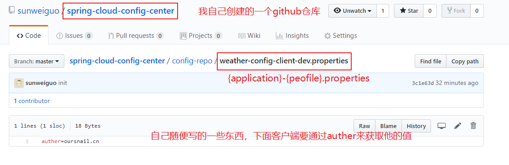
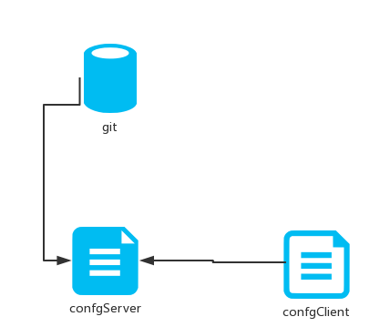

# 10.天气预报系统-集中化配置

## 一、背景

随着线上项目变的日益庞大，每个项目都散落着各种配置文件，如果采用分布式的开发模式，需要的配置文件随着服务增加而不断增多。某一个基础服务信息变更，都会引起一系列的更新和重启，运维苦不堪言也容易出错。配置中心便是解决此类问题的灵丹妙药。

我们需要一个外部的、集中化的一个配置中心。

## 二、配置分类

- 按配置的来源划分

主要有源代码、文件、数据库连接、远程调用等

- 按配置的环境划分

主要有开发环境、测试环境、预发布环境、生产环境等。

- 按配置的集成阶段划分

编译时、打包时和运行时

- 按配置的加载方式划分

启动加载和动态加载


## 三、Spring Cloud Config

在我们了解`spring cloud config`之前，我可以想想一个配置中心提供的核心功能应该有什么

- 提供服务端和客户端支持
- 集中管理各环境的配置文件
- 配置文件修改之后，可以快速的生效
- 可以进行版本管理
- 支持大的并发查询
- 支持各种语言

`Spring Cloud Config`可以完美的支持以上所有的需求。

**Spring Cloud Config项目是一个解决分布式系统的配置管理方案。它包含了Client和Server两个部分，server提供配置文件的存储、以接口的形式将配置文件的内容提供出去，client通过接口获取数据、并依据此数据初始化自己的应用。Spring cloud使用git或svn存放配置文件，默认情况下使用git.**

<div align="center">
    
</div>

## Server端

注册到`eureka`的实例名：`weather-config-server`

1、添加依赖


```
<dependencies>
  <dependency>
    <groupId>org.springframework.cloud</groupId>
    <artifactId>spring-cloud-config-server</artifactId>
  </dependency>
</dependencies>
```

2、配置文件

```
spring:
  application:
    name: weather-config-server
  cloud:
    config:
      server:
        git:
          uri: https://github.com/sunweiguo/spring-cloud-config-center
          search-paths: config-repo
          username: sunweiguo
          password: xxx
eureka:
  client:
    service-url:
      defaultZone: http://localhost:8761/eureka
server:
  port: 8086
```

`config-repo`这个文件夹是由自己在github上创建的。在这个目录下新建一个文件：`weather-config-client-dev.properties`,里面的内容为`auther=oursnail.cn`(随便写点东西以供测试)

> 仓库中的配置文件会被转换成web接口，访问可以参照以下的规则：
> 
> /{application}/{profile}[/{label}]
> 
> /{application}-{profile}.yml
> 
> /{label}/{application}-{profile}.yml
> 
> /{application}-{profile}.properties
> 
> /{label}/{application}-{profile}.properties

我这里的`weather-config-client-dev.properties`,它的`application`是`weather-config-client`，`profile`是`dev`。`client`会根据填写的参数来选择读取对应的配置。

<div align="center">
    
</div>


3、启动类

启动类添加`@EnableConfigServer`，激活对配置中心的支持


```java
@SpringBootApplication
@EnableDiscoveryClient
@EnableConfigServer
public class WeatherEurekaClientApplication {

    public static void main(String[] args) {
        SpringApplication.run(WeatherEurekaClientApplication.class, args);
    }
}
```
到此server端相关配置已经完成

4、测试

访问 http://localhost:8086/auther/dev 返回：


```
{
"name": "auther",
"profiles": [
"dev"
],
"label": null,
"version": "ef1a6baeddce01d3956ba2a7181f66721959a10c",
"state": null,
"propertySources": []
}
```
我们可以读到`auther`里的内容，说明服务端配置成功。

## 四、Client端

注册到`eureka`的实例名：`weather-config-client`

1、添加依赖


```
<dependencies>
  <dependency>
    <groupId>org.springframework.cloud</groupId>
    <artifactId>spring-cloud-starter-config</artifactId>
  </dependency>
  <dependency>
    <groupId>org.springframework.boot</groupId>
    <artifactId>spring-boot-starter-web</artifactId>
  </dependency>
  <dependency>
    <groupId>org.springframework.boot</groupId>
    <artifactId>spring-boot-starter-test</artifactId>
    <scope>test</scope>
  </dependency>
</dependencies>
```


2、配置文件

需要配置两个配置文件，`application.properties`和`bootstrap.properties`

`application.properties`如下：


```
spring.application.name=weather-config-client
server.port=8087

eureka.client.service-url.defaultZone: http://localhost:8761/eureka
```


`bootstrap.properties`如下：


```
spring.cloud.config.name=weather-config-client
spring.cloud.config.profile=dev
spring.cloud.config.uri=http://localhost:8086/
spring.cloud.config.label=master
```

`spring.application.name`：对应`{application}`部分

`spring.cloud.config.profile`：对应`{profile}`部分

`spring.cloud.config.label`：对应git的分支。如果配置中心使用的是本地存储，则该参数无用

`spring.cloud.config.uri`：配置中心的具体地址,就是server端地址


> 特别注意：上面这些与spring-cloud相关的属性必须配置在bootstrap.properties中，config部分内容才能被正确加载。因为config的相关配置会先于application.properties，而bootstrap.properties的加载也是先于application.properties。

测试：


```java
@RunWith(SpringRunner.class)
@SpringBootTest
public class WeatherEurekaClientApplicationTests {
    @Value("${auther}")
    private String auther;

    @Test
    public void contextLoads() {
        Assert.assertEquals("oursnail.cn",auther);
    }

}
```

如果测试通过，那么获取内容成功。

但是我们通过网页的方式进行测试，我们会发现修改了github上的内容后，网页上的内容是不能立即刷新的。这比较头疼，可以通过一些途径去解决。


```java
@RestController
public class HelloController {
    @Value("${auther}")
    private String auther;

    @GetMapping("/hello")
    public String hello(){
        return auther;
    }
}
```
