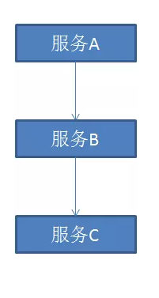
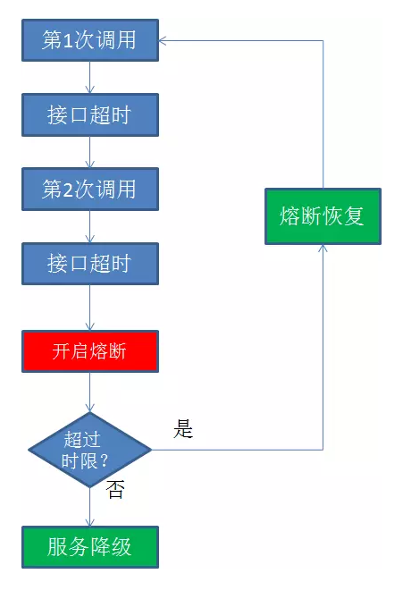
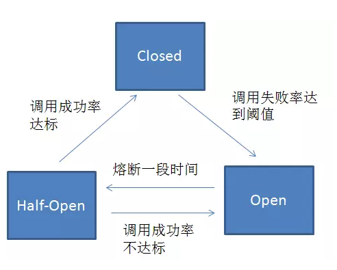
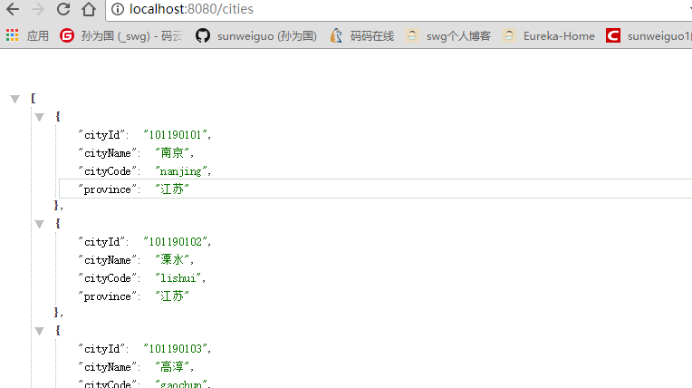
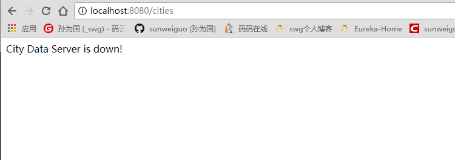
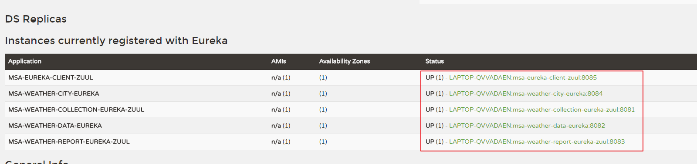
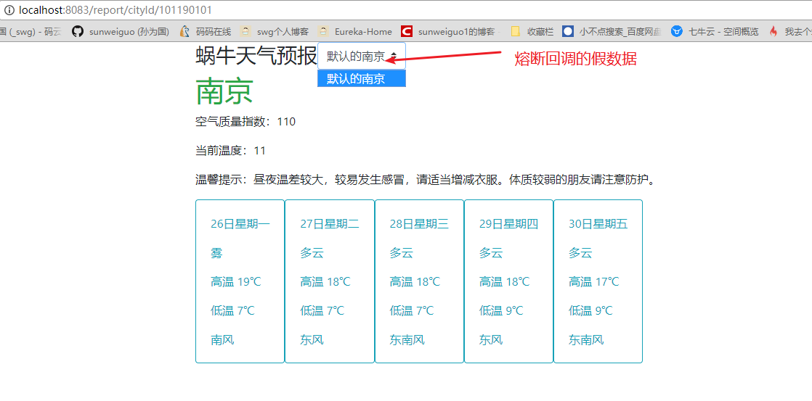
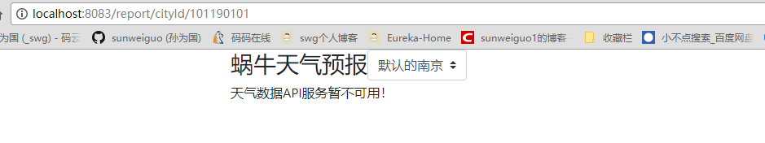

# 11.天气预报系统-熔断机制

## 一、定义

保护系统的一种方式，当请求超出阈值，把真实的服务接口断开，可能只是返回给你一个默认值。这样，掐断了自己的服务，又可以给用户一个响应。


> 对该服务的调用执行熔断，对于后续请求，不再继续调用该目标服务，而是直接返回，从而可以快速释放资源。


熔断器好处：系统稳定、减少性能损耗、及时响应、阈值可配置

熔断这一概念来源于电子工程中的断路器（Circuit Breaker）。在互联网系统中，当下游服务因访问压力过大而响应变慢或失败，上游服务为了保护系统整体的可用性，可以暂时切断对下游服务的调用。

这种牺牲局部，保全整体的措施就叫做熔断。

如果不采取熔断措施，我们的系统会怎样呢？我们来看一个栗子。当前系统中有A，B，C三个服务，服务A是上游，服务B是中游，服务C是下游。它们的调用链如下：

<div align="center">
    
</div>

一旦下游服务C因某些原因变得不可用，积压了大量请求，服务B的请求线程也随之阻塞。线程资源逐渐耗尽，使得服务B也变得不可用。紧接着，服务A也变为不可用，整个调用链路被拖垮。

<div align="center">
    
</div>

像这种调用链路的连锁故障，叫做<b>雪崩</b>。

正所谓刮骨疗毒，壮士断腕。在这种时候，就需要我们的熔断机制来挽救整个系统。

<div align="center">
    
</div>

1. **<font color="red">开启熔断</font>**:在固定时间窗口内，接口调用超时比率达到一个阈值，会开启熔断。进入熔断状态后，后续对该服务接口的调用不再经过网络，直接执行本地的默认方法，达到服务降级的效果。
2. **<font color="red">熔断恢复</font>**:熔断不可能是永久的。当经过了规定时间之后，服务将从熔断状态回复过来，再次接受调用方的远程调用。


## 二、熔断和降级

1. 在股票市场，熔断这个词大家都不陌生，是指当股指波幅达到某个点后，交易所为控制风险采取的暂停交易措施。相应的，服务熔断一般是指软件系统中，由于某些原因使得服务出现了过载现象，为防止造成整个系统故障，从而采用的一种保护措施，所以很多地方把熔断亦称为过载保护。
2. 大家都见过女生旅行吧，大号的旅行箱是必备物，平常走走近处绰绰有余，但一旦出个远门，再大的箱子都白搭了，怎么办呢？常见的情景就是把物品拿出来分分堆，比了又比，最后一些非必需品的就忍痛放下了，等到下次箱子够用了，再带上用一用。而服务降级，就是这么回事，整体资源快不够了，忍痛将某些服务先关掉，待渡过难关，再开启回来。


>降级白话理解：比如在公司 遇到贵宾要来 就把一些不重要的常规接待暂停 把这些资源供给招待贵宾 之前有个淘宝的分享 比如双11 把订单评论和收藏等功能在这一天暂停 把这些资源分给其它关键服务 比如下单

所以从上述分析来看，两者其实从有些角度看是有一定的类似性的：
1. **<font color="red">目的很一致</font>**，都是从可用性可靠性着想，为防止系统的整体缓慢甚至崩溃，采用的技术手段；
2. **<font color="red">最终表现类似</font>**，对于两者来说，最终让用户体验到的是某些功能暂时不可达或不可用；
3. **<font color="red">粒度一般都是服务级别</font>**，当然，业界也有不少更细粒度的做法，比如做到数据持久层（允许查询，不允许增删改）；
4. **<font color="red">自治性要求很高</font>**，熔断模式一般都是服务基于策略的自动触发，降级虽说可人工干预，但在微服务架构下，完全靠人显然不可能，开关预置、配置中心都是必要手段；

而两者的区别也是明显的：

1. **<font color="red">触发原因不太一样</font>**，服务熔断一般是某个服务（下游服务）故障引起，而服务降级一般是从整体负荷考虑；
2. **<font color="red">管理目标的层次不太一样</font>**，熔断其实是一个框架级的处理，每个微服务都需要（无层级之分），而降级一般需要对业务有层级之分（比如降级一般是从最外围服务开始）

## 三、Spring Cloud Hystrix

Spring Cloud Hystrix是基于Netflix的开源框架Hystrix实现，该框架实现了服务熔断、线程隔离等一系列服务保护功能。对于熔断机制的实现，Hystrix设计了三种状态：

<div align="center">
    
</div>

1. **<font color="red">熔断关闭状态（Closed）</font>**：服务没有故障时，熔断器所处的状态，对调用方的调用不做任何限制。
2. **<font color="red">熔断开启状态（Open）</font>**：在固定时间窗口内（Hystrix默认是10秒），接口调用出错比率达到一个阈值（Hystrix默认为50%），会进入熔断开启状态。进入熔断状态后，后续对该服务接口的调用不再经过网络，直接执行本地的fallback方法。
3. **<font color="red">半熔断状态（Half-Open）</font>**：在进入熔断开启状态一段时间之后（Hystrix默认是5秒），熔断器会进入半熔断状态。所谓半熔断就是尝试恢复服务调用，允许有限的流量调用该服务，并监控调用成功率。如果成功率达到预期，则说明服务已恢复，进入熔断关闭状态；如果成功率仍旧很低，则重新进入熔断关闭状态。


集成Hystrix也是很简单的：

demo的改造的基础是`eureka-client-feign`,将其改造为`eureka-client-feign-hystrix`

1、引入依赖：


```xml
<!--Hystrix-->
<dependency>
    <groupId>org.springframework.cloud</groupId>
    <artifactId>spring-cloud-starter-netflix-hystrix</artifactId>
</dependency>
```
2、添加注解@EnableCircuitBreaker，启用Hystrix


```java
@SpringBootApplication
@EnableDiscoveryClient
@EnableFeignClients
@EnableCircuitBreaker
public class EurekaClientFeignApplication {

    public static void main(String[] args) {
        SpringApplication.run(EurekaClientFeignApplication.class, args);
    }
}
```

3、在controller方法上增加注解@HystrixCommand


```java
@RestController
public class TestController {
    @Autowired
    private CityClient cityClient;

    @GetMapping("cities")
    @HystrixCommand(fallbackMethod = "defaultCities")
    public String getData(){
        String res = cityClient.listCity();
        return res;
    }

    public String defaultCities(){
        return "City Data Server is down!";
    }
}
```
4、测试

启动eureka和城市数据服务，再启动本服务，是正常的。

<div align="center">
    
</div>

那么，我们将城市数据服务关闭，看看有没有返回我们指定的默认值。

<div align="center">
    
</div>

## 四、改造本系统

在demo中，用`@HystrixCommand`注解中的熔断时执行的方法来实现异常情况下的默认返回。现在我们要改造`msa-weather-report-eureka-feign-gateway`，将其改造为`msa-weather-report-eureka-feign-gateway-hystrix`，我们用新的方式，直接在`DataClient`这个接口里面声明触发熔断时回调的类`DataClientFallback.class`。


```java
@FeignClient(name = "msa-eureka-client-zuul",fallback = DataClientFallback.class)
public interface DataClient {
    /**
     * 获取城市列表
     */
    @RequestMapping("city/cities")
    List<City> listCity() throws Exception;

    /**
     * 根据城市ID获取天气
     */
    @RequestMapping("data/weather/cityId/{cityId}")
    WeatherResponse getDataByCityId(@PathVariable("cityId") String cityId);

}
```
具体这个回调的类里面时这样写的：
```
@Component
public class DataClientFallback implements DataClient {
    @Override
    public List<City> listCity() throws Exception {
        List<City> cityList = new ArrayList<>();
        City city = new City();
        city.setCityId("101190101");
        city.setCityName("默认的南京");

        cityList.add(city);
        return cityList;
    }

    @Override
    public WeatherResponse getDataByCityId(String cityId) {
        return null;
    }
}
```
也就是说，如果城市数据服务挂了，就默认返回一下我这里设置的城市；如果获取天气信息的服务挂了，我们就直接返回null;

那么，我们就相当于在feign中启用hystrix，就需要在配置文件中增加配置：


```
feign:
  hystrix:
    enabled: true
```

因为如果根据城市id获取天气信息的服务不可用时，我们默认直接返回null，显示页面啥都不显示时不好的，所以我们需要在前端判断一下：


```html
<!--不为空时-->
<div th:if="${reportModel.report} != null">
    <div class="row">
        <h1 class="text-success" th:text="${reportModel.report.city}">城市名称</h1>
    </div>

    <div class="row">
        <p>
            空气质量指数：<span th:text="${reportModel.report.aqi}"></span>
        </p>
    </div>
    <div class="row">
        <p>
            当前温度：<span th:text="${reportModel.report.wendu}"></span>
        </p>
    </div>
    <div class="row">
        <p>
            温馨提示：<span th:text="${reportModel.report.ganmao}"></span>
        </p>
    </div>
    <div class="row">
        <div class="card  border-info" th:each="forecast : ${reportModel.report.forecast}">
            <div class="card-body text-info">
                <p class="card-text" th:text="${forecast.date}">日期</p>
                <p class="card-text " th:text="${forecast.type}">天气类型</p>
                <p class="card-text" th:text="${forecast.high}">最高温度</p>
                <p class="card-text" th:text="${forecast.low}">最低温度</p>
                <p class="card-text" th:text="${forecast.fengxiang}">风向</p>
            </div>
        </div>
    </div>
</div>
<!--为空时，说明熔断器生效，直接显示提示信息-->
<div th:if="${reportModel.report} == null">
    <div class="row">
       <p>
           天气数据API服务暂不可用！
       </p>
    </div>
</div>
```

下面就来测试一把吧！

首先时完全正常的情况，各个服务都可用：

启动如下服务：redis,`weather-sureka-server`,`msa-weather-city-eureka`,`msa-weather-collection-eureka-feign-gateway`,`msa-weather-data-eureka`,`msa-weather-report-eureka-feign-gateway-hystrix`,`msa-eureka-client-zuul`这六个服务：

<div align="center">
    
</div>

正常的话，就会看到之前的页面：http://localhost:8083/report/cityId/101190101


城市数据服务不可用，熔断器生效：

关闭城市数据服务`msa-weather-city-eureka`，造成服务不可用的现象。看页面显示是否只有我塞进去的假数据。


<div align="center">
    
</div>


天气数据服务不可用，熔断器生效：

关闭天气数据API服务`msa-weather-data-eureka`.看页面是否显示服务暂不可用的提示信息。

报了一个空指针错误，原因是`msa-weather-report-eureka-feign-gateway-hystrix`中`WeatherReportServiceImpl`中的方法原来是这样写的：


```java
@Service
@Slf4j
public class WeatherReportServiceImpl implements IWeatherReportService {
    @Autowired
    private WeatherClient weatherClient;

    @Override
    public Weather getDataByCityId(String cityId) {
        return weatherClient.getDataByCityId(cityId).getData();
    }
}
```


显然，要做一下判空操作，否则是不能调用`getData()`这个方法的。


```java
@Service
@Slf4j
public class WeatherReportServiceImpl implements IWeatherReportService {
    @Autowired
    private DataClient dataClient;

    @Override
    public Weather getDataByCityId(String cityId) {
        WeatherResponse res = dataClient.getDataByCityId(cityId);
        Weather weather = null;
        if(res != null){
            weather = res.getData();
        }
        return weather;
    }
}
```
这样子，重新启动天气预报UI服务。就可以看到效果啦！

<div align="center">
    
</div>
这样，本系统集成`hystrix`就成功了。