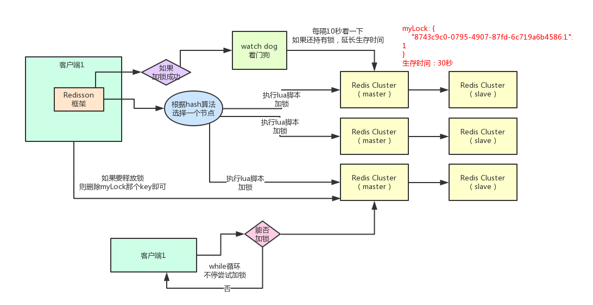
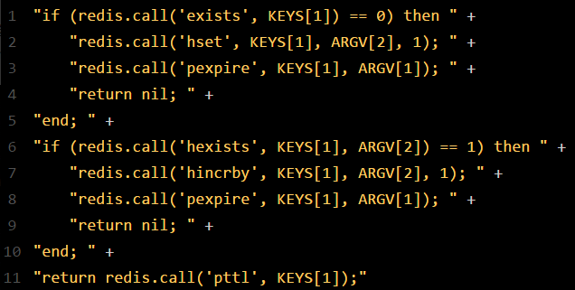
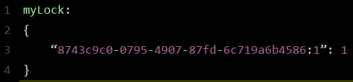
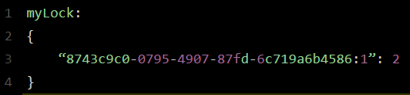

# Redisson实现Redis分布式锁原理

用Redisson来实现分布式锁异常地简单，形如：

<div align="center">
    
</div>

还支持redis单实例、redis哨兵、redis cluster、redis master-slave等各种部署架构，都可以给你完美实现。

## 加锁

原理图：

<div align="center">
    
</div>

现在某个客户端要加锁。如果该客户端面对的是一个`redis cluster`集群，他首先会根据hash节点选择一台机器。紧接着，就会发送一段lua脚本到redis上，那段lua脚本如下所示：

<div align="center">
    
</div>

为啥要用lua脚本呢？因为一大坨复杂的业务逻辑，可以通过封装在lua脚本中发送给redis，保证这段复杂业务逻辑执行的**原子性**。

解释一下这段脚本的意思。

这里的`KEYS[1]`代表的是你加锁的那个key的名字。这个key就是我们常看到的：

```java
RLock lock = redisson.getLock("myLock");
```
中的`myLock`，我就是对这个key进行加锁。

这里的`ARGV[1]`代表的就是锁key的默认生存时间，默认30秒。`ARGV[2]`代表的是加锁的客户端的ID:比如`8743c9c0-0795-4907-87fd-6c719a6b4586:1`

第一段if判断语句，就是相当于用`exists myLock`命令判断一下，如果你要加锁的那个锁key不存在的话，你就进行加锁。如何加锁呢？很简单，用下面的命令：`hset myLock`。

执行完`hest`之后，设置了一个hash数据结构：`8743c9c0-0795-4907-87fd-6c719a6b4586:1 1`，这行命令执行后，会出现一个类似下面的数据结构：

<div align="center">
    
</div>

紧接着会执行`pexpire myLock 30000`命令，设置myLock这个锁key的生存时间是30秒。好了，到此为止，ok，加锁完成了。

## 锁互斥

那么在这个时候，如果客户端2来尝试加锁，执行了同样的一段lua脚本，会咋样呢？很简单，第一个if判断会执行`exists myLock`，发现myLock这个锁key已经存在了。接着第二个if判断，判断一下，myLock锁key的hash数据结构中，是否包含客户端2的ID，但是明显不是的，因为那里包含的是客户端1的ID。

所以这个客户端2两个if都不能进入，只能执行最后的`pttl myLock`，返回值代表了myLock这个锁key的剩余生存时间。比如还剩15000毫秒的生存时间。此时客户端2会进入一个while循环，不停的尝试加锁。

## watch dog自动延期机制

客户端1加锁的锁key默认生存时间才30秒，如果超过了30秒，客户端1还想一直持有这把锁，怎么办呢？

简单！只要客户端1一旦加锁成功，就会启动一个`watch dog`看门狗，他是一个后台线程，会每隔10秒检查一下，如果客户端1还持有锁key，那么就会不断的延长锁key的生存时间。


## 可重入加锁机制

看一下代码，相同的客户进来，会进入第二个if，会执行`hincrby`，即增1，那么这个hash结构就会变成：

<div align="center">
    
</div>

## 释放锁

如果执行`lock.unlock()`，就可以释放分布式锁，此时的业务逻辑也是非常简单的。其实说白了，就是每次都对myLock数据结构中的那个加锁次数减1。如果发现加锁次数是0了，说明这个客户端已经不再持有锁了，此时就会用：`del myLock`命令，从redis里删除这个key。然后呢，另外的客户端2就可以尝试完成加锁了。

这就是所谓的分布式锁的开源Redisson框架的实现机制。

## 存在的问题

其实上面那种方案最大的问题，就是如果你对某个`redis master`实例，写入了myLock这种锁key的value，此时会异步复制给对应的`master slave`实例。

但是复制的这个过程中一旦发生`redis master`宕机，主备切换，`redis slave`变为了`redis master`。

假设客户端1在`redis master`上获得锁，然后主机宕机，`redis slave`成为新的`redis master`，但是还未同步到`redis slave`上，但是客户端1已经觉得自己获取到了锁。

此时，客户端2来尝试加锁的时候，在新的`redis master`上完成了加锁，此时就会发生多个客户端完成对一个key的加锁。这时系统在业务语义上一定会出现问题，导致各种脏数据的产生。

所以这个就是`redis cluster`，或者是`redis master-slave`架构的主从异步复制导致的redis分布式锁的最大缺陷：在`redis master`实例宕机的时候，可能导致多个客户端同时完成加锁。