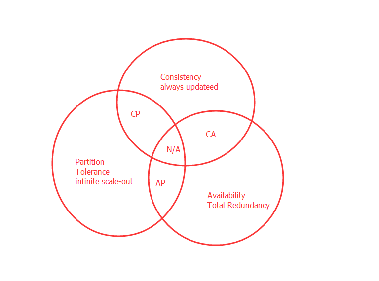

# Zookeeper笔记1-CAP和BASE理论

## 前言

学习`zookeeper`才算是真正跨进分布式这个大门。比较经典的应用是可以作为`dubbo`推荐的注册中心。

首先，我们必须要明确几个我们之前可能不会遇到的但是在分布式系统中又很常见的问题：

- 网络相当可靠
- 延迟为0
- 传输带宽是无限的
- 网络相当安全
- 拓扑结构不会改变
- 必须要有一个管理员
- 传输成本为0
- 网络同质化

总结起来，分布式系统中最常出现的问题是：通信异常，表现为网络通信成功，失败和超时；节点故障，包括宕机和OOM

## Zookeeper是什么

官方解释：

> 它是一个分布式服务框架，是Apache Hadoop 的一个子项目，它主要是用来解决分布式应用中经常遇到的一些数据管理问题，如：统一命名服务、状态同步服务、集群管理、分布式应用配置项的管理等。

上面的解释有点抽象，简单来说**zookeeper=文件系统+监听通知机制**。我们这里拿比较简单的分布式应用配置管理为例来说明。

假设我们的程序是分布式部署在多台机器上，如果我们要改变程序的配置文件，需要逐台机器去修改，非常麻烦，现在把这些配置全部放到`zookeeper`上去，保存在 `zookeeper` 的某个目录节点中，然后所有相关应用程序对这个目录节点进行监听，一旦配置信息发生变化，每个应用程序就会收到 `zookeeper` 的通知，然后从 `zookeeper` 获取新的配置信息应用到系统中。

    

## Zookeeper设计目的

* 1、最终一致性：`client`不论连接到哪个`Server`，展示给它都是同一个视图，这是`zookeeper`最重要的性能。 
* 2、可靠性：具有简单、健壮、良好的性能，如果消息被到一台服务器接受，那么它将被所有的服务器接受。 
* 3、实时性：`Zookeeper`保证客户端将在一个时间间隔范围内获得服务器的更新信息，或者服务器失效的信息。但由于网络延时等原因，`Zookeeper`不能保证两个客户端能同时得到刚更新的数据，如果需要最新数据，应该在读数据之前调用`sync()`接口。 
* 4、等待无关（wait-free）：慢的或者失效的`client`不得干预快速的`client`的请求，使得每个`client`都能有效的等待。 
* 5、原子性：更新只能成功或者失败，没有中间状态。 
* 6、顺序性：包括全局有序和偏序两种：全局有序是指如果在一台服务器上消息a在消息b前发布，则在所有Server上消息a都将在消息b前被发布；偏序是指如果一个消息b在消息a后被同一个发送者发布，a必将排在b前面。 

## CAP理论

指的是在一个分布式系统中，不可能同时满足Consistency（一致性）、 Availability（可用性）、Partition tolerance（分区容错性）这三个基本需求，最多只能满足其中的两项。

* 1、一致性：
指数据在多个副本之间是否能够保持一致的特性。当执行数据更新操作后，仍然剋保证系统数据处于一致的状态。
* 2、可用性(高可用)：
系统提供的服务必须一直处于可用的状态。对于用户的每一个操作请求总是能够在“有限的时间内”返回结果。这个有限时间是系统设计之初就指定好的系统运行指标。返回的结果指的是系统返回用户的一个正常响应结果，而不是“out ot memory error”之类的系统错误信息。
* 3、分区容错性（数据分片）：
分布式系统在遇到任何网络分区故障的时候，仍然需要能够保证对外提供满足一致性和可用性的服务，除非是整个网络环境都发生了故障。组成分布式系统的每个节点的加入与退出都可以看成是一个特殊的网络分区。

一个分布式系统无法同时满足这三个条件，只能满足两个，意味着我们要抛弃其中的一项，如下图所示：

    

* 1、CA，放弃P：将所有数据都放在一个分布式节点上。这同时放弃了系统的可扩展性。
* 2、CP，放弃A：一旦系统遇到故障时，受影响的服务器需要等待一段时间，在恢复期间无法对外提供正常的服务。
* 3、AP，放弃C：这里的放弃一致性是指放弃数据强一致性，而保留数据的最终一致性。系统无法实时保持数据的一致，但承诺在一个限定的时间窗口内，数据最终能够达到一致的状态。

对于分布式系统而言，分区容错性是一个最基本的要求，因为分布式系统中的组件必然需要部署到不通的节点，必然会出现子网络，在分布式系统中，网络问题是必定会出现的异常。因此分布式系统只能在C（一致性）和A（可用性）之间进行权衡。

## BASE理论

`Basically Available`（基本可用）、`Soft-state`（ 软状态/柔性事务）、`Eventual Consistency`（最终一致性）。是基于CAP定理演化而来，是对CAP中一致性和可用性权衡的结果。

核心思想：即使无法做到强一致性，但每个业务根据自身的特点，采用适当的方式来使系统达到最终一致性。

* 1、基本可用：
指分布式系统在出现故障的时候，允许损失部分可用性，保证核心可用。但不等价于不可用。比如：搜索引擎0.5秒返回查询结果，但由于故障，2秒响应查询结果；网页访问过大时，部分用户提供降级服务，等。
* 2、软状态：
软状态是指允许系统存在中间状态，并且该中间状态不会影响系统整体可用性。即允许系统在不同节点间副本同步的时候存在延时。
* 3、最终一致性：
系统中的所有数据副本经过一定时间后，最终能够达到一致的状态，不需要实时保证系统数据的强一致性。最终一致性是弱一致性的一种特殊情况。

BASE理论面向的是大型高可用可扩展的分布式系统，通过牺牲强一致性来获得可用性。ACID是传统数据库常用的概念设计，追求强一致性模型。

