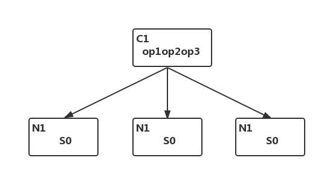
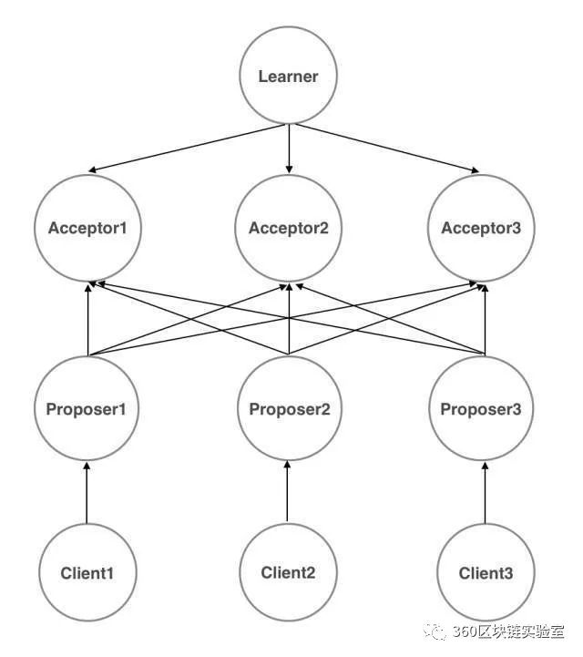
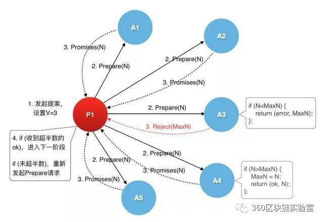
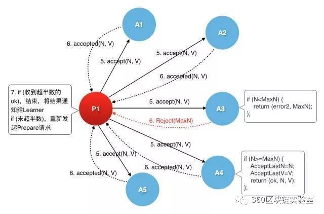
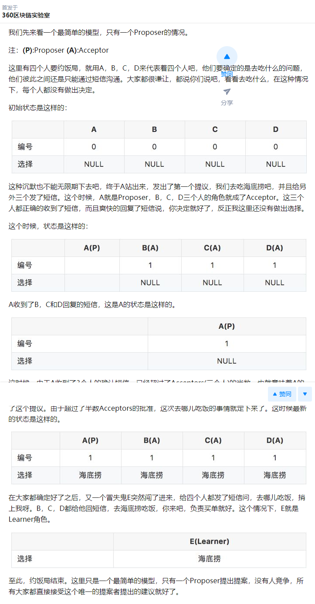

# Zookeeper笔记3-paxos算法

本章尝试从程序的角度来了解一下paxos算法。

## 一、paxos解决了什么问题

在上一章节中，我们着重提到了解决一致性问题的两种协议：2PC和3PC。但是在分布式环境中，这两种协议都无法真正实现一致性(分布式的一致性问题其实主要是指分布式系统中的数据一致性问题。所以，为了保证分布式系统的一致性，就要保证分布式系统中的数据是一致的。)

分布式系统中的节点通信存在两种模型：共享内存（Shared memory）和消息传递（Messages passing）。基于消息传递通信模型的分布式系统，不可避免的会发生以下错误：
- 进程可能会慢、被杀死或者重启
- 消息可能会延迟、丢失、重复

（在基础 Paxos 场景中，先不考虑可能出现消息篡改即拜占庭错误的情况）

**Paxos 算法解决的问题是在一个可能发生上述异常的分布式系统中如何就某个值达成一致，保证不论发生以上任何异常，都不会破坏决议的一致性。**

那么我们可用形象地理解为：Paxos可以说是一个民主选举的算法——大多数节点的决定会成个整个集群的统一决定。任何一个点都可以提出要修改某个数据的提案，是否通过这个提案取决于这个集群中是否有超过半数的节点同意。取值一旦确定将不再更改，并且可以被获取到(不可变性，可读取性)。

## 二、典型场景

一个典型的场景是，在一个分布式数据库系统中，如果各节点的初始状态一致，每个节点都执行相同的操作序列，那么他们最后能得到一个一致的状态。为保证每个节点执行相同的命令序列，需要在每一条指令上执行一个“一致性算法”以保证每个节点看到的指令一致。

所以，**paxos算法主要解决的问题就是如何保证分布式系统中各个节点都能执行一个相同的操作序列**。

    

上图中，C1是一个客户端，N1、N2、N3是分布式部署的三个服务器，初始状态下N1、N2、N3三个服务器中某个数据的状态都是S0。当客户端要向服务器请求处理操作序列：op1--op2--op3时（op表示operation）

如果想保证在处理完客户端的请求之后，N1、N2、N3三个服务器中的数据状态都能从S0变成S1并且一致的话（或者没有执行成功，还是S0状态），就要保证N1、N2、N3在接收并处理操作序列op1--op2--op3时，严格按照规定的顺序正确执行opi，要么全部执行成功，要不就全部都不执行。

所以，针对上面的场景，paxos解决的问题就是如何依次确定不可变操作opi的取值，也就是确定第i个操作什么，在确定了opi的内容之后，就可以让各个副本执行opi操作。

## 三、paxos算法

### 1、算法涉及的主要角色：

- Proposer：提议者，提出议案(同时存在一个或者多个，他们各自发出提案)
- Acceptor：接受者，收到议案后选择是否接受
- Learner：最终决策学习者，只学习正确的决议
- Client：产生议题者，发起新的请求

    

主要的角色就是“提议者”和“接受者”。先有提议，再来表决。（注：实际应用中，可以将一堆服务器任意指定角色，一部分做“提议者”、一部分做“接受者”，也可以指定特定的服务器做“提议者”，剩下的都是“接受者”。）

Proposer就像Client的代理人，由Proposer拿着Client的议题去向Acceptor提议，让Acceptor来做出决策。

这幅图表示的是角色之间的逻辑关系，每一种角色就代表了一种节点类型。在物理部署环节，可以把每一种角色都部署在一台物理机器上，也可以组合任何两种或者多种角色部署在一台物理机器上，甚至于，把这四种角色都部署在同一台物理机器上也是可以的。

### 2、整个算法的大致过程为：

第一阶段：Prepare阶段

proposer选择一个提案编号n并将Prepare请求发送给acceptors中的一个多数派(即超过半数)；acceptor收到Prepare消息后，**如果提案的编号大于它已经回复的所有Prepare消息，则acceptor将自己上次接受的提案回复给proposer**，并承诺不再回复小于n的提案；

注意加粗部分，如果这个acceptors是第一次收到来自proposer的提案，那就无脑接收。在自己账本上记录下(N,"来自谁谁的提案").并且保证下面小于这个N的提案不再被接受。如果大于这个N呢？要更新N的值。将更新后的值和以前接收的提案返回给proposer。

    

第二阶段：批准阶段

当一个proposer收到了多数acceptors对Prepare的回复后，就进入批准阶段。它要向回复Prepare请求的acceptors发送accept请求，包括编号n和value；

在不违背自己向其他proposer的承诺的前提下，acceptor收到accept请求后即接受这个请求。

    

### 3、关于这两阶段的理解

从一个故事说起。

从前，在国王Leslie Lamport的统治下，有个黑暗的希腊城邦叫paxos。城邦里有3类人，
- 决策者
- 提议者
- 群众

虽然这是一个黑暗的城邦但是很民主，按照议会民主制的政治模式制订法律，群众有什么建议和意见都可以写提案交给提议者，提议者会把提案交给决策者来决策，决策者有奇数个，为什么要奇数个？很简单因为决策的方式很无脑，少数服从多数。最后决策者把刚出炉的决策昭告天下，群众得知决策结果。

等一下，那哪里黑暗呢？问题就出在“提议者会把提案交给决策者来决策”，那么多提案决策者先决策谁的？谁给的钱多就决策谁的。

那这样会有几个问题，决策者那么多，怎么保证最后决策的是同一个提案，以及怎么保证拿到所有提议者中最高的报价。

聪明又贪婪的决策者想到了一个办法：分两阶段报价

**第一阶段**：

- 决策者接受所有比他当前持有报价高的报价，且不会通知之前报价的人
- 提议者给所有(一半以上即可)决策者报价，若有人比自己报价高就加价，有半数以上决策者接受自己报价就停止报价。

一旦某个提议者收到了所有决策者中一半以上的人同意的回复。就会进入第二阶段。

**第二阶段**：

提议者去找收过自己钱的大佬签合同，这里有3种情况：

- 很多大佬收了别人更高的价，达不到一半人数了，只好回去拿钱继续贿赂，回到第一阶段重新升级;
- 大佬收到的最高报价是自己的，美滋滋，半数以上成功签合同，提案成功;
- 提议者回去拿钱回来继续贿赂的时候发现合同已经被签了且半数以上都签了这个提案，不干了，赶快把自己的提案换成已经签了的提案，再去提给所有大佬，看看能不能分一杯羹遇见还没签的大佬。

最后一步就是让所有节点知道这个过半通过的提议是什么，从而达到最终的一致。

## 四、饭局例子来理解

简单的四人约饭：

    

七个人约饭局的问题：

    

还有一个问题需要考量，假如proposer A发起ID为n的提议，在提议未完成前proposer B又发起ID为n+1的提议，在n+1提议未完成前proposer C又发起ID为n+2的提议…… 如此acceptor不能完成决议、形成活锁(livelock)，虽然这不影响一致性，但我们一般不想让这样的情况发生。解决的方法是从proposer中选出一个leader，提议统一由leader发起。

## 五、总结

对于paxos算法的理解简单来说就是：以前都是一台服务器干活，但是后来发现一台服务器坏了，干的活就要停下来。于是，聪明人发明了多台服务器同时干活的方案。但这个方案有个问题，多台服务器同时提出下一步干什么事情时，最终听谁的呢？这时，Paxos算法横空出世了，利用它，可以在这多台服务器中间建立一种选举机制，并通过这个机制最终让所有服务器对下一步动作达成一致意见。这样，无论有多少台服务器同时工作，都不会发生冲突。

对于paxos算法，主要就是两阶段里面的约束规则。简单来说，第一阶段就是要让大多数节点接受自己的贿赂，第二个阶段就是让大多数接受自己贿赂的节点们在接受更多贿赂之前通过自己的决议（这里存在博弈，也可能存在死锁）。一旦通过，其他的节点在询问到这种情况之后，就会逐渐跟接受的提议趋于一致。最终只会有一个状态。

- https://zhuanlan.zhihu.com/p/44997221
- http://blog.51cto.com/9587671/2286358
- https://zhuanlan.zhihu.com/p/21895686
- http://www.cnblogs.com/bangerlee/p/5655754.html