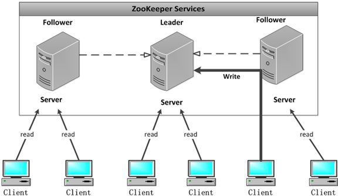
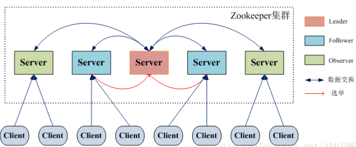

# Zookeeper笔记4-Zookeeper介绍

关于zookeeper最基本的介绍已经在笔记一中介绍了。不再赘述。ZooKeeper 是一个典型的分布式数据一致性解决方案，分布式应用程序可以基于 ZooKeeper 实现诸如数据发布/订阅、负载均衡、命名服务、分布式协调/通知、集群管理、Master 选举、分布式锁和分布式队列等功能。

    

- 1、 **配置维护**：在分布式系统中，一般会把服务部署到n台机器上，服务配置文件都是相同的，如果配置文件的配置选项发生了改变，那我们就得一台一台的去改动。这时候zookeeper就起作用了，可以把zk当成一个高可用的配置存储器，把这样配置的事情交给zk去进行管理，将集群的配置文件拷贝到zookeeper的文件系统的某个节点上，然后用zk监控所有分布式系统里的配置文件状态，一旦发现有配置文件发生了变化，那么每台服务器同步zk的配置文件，zk同时保证同步操作的原子性，确保每个服务器的配置文件都能被更新。
- 2、 **命名服务**：在分布式应用中，通常需要一个完整的命名规则，既能够产生唯一的名称又便于人识别和记住。Zk就提供了这种服务，类似于域名和ip之间对应关系，域名容易记住，通过名称来获取资源和服务的地址，提供者等信息。
- 3、 **分布式锁**：分布式程序分布在不同主机上的进程对互斥资源进行访问的时候需要加锁。这样理解：很多分布式系统有多个服务窗口，但是某个时刻只让一个服务去干活，当这台服务器出问题的时候锁释放，里脊fail over到另外的服务。举例子，比如去某个地方办理证件的时候，只能有一个窗口对你服务，如果这个窗口的柜员有急事走了，那么系统或者经理给你指定另外一个窗口继续服务。
- 4、 **集群管理**：分布式集群中，经常会由于各种原因，比如硬件故障，网络问题，有些节点挂掉、有些节点加进来。这个时候机器需要感知到变化，然后根据变化做出对应的决策，那么zk就实现了类似这种集群的管理。

## 一、特性

- **顺序一致性**：
从同一个客户端发起的事务请求，最终将会严格按照其发起顺序被应用到ZooKeeper中。
- **原子性**：
所有事务请求的结果在集群中所有机器上的应用情况是一致的，也就是说要么整个集群所有集群都成功应用了某一个事务，要么都没有应用，一定不会出现集群中部分机器应用了该事务，而另外一部分没有应用的情况。
- **单一视图**：
无论客户端连接的是哪个ZooKeeper服务器，其看到的服务端数据模型都是一致的。
- **可靠性**：
一旦服务端成功地应用了一个事务，并完成对客户端的响应，那么该事务所引起的服务端状态变更将会被一直保留下来，除非有另一个事务又对其进行了变更。
- **实时性**：
通常人们看到实时性的第一反应是，一旦一个事务被成功应用，那么客户端能够立即从服务端上读取到这个事务变更后的最新数据状态。这里需要注意的是，ZooKeeper仅仅保证在一定的时间段内，客户端最终一定能够从服务端上读取到最新的数据状态。

## 二、集群角色

最典型集群模式： Master/Slave 模式（主备模式）。在这种模式中，通常 Master服务器作为主服务器提供写服务，其他的 Slave 服务器从服务器通过异步复制的方式获取 Master 服务器最新的数据提供读服务。

但是，在 ZooKeeper 中没有选择传统的  Master/Slave 概念，而是引入以下三种角色：
- Leader 
- Follower
- Observer

    

`zookeeper-server status`可以看当前节点的ZooKeeper是什么角色。

ZooKeeper默认只有Leader和Follower两种角色，没有Observer角色。

ZooKeeper集群的所有机器通过一个Leader选举过程来选定一台被称为『Leader』的机器，Leader服务器为客户端提供读和写服务。

Follower和Observer都能提供读服务，不能提供写服务。两者唯一的区别在于，Observer机器不参与Leader选举过程，也不参与写操作的『过半写成功』策略，因此Observer可以在不影响写性能的情况下提升集群的读性能。

    

系统模型如图所示：

    

## 三、关于`ZooKeeper`的一些重要概念

- `ZooKeeper`本身就是一个分布式程序（**只要半数以上节点存活，`ZooKeeper`就能正常服务**）
- 为了保证高可用，最好是以集群形态来部署`ZooKeeper`，这样只要集群中大部分机器是可用的（能够容忍一定的机器故障），那么`ZooKeeper`本身仍然是可用的。
- `ZooKeeper`将数据保存在内存中，这也就保证了 高吞吐量和低延迟（但是内存限制了能够存储的容量不太大，此限制也是保持`znode`中存储的数据量较小的进一步原因）。
- **`ZooKeeper`是高性能的。 在“读”多于“写”的应用程序中尤其地高性能，因为“写”会导致所有的服务器间同步状态。**（“读”多于“写”是协调服务的典型场景。）
- `ZooKeeper`有临时节点的概念。 当创建临时节点的客户端会话一直保持活动，瞬时节点就一直存在。而当会话终结时，瞬时节点被删除。持久节点是指一旦这个`ZNode`被创建了，除非主动进行`ZNode`的移除操作，否则这个`ZNode`将一直保存在`Zookeeper`上。
- `ZooKeeper`底层其实只提供了两个功能：①管理（存储、读取）用户程序提交的数据；②为用户程序提交数据节点监听服务。

只要半数以上节点存活，`ZooKeeper`就能正常服务，==这也解释了为什么集群个数一般是奇数==。

我们知道在`Zookeeper`中`Leader`选举算法采用了`Zab`协议。`Zab`核心思想是当多数`Server`写成功，则任务数据写成功。

①如果有3个`Server`，则最多允许1个`Server`挂掉。

②如果有4个`Server`，则同样最多允许1个`Server`挂掉。

既然3个或者4个`Server`，同样最多允许1个`Server`挂掉，那么它们的可靠性是一样的，所以选择奇数个`ZooKeeper Server`即可，这里选择3个`Server`。

## 四、会话

`Session`是指客户端会话，在讲解客户端会话之前，我们先来了解下客户端连接。在`ZooKeeper`中，一个客户端连接是指客户端和`ZooKeeper`服务器之间的TCP长连接。`ZooKeeper`对外的服务端口默认是2181，客户端启动时，首先会与服务器建立一个TCP连接，从第一次连接建立开始，客户端会话的生命周期也开始了，通过这个连接，客户端能够通过心跳检测和服务器保持有效的会话，也能够向`ZooKeeper`服务器发送请求并接受响应，同时还能通过该连接接收来自服务器的`Watch`事件通知。

`Session`的`SessionTimeout`值用来设置一个客户端会话的超时时间。当由于服务器压力太大、网络故障或是客户端主动断开连接等各种原因导致客户端连接断开时，只要在`SessionTimeout`规定的时间内能够重新连接上集群中任意一台服务器，那么之前创建的会话仍然有效。

在为客户端创建会话之前，服务端首先会为每个客户端都分配一个`sessionID`。由于`sessionID` 是`Zookeeper`会话的一个重要标识，许多与会话相关的运行机制都是基于这个`sessionID`的，因此，无论是哪台服务器为客户端分配的`sessionID`，都务必保证全局唯一。

## 五、数据节点

`Zookeeper`将所有数据存储在内存中，数据模型是一棵树（`Znode Tree`)，由斜杠（/）的进行分割的路径，就是一个`Znode`，例如`/foo/path1`。每个上都会保存自己的数据内容，同时还会保存一系列属性信息。

## 六、Watcher

`Watcher`（事件监听器），是`Zookeeper`中的一个很重要的特性。`Zookeeper`允许用户在指定节点上注册一些`Watcher`，并且在一些特定事件触发的时候，`ZooKeeper`服务端会将事件通知到感兴趣的客户端上去，该机制是`Zookeeper`实现分布式协调服务的重要特性。

## 七、版本

在前面我们已经提到，`Zookeeper`的每个`ZNode`上都会存储数据，对应于每个`ZNode`，`Zookeeper`都会为其维护一个叫作`Stat`的数据结构，`Stat`中记录了这个`ZNode`的三个数据版本，分别是`version`（当前ZNode的版本）、`cversion`（当前ZNode子节点的版本）和 `cversion`（当前ZNode的ACL版本）。

`Zookeeper`采用`ACL`（`AccessControlLists`）策略来进行权限控制，类似于`UNIX`文件系统的权限控制。

- CREATE: 创建子节点的权限。
- READ: 获取节点数据和子节点列表的权限。
- WRITE：更新节点数据的权限。
- DELETE: 删除子节点的权限。
- ADMIN: 设置节点ACL的权限。

注意：`CREATE` 和 `DELETE` 都是针对子节点的权限控制。

下一节说说ZAB协议。