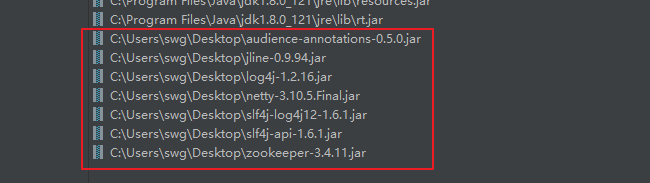

# Zookeeper笔记9-原生Java API使用

## 环境准备

新建一个普通的java项目即可，然后引入一些jar包的依赖：

<div align="center">
    
</div>
代码在`code-for-chapter9`

## 客户端与ZK建立连接


```java
import org.apache.zookeeper.WatchedEvent;
import org.apache.zookeeper.Watcher;
import org.apache.zookeeper.ZooKeeper;

import java.io.IOException;

public class ZKConnect implements Watcher {

    public static void main(String[] args) throws IOException {
        String serverPath = "127.0.0.1:2181,127.0.0.1:2182,127.0.0.1:2183";
        /**
         * serverPath:可以是一个ip，也可以是多个ip
         * sessionTimeout：超时时间，心跳收不到，就超时
         * watcher：通知事件，如果有对应的事件发生触发，则客户端会收到通知
         * canBeReadOnly：可读，当这个物理机节点断开以后，还是可以读到数据的，只是不能写
         * 此时数据被读取到的可能是旧数据，此处建议设置为false
         * sessionId：会话的ID
         * sessionPassword：会话密码 当会话消失以后，可以一句sessionId和sessionPasswd重新获取会话
         */
        ZooKeeper zk = new ZooKeeper(serverPath,5*1000,new ZKConnect());

        System.out.println("客户端开始连接zk...，连接状态为:"+zk.getState());

        /**
         * 休息一段时间，保证让节点状态看到
         */
        try {
            Thread.sleep(2000);
        } catch (InterruptedException e) {
            e.printStackTrace();
        }

        System.out.println("连接状态为:"+zk.getState());


    }

    @Override
    public void process(WatchedEvent watchedEvent) {
        System.out.println("接受到的watch通知："+watchedEvent);
    }
}
```


## 会话重连机制

主要的思路就是上一个程序注释中所描述:用上一次连接的sessionId和sessionPasswd这两个参数代入到下次连接中，就可以重新获取上一次的连接了。

下面就是不断地看seesionId来判断是否为同一个连接。


```java
public class ZKConnectSessionWatcher implements Watcher {

    public static void main(String[] args) throws IOException {
        String serverPath = "127.0.0.1:2181,127.0.0.1:2182,127.0.0.1:2183";
        long sessionId = 999L;
        byte[] sessionPasswd = null;

        /**
         * 第一次连接
         */
        ZooKeeper zk = new ZooKeeper(serverPath,5*1000,new ZKConnectSessionWatcher());

        try {
            Thread.sleep(2000);
        } catch (InterruptedException e) {
            e.printStackTrace();
        }
        
        //如果状态时已连接了，就获取sessionId
        if (zk.getState().equals(ZooKeeper.States.CONNECTED)){
            sessionId = zk.getSessionId();
            System.out.println(sessionId);

            String ssid = "0x" + Long.toHexString(sessionId);
            //对sessionId经过64位编码之后的值，也就是dump命令查出来的sessionId值
            System.out.println(ssid);

            sessionPasswd = zk.getSessionPasswd();
        }

        
        /**
         * 第2次连接，会话重连，那么用sessionID和password来进行来重新获取连接
         */
        System.out.println("会话重连...");


        ZooKeeper zkSession = new ZooKeeper(serverPath,5*1000,new ZKConnectSessionWatcher(),sessionId,sessionPasswd);

        try {
            Thread.sleep(1000);
        } catch (InterruptedException e) {
            e.printStackTrace();
        }

        System.out.println("重连之后的sessionId为："+zkSession.getSessionId());
    }

    @Override
    public void process(WatchedEvent watchedEvent) {
        System.out.println("接受到的watch通知："+watchedEvent);
    }
}
```

## 节点的增删改查

```java
public class ZKNodeOperator implements Watcher {

    final static String serverPath = "127.0.0.1:2181,127.0.0.1:2182,127.0.0.1:2183";

    private ZooKeeper zooKeeper = null;

    public ZooKeeper getZooKeeper(){
        return zooKeeper;
    }

    public void setZooKeeper(ZooKeeper zooKeeper){
        this.zooKeeper = zooKeeper;
    }

    public ZKNodeOperator(){}

    public ZKNodeOperator(String connectionString,int sessionTimeout){
        try {
            zooKeeper = new ZooKeeper(connectionString,sessionTimeout,new ZKNodeOperator());
        } catch (IOException e) {
            e.printStackTrace();
            if(zooKeeper != null){
                try {
                    zooKeeper.close();
                } catch (InterruptedException e1) {
                    e1.printStackTrace();
                }
            }
        }
    }


    public static void main(String[] args) {
        ZKNodeOperator zkServer = new ZKNodeOperator(serverPath,5*1000);

        //1. 同步创建节点
        /**
         * zkServer.syncCreateZkNode(path,data,acls);
         * path：节点路径
         * data：节点数据
         * acls：节点权限，有Id ANYONE_ID_UNSAFE = new Id("world", "anyone");和Id AUTH_IDS = new Id("auth", "");
         */
        /*
        try {
            zkServer.getZooKeeper().create("/testNode1","123".getBytes(), ZooDefs.Ids.OPEN_ACL_UNSAFE,CreateMode.PERSISTENT);
            Thread.sleep(2000);
        } catch (InterruptedException e) {
            e.printStackTrace();
        } catch (KeeperException e) {
            e.printStackTrace();
        }*/


        //2. 异步创建节点
        /**
         * path：节点路径
         * data：节点数据
         * acls：权限
         * mode：持久类型还是其他类型
         * callback：异步的回调函数
         * ctx：回调内容
         */
        /*
        String ctx = "{'create':'success'}";
        zkServer.getZooKeeper().create("/testNode2","456".getBytes(), ZooDefs.Ids.OPEN_ACL_UNSAFE,CreateMode.PERSISTENT,new CreateCallBack(),ctx);
        try {
            Thread.sleep(2000);
        } catch (InterruptedException e) {
            e.printStackTrace();
        }*/

        //3. 同步修改节点
        /*
        try {
            zkServer.getZooKeeper().setData("/testNode1","update123".getBytes(),0);//版本必须要对
            Thread.sleep(2000);
        } catch (KeeperException e) {
            e.printStackTrace();
        } catch (InterruptedException e) {
            e.printStackTrace();
        }*/

        //4. 异步修改节点
        /*
        String ctx = "{'update':'success'}";
        zkServer.getZooKeeper().setData("/testNode1","update123456".getBytes(),1,new UpdateCallBack(),ctx);
        try {
            Thread.sleep(2000);
        } catch (InterruptedException e) {
            e.printStackTrace();
        }*/

        //5. 同步删除节点
        /*
        try {
            zkServer.getZooKeeper(). delete("/testNode1",2);
            Thread.sleep(2000);
        } catch (InterruptedException e) {
            e.printStackTrace();
        } catch (KeeperException e) {
            e.printStackTrace();
        }*/

        //6. 异步删除数据
        
        String ctx = "{'delete':'success'}";
        zkServer.getZooKeeper().delete("/testNode1",0,new DeleteCallBack(),ctx);
        try {
            Thread.sleep(2000);
        } catch (InterruptedException e) {
            e.printStackTrace();
        }
    }

    @Override
    public void process(WatchedEvent watchedEvent) {
        System.out.println("watch被触发..."+watchedEvent);
    }


}
```


## countDownLatch

上面学习了对于节点的增删改，还差一个查，这里先学习一下`countDownLatch`：

demo的场景是：有一个监控中心，监控很多地方的调度中心的情况，每检查一个，就返回一个状态，直到所有的调度中心都检查完。

代码在文件夹`countdownlatchdemo`.

这个玩意就是一个计数器。引入这个玩意，是为了配合下面的案例，使得线程能挂起，我们可以测试数据变化一下，然后触发watcher,拿到变化后的值，然后主线程执行结束。


## 获取父节点数据


```java
public class ZKGetNodeData implements Watcher {

    private ZooKeeper zooKeeper;

    final static String serverPath = "127.0.0.1:2181,127.0.0.1:2182,127.0.0.1:2183";

    private static Stat stat = new Stat();

    private static CountDownLatch countDownLatch = new CountDownLatch(1);


    public ZKGetNodeData(){}

    public ZKGetNodeData(String connectionString,int sessionTimeout){
        try {
            zooKeeper = new ZooKeeper(connectionString,sessionTimeout,new ZKGetNodeData());
        } catch (IOException e) {
            e.printStackTrace();
            if(zooKeeper != null){
                try {
                    zooKeeper.close();
                } catch (InterruptedException e1) {
                    e1.printStackTrace();
                }
            }
        }
    }

    public static void main(String[] args) throws InterruptedException, KeeperException {
        ZKGetNodeData zkServer = new ZKGetNodeData(serverPath,5*1000);

        byte[] resByte = zkServer.getZooKeeper().getData("/hello",true,stat);
        String result = new String(resByte);
        System.out.println("当前值:"+result);
        countDownLatch.await();
    }


    @Override
    public void process(WatchedEvent event) {
        try {
            if(event.getType() == Event.EventType.NodeDataChanged){
                ZKGetNodeData zkServer = new ZKGetNodeData(serverPath,5*1000);

                byte[] resByte = zkServer.getZooKeeper().getData("/hello",true,stat);
                String result = new String(resByte);

                System.out.println("更改后的值："+result);
                System.out.println("版本："+stat.getVersion());

                countDownLatch.countDown();
            }else if(event.getType() == Event.EventType.NodeCreated){

            }else if(event.getType() == Event.EventType.NodeChildrenChanged){

            }else if(event.getType() == Event.EventType.NodeDeleted){

            }
        }catch (Exception e){
            e.printStackTrace();
        }
    }

    public ZooKeeper getZooKeeper() {
        return zooKeeper;
    }

    public void setZooKeeper(ZooKeeper zooKeeper) {
        this.zooKeeper = zooKeeper;
    }
}

```


## 获取子节点数据

基本同上，见代码`ZKGetChildrenList`

## 判断节点是否存在

基本同上，见代码`ZKNodeExist`。

